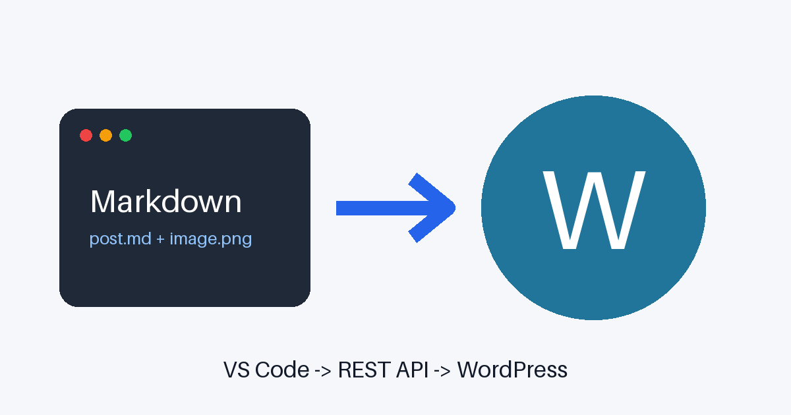

# Markdown becomes WordPress content

This paragraph includes **bold**, *italic*, ~~strikethrough~~, `inline code`, and a [link to WordPress](https://wordpress.org/).

> The local Markdown file remains the source used for intentional updates.

## A two-by-two table

| Local | WordPress |
| --- | --- |
| Markdown | HTML |
| Relative image | Media Library URL |

## Lists

- A normal bullet
- A second bullet
  - A nested bullet

1. Lint
2. Preview
3. Push
4. Verify

- [x] CommonMark content
- [ ] Publish when ready

## Image



## Code

```python
print("WordPress content, without opening wp-admin")
```

Term with a definition
: Definition lists are supported by the renderer.

Footnotes work too.[^1]

[^1]: The generated HTML is sent through the core REST API.

