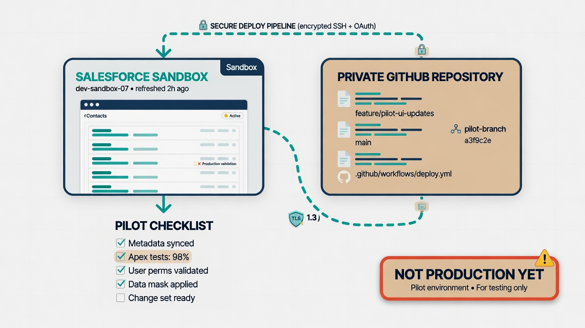
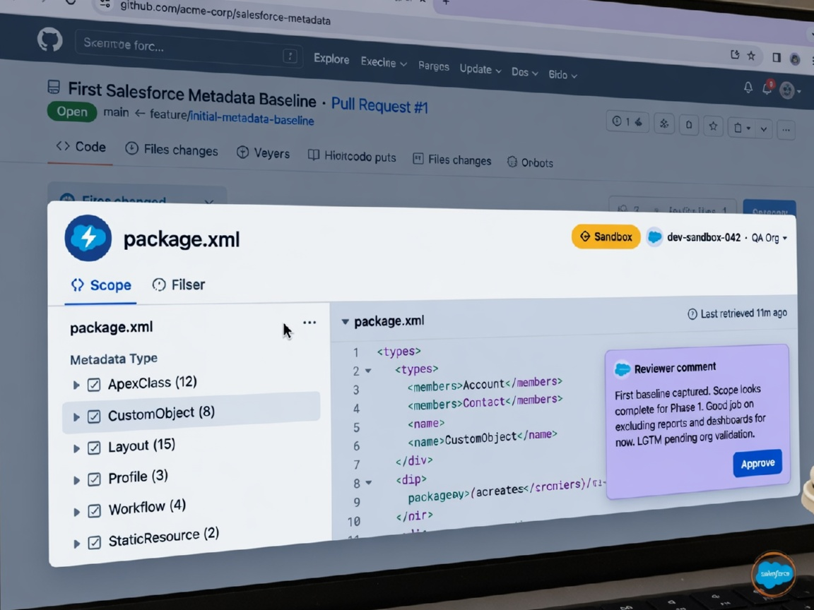
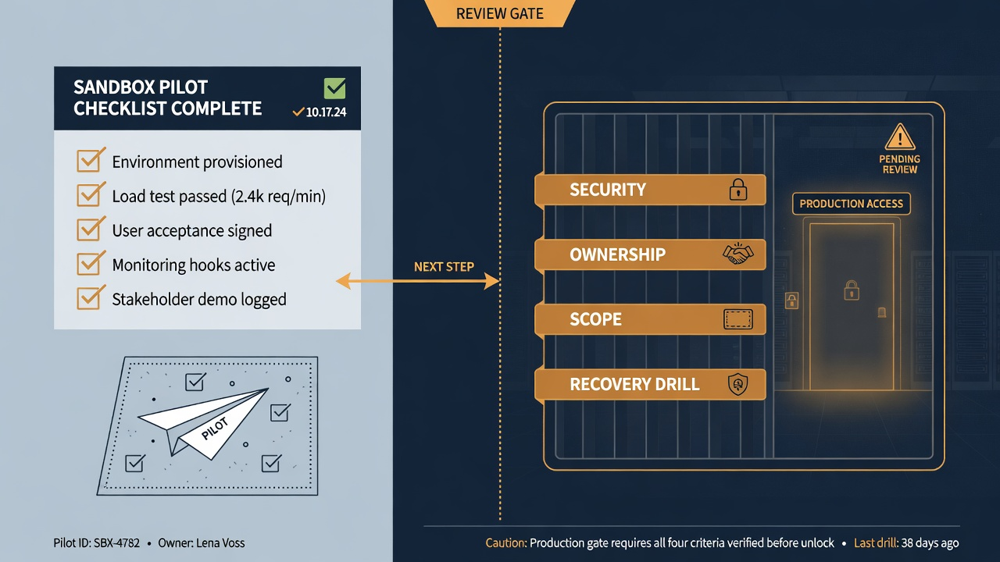

The safest way to connect a Salesforce sandbox to GitHub is to treat the first integration as a pilot with explicit learning goals, not as a stealth production backup. A sandbox gives the team room to practice project structure, authentication, retrieval scope, commit quality, secrets handling, and failure diagnosis before anyone attaches production credentials to automation. That sequence is less dramatic than “wire prod tonight,” and far more likely to produce a repository the organization still trusts six months later.

This guide walks through a practical first connection: why sandbox or dev comes first, how to create a Salesforce DX project, authenticate without stuffing tokens into Git, retrieve a baseline, host it in a private repository, run a first scheduled snapshot, prove that a known change appears as a diff, handle secrets and failures, hand the pilot off cleanly, and avoid premature production steps. Throughout, remember that metadata history is not the same thing as Salesforce record-data backup. The pilot should make that boundary obvious in documentation and stakeholder language.



*Prove the plumbing in a non-production org first.*

## Why sandbox or dev first

Production is the wrong classroom for repository fundamentals.

A non-production pilot lets the team learn:

- which metadata types retrieve cleanly for this org shape;
- how long retrieves take and how noisy diffs are;
- what the integration user can and cannot see;
- how GitHub Actions runners install Salesforce CLI in the team’s environment;
- what failure logs look like when auth expires or a manifest is wrong;
- who needs access to secrets, workflows, and repository settings;
- how admins and developers will review machine-generated commits.

Those lessons are cheaper in a sandbox. They also reduce political resistance. Security reviewers can inspect a real workflow without accepting production risk. Admins can watch a known change show up in Git without fearing an accidental deploy. Managers can evaluate usefulness before sponsoring broader scope.

Use a sandbox that is stable enough to be educational. A scratch org can be excellent for command practice, but a shared sandbox often better resembles the collaboration patterns the team will face later. Avoid a sandbox scheduled for imminent refresh unless the pilot plan includes that date.

## Define pilot success before touching credentials

Write success criteria that are observable and limited.

A solid pilot proves:

1. A private GitHub repository exists with clear owners.
2. A Salesforce DX project can authenticate to the sandbox non-interactively in CI.
3. An approved metadata scope retrieves successfully.
4. The retrieved source is committed in a readable structure.
5. A scheduled workflow produces a useful commit or a clearly empty “no changes” result.
6. A deliberate sandbox metadata change appears as a diff in a later run.
7. Secrets are not present in the repository history or workflow logs.
8. The team can revoke access and disable the workflow.
9. Documentation explains what is in scope and what is not, including the metadata-versus-data boundary.
10. Production remains intentionally disconnected.

If the pilot instead optimizes for “maximum metadata types on day one,” it usually optimizes for confusion. Breadth can expand after the pipeline is boringly reliable.

## Create the Salesforce DX project

Work from a clean local directory and generate a real project rather than improvising a folder of XML.

Salesforce CLI can scaffold the structure. The [`sf template generate project` reference](https://developer.salesforce.com/docs/platform/salesforce-cli-reference/guide/cli_reference_template_generate_project.html) describes the generated layout and default package directory. Salesforce also notes that [source format is optimized for version control](https://developer.salesforce.com/docs/platform/code-builder/guide/codebuilder-source-format.html), which is the right storage shape for GitHub history.

A minimal pilot tree often looks like:

```text
salesforce-sandbox-pilot/
├── .github/
│   └── workflows/
│       └── metadata-snapshot.yml
├── config/
├── docs/
│   ├── pilot-scope.md
│   └── authentication.md
├── force-app/
│   └── main/
│       └── default/
├── manifest/
│   └── snapshot.xml
├── scripts/
│   └── retrieve-snapshot.sh
├── .forceignore
├── .gitignore
├── README.md
└── sfdx-project.json
```

Keep the first package directory simple. Multi-package ambition can wait until the pilot proves retrieve and review habits.

Populate `README.md` with operating facts:

- which sandbox the pilot targets;
- who owns the repository and workflow;
- how local auth should work;
- which manifest defines snapshot scope;
- how to run a manual retrieve;
- how to disable automation;
- what success looks like;
- explicit statement that this is metadata history, not full data backup.

## Authenticate the right way

Authentication is where many first integrations become accidental security incidents.

### Local development auth

For humans, use Salesforce CLI login flows appropriate to the sandbox and the organization’s identity provider practices. Keep local auth state out of Git. Ignore Salesforce auth files, `.env` files, and any exported URL or token material.

### Automation auth

For GitHub Actions, use a dedicated non-human identity and a non-interactive method approved by your security team—commonly a JWT-based flow with a connected app and certificate, or another sanctioned pattern for the platform at the time of implementation. Store sensitive values only in GitHub Secrets or environment secrets.

Practical rules:

- do not use a personal administrator account as the long-term integration user;
- grant only the permissions required for retrieve in the pilot;
- store the private key or secret in GitHub Secrets, not in the repository;
- restrict which workflows can read those secrets;
- document rotation and revocation;
- never echo secrets in logs, debug prints, or commit messages.

GitHub documents [using secrets in GitHub Actions](https://docs.github.com/en/actions/security-guides/using-secrets-in-github-actions). Read that material before wiring production-like credentials, even for a sandbox pilot. Sandbox credentials still deserve care because sandboxes often contain sensitive configuration patterns and sometimes subsets of real data.

### Prove auth before scheduling anything

Run a simple authenticated CLI command in a manual workflow or local session against the sandbox. Confirm org ID and username match the intended target. Mis-pointed automation is a surprisingly common pilot failure.

## Retrieve a baseline with an intentional manifest

Do not start by asking for every metadata type known to Salesforce. Start with a snapshot manifest the team can interpret.

A conservative first scope might include:

- Apex classes and triggers the team owns;
- Lightning Web Components in active use;
- custom objects and fields for one business domain;
- a subset of Flows;
- permission sets under active administration;
- custom metadata types the application depends on.

Put that selection in `manifest/snapshot.xml` with an explicit API version. Retrieve into the project using Salesforce CLI, then inspect the file tree before any commit. The [`sf project retrieve start` documentation](https://developer.salesforce.com/docs/platform/salesforce-cli-reference/guide/cli_reference_project_retrieve_start.html) covers manifest-based retrieval options and related flags.

Baseline review checklist:

- Are the paths in source format under the expected package directory?
- Did unexpected managed package components appear?
- Are there files that look environment-specific or sensitive?
- Is the diff size understandable for a human reviewer?
- Did ignore rules omit local junk while keeping desired metadata?
- Does the team know who owns the retrieved components?

Commit the baseline as a reviewed initial import with a clear message. That commit is the pilot’s “we know where we started” marker.



*Inspect scope, package.xml, and the sandbox source before you trust the history.*

## Create a private GitHub repository and push the pilot

Use a private repository. Even non-production metadata can reveal business process design, integration endpoints, permission models, and naming that should not be public.

Repository setup tasks:

- confirm organization ownership and visibility;
- add the smallest useful collaborator set;
- enable default branch protection for the trunk the team will use;
- add a CODEOWNERS file if ownership is already known;
- add `SECURITY.md` or a short security section in the README for credential concerns;
- ensure secret scanning and push protection are enabled according to the organization’s GitHub settings;
- avoid committing large binary dumps or record exports “for convenience.”

Push the baseline. Confirm the GitHub UI shows the expected tree. If the team uses GitHub Enterprise policies, validate that Actions are allowed for this repository before writing workflows.

## Add the first scheduled snapshot

The first automation should retrieve and commit, not deploy.

A focused snapshot workflow typically:

1. Checks out the repository.
2. Installs Salesforce CLI.
3. Authenticates with secrets.
4. Retrieves using `manifest/snapshot.xml`.
5. Normalizes line endings or formatting if the team has a standard.
6. Detects whether metadata files changed.
7. Commits and pushes as a bot identity when changes exist.
8. Emits a summary for the run.

Keep permissions least-privilege. A snapshot job needs enough `contents` permission to push if that is the chosen pattern, and no production deploy secrets at all.

Scheduling tips:

- start with a manual `workflow_dispatch` trigger and prove one clean run;
- add a daily cron only after the manual run is trustworthy;
- document that GitHub scheduled workflows can be delayed under load, as noted in GitHub’s Actions operational docs;
- alert on failure through the team’s normal channel, even if that is initially email on failed workflow runs.

If the team prefers not to let automation push directly to the default branch, write the snapshot to a `snapshot/*` branch and open or update a pull request. That pattern adds review friction in exchange for more human control over observational commits.

## Prove a known change as a diff

A green workflow that never moves is not proof of monitoring. Create a deliberate, harmless metadata change in the sandbox and show that Git sees it.

Example pilot experiment:

1. Note the latest snapshot commit.
2. In the sandbox, make a small, approved change—such as updating a validation rule message, adding a clearly named custom field on a pilot object, or adjusting a non-critical label.
3. Record what you changed and when.
4. Run the snapshot workflow manually.
5. Confirm the resulting commit diff matches the intentional change and does not include unrelated surprise files.
6. Revert or keep the sandbox change according to sandbox hygiene rules.
7. Capture screenshots or links for the pilot report.

This exercise does more stakeholder education than any architecture slide. People can see the chain: org edit → retrieve → Git history.

If the change does not appear, debug systematically:

- Was the component included in `package.xml`?
- Did the integration user have access to retrieve it?
- Did ignore rules drop it?
- Did the workflow authenticate to a different sandbox?
- Did the job commit path filters exclude the folder?
- Did the change belong to a metadata type that retrieves differently than expected?

Fix the pipeline until the known change is visible. That is the pilot’s confidence test.

## Secrets, identities, and least privilege

Sandbox pilots fail in two opposite ways: too careless with secrets, or too chaotic with shared personal credentials.

Recommended posture:

- dedicated integration user for automation;
- dedicated connected app or approved auth client for the pilot;
- secrets stored only in GitHub Secrets or environment secrets;
- repository and environment access limited to operators who need them;
- workflow permissions set explicitly at the workflow or job level;
- no unrestricted `pull_request_target` patterns that can expose secrets to untrusted code;
- logging policies that avoid printing auth responses and command debug output containing tokens.

Rotate the pilot credential once during the pilot on purpose. Practice rotation while the stakes are low. Document the steps in `docs/authentication.md`.

If the sandbox contains masked or partial production data, treat the repository and logs with corresponding care. Metadata may reference objects that hold sensitive records even when the records themselves are not in Git.

## Failure handling the team can live with

The pilot should include at least one forced failure and recovery.

Useful drills:

- expire or revoke the auth secret and confirm the job fails loudly without partial junk commits;
- break the manifest with an invalid member and confirm diagnostics are readable;
- deny the bot push permission and confirm the failure mode is understood;
- disable the workflow and confirm operators know how to re-enable it.

For each failure, record:

- the user-visible symptom;
- the log location;
- the owner who responds;
- the fix;
- whether the repository was left in a clean state.

A pilot that only records happy paths teaches very little about operations.

Also define what “no changes” means. An empty diff can be healthy. A week of empty diffs after known admin activity is a monitoring failure. Distinguish “retrieve succeeded, nothing changed” from “job did not run” in whatever status reporting the team uses.

## Handoff: turn a personal experiment into a team capability

Many Salesforce-to-GitHub attempts die as one enthusiast’s laptop project. Plan the handoff before the pilot ends.

Handoff package:

- repository link and ownership group;
- sandbox identification and integration user;
- secret names (not secret values) and rotation procedure;
- workflow names and schedules;
- manifest purpose and current scope;
- known limitations and excluded metadata;
- evidence of the known-change experiment;
- open questions and recommended next scope expansion;
- explicit decision record: production not connected yet, and criteria for that later decision.

Walk through the pilot with at least one other person performing a manual snapshot run. If only one human can operate the system, it is not yet an organizational capability.

Update internal support channels so future admins know the repository exists before they invent a second, conflicting process.

## What not to do with production yet

The pilot creates momentum. Resist using that momentum to skip controls.

Do not:

- reuse the sandbox connected app and weak permission model unchanged for production without review;
- attach production secrets to the same unrestricted workflow that any collaborator can edit;
- deploy from the pilot repository to production “just to see”;
- claim disaster recovery readiness because a sandbox snapshot job is green;
- store production data exports in the metadata repository;
- disable branch protection to make the bot convenient;
- expand to every metadata type the same day production is connected;
- skip stakeholder communication about what the repository does and does not protect.

Production connection should be a separate decision with:

- security review of identity, secrets, and workflow triggers;
- clearer separation of snapshot versus deploy authority;
- environment protection and approvals;
- a documented recovery drill plan;
- monitoring and ownership on a working team calendar;
- a metadata scope justified by operational needs rather than curiosity.

The sandbox pilot earns the team the right to ask for production access with evidence. It is not itself production enablement.



*Production access waits on security, ownership, scope, and a recovery drill.*

## A day-by-day pilot plan that stays realistic

Teams often ask how long this should take. Actual elapsed time depends on access approvals, but a focused sequence looks like:

### Day 1: scope and access

- choose sandbox and owners;
- create private repository;
- draft pilot-scope documentation;
- request integration user and connected app approvals.

### Day 2: project and baseline

- generate Salesforce DX project;
- write first `snapshot.xml`;
- authenticate locally;
- retrieve baseline;
- review files;
- commit and push.

### Day 3: automation

- store secrets;
- implement manual snapshot workflow;
- run once;
- fix auth, path, and commit issues;
- add schedule only after success.

### Day 4: proof and failure drills

- make a known sandbox change;
- prove the diff;
- force an auth or manifest failure;
- document recovery;
- practice secret rotation if possible.

### Day 5: handoff

- second operator performs a run;
- pilot report to stakeholders;
- decide next scope expansion or pause;
- record production decision criteria without connecting production.

If approvals take longer, stretch the calendar rather than skipping evidence steps.

## Documentation snippets worth keeping in the repository

Short, specific documentation beats generic vendor excerpts.

`docs/pilot-scope.md` should answer:

- What org is connected?
- What metadata is included?
- What is excluded and why?
- How often does snapshot run?
- Who reviews unexpected diffs?
- What would expansion require?

`docs/authentication.md` should answer:

- Which identity authenticates?
- Where are secrets stored?
- How are they rotated?
- How is access revoked?
- Which workflows may use them?

`docs/non-goals.md` can prevent later myth-making:

- not a record-data backup;
- not a production deploy pipeline yet;
- not coverage of every metadata type;
- not a substitute for sandbox refresh planning;
- not an emergency process until restore drills exist.

These files keep the pilot honest when people paraphrase it months later.

## Expanding after the pilot works

Once the sandbox connection is boring, expansion options include:

- widening snapshot scope carefully;
- adding pull-request validation against the sandbox;
- introducing CODEOWNERS and stronger rulesets;
- adding a second non-production org for validation separation;
- defining the production snapshot decision and security package;
- practicing a metadata restore into a disposable sandbox from Git history.

Expand one control surface at a time. The teams that struggle are usually the ones that try to deliver backup, CI validation, production deploy, and full-org inventory in a single leap.

The Metadata API and Salesforce CLI will keep evolving; keep official references in the README and re-test after major platform or CLI releases. The [Metadata API Developer Guide](https://developer.salesforce.com/docs/atlas.en-us.api_meta.meta/api_meta/meta_intro.htm) remains a useful anchor for package and retrieve concepts that sit under the CLI commands.

## What good looks like at pilot end

You are ready to call the sandbox integration successful when a teammate who did not build the workflow can:

- find the repository and identify the target sandbox;
- explain the snapshot manifest’s purpose;
- trigger a manual run or interpret the schedule;
- locate secrets without seeing their values in Git;
- recognize a meaningful metadata diff;
- disable the integration if needed;
- state clearly that production is not connected and record data is not backed up here.

That is a safe first integration: small enough to understand, real enough to teach, and disciplined enough to grow without regret.

## Stakeholder conversations that keep the pilot honest

Technical success can still fail organizationally if different audiences hear different promises. Prepare short, accurate statements for common stakeholders.

### For security and compliance

“We are connecting a non-production sandbox to a private GitHub repository using a dedicated integration identity. Secrets live in GitHub Secrets, not in Git. The workflow only retrieves metadata in the pilot. Production credentials are out of scope until a separate review.”

### For Salesforce admins

“You can keep configuring in the sandbox. The pilot shows selected metadata in Git history so we can see what changed. This is not a demand that every click becomes a complex developer ritual on day one. It is a way to make durable configuration visible and reviewable.”

### For engineering leadership

“The deliverable is a repeatable pipeline and operating ownership, not a giant one-time export. We will prove auth, scope, scheduling, a known-change diff, failure handling, and handoff. Those proofs are the entry ticket to later CI validation and production discussions.”

### For business owners

“This improves resilience and change visibility for configuration. It does not by itself restore customer records after data loss. If record-level recovery is a requirement, that remains a separate workstream.”

Consistent language prevents the pilot from being rewritten in hallway conversation as either “full backup” or “developer toy.”

## Local workstation hygiene during the pilot

Laptops are where credentials and accidental commits often leak.

Baseline hygiene:

- use a dedicated directory for the pilot project;
- never copy secrets into shell history notes in the repo;
- run `git status` and `git diff` before every commit;
- reject commits that include auth files, keys, `.env`, or retrieve ZIP dumps;
- prefer CLI auth that stores tokens outside the project tree;
- turn on secret scanning alerts and treat findings as stop-ship events;
- if a secret is committed, rotate it immediately and treat history cleanup as a security task, not an inconvenience.

Even in a sandbox pilot, a leaked key can become a habit that later targets production. Practice the careful path while the blast radius is smaller.

## Interpreting the first two weeks of snapshot commits

Early snapshot history teaches the team what “normal” looks like.

Patterns you may see:

- large initial baseline followed by small daily diffs;
- bursts after admin working sessions;
- formatting churn if API version or conversion settings drift between local and CI;
- repeated flip-flopping on the same component, which may indicate two environments or two operators overwriting each other;
- empty runs that confirm stability, not failure.

Assign someone to skim snapshot commits for the first two weeks and file issues for unexplained churn. Unowned automation becomes noise, and noise gets ignored right before it would have been useful.

If the sandbox is shared and volatile, consider whether the pilot org is too chaotic to teach clean habits. A slightly quieter sandbox can be a better classroom than the busiest project environment.

## Minimal workflow design choices that matter later

A few early choices are painful to reverse:

- bot push to default branch versus snapshot branch with pull requests;
- one combined repository versus separate unlockable app repositories;
- JWT connected app design and certificate ownership;
- whether validation jobs will share the snapshot identity later;
- commit message conventions that distinguish human intent from observational retrieves.

Write the decision and the reason in an architecture note. You do not need a long committee process. You need a sentence the next operator can find.

For most first pilots, prefer:

- one private repository;
- one sandbox target;
- snapshot-only automation;
- explicit manifest path;
- manual approval before any deploy-capable workflow is added;
- human pull requests for intentional metadata authored in source.

That combination maximizes learning per unit of risk.

## Sample pilot report outline

When the pilot ends, a two-page report is more valuable than a slide deck with architecture hexagons. Include:

1. Objective and non-goals.
2. Sandbox identity and repository URL.
3. Authentication method and secret locations (names only).
4. Manifest scope summary.
5. Evidence links: baseline commit, successful scheduled run, known-change commit, forced failure run.
6. Issues discovered and fixes applied.
7. Operator handoff status.
8. Recommended next increments with owners and prerequisites.
9. Explicit statement on production readiness: not ready, and why.
10. Explicit statement on data backup: not provided by this pilot.

Attach the report in the repository under `docs/` so it remains near the system it describes.

## Common objections and grounded responses

**“We already have change sets.”**  
Change sets can move work between orgs. They do not provide the same durable, searchable, automatable history in GitHub, nor the same pull request review model. The pilot complements release mechanics; it does not require you to abandon every existing tool on day one.

**“Git is too hard for admins.”**  
Some Git details are hard. Reading a diff and commenting on a pull request is learnable, especially when the repository and templates are designed for clarity. The pilot should reduce unnecessary command-line burden while preserving history.

**“Our sandbox data is sensitive.”**  
That is an argument for careful scope, private repositories, controlled access, and possibly a cleaner sandbox—not an argument for avoiding version control of metadata forever. It may also be an argument for accelerating production-quality secret handling during the pilot.

**“We need production backup now.”**  
If production metadata history is an urgent risk, say so and run a time-boxed production read-only snapshot program with security review in parallel. Still keep the full operating model—deploy authority, broad wildcards, and untested restore claims—out of the emergency path until proven. Urgency does not convert a retrieve job into a complete continuity strategy.

## Closing the loop with continuous improvement

After handoff, put three recurring reminders on the team calendar:

- monthly: review snapshot failures and unexpected diffs;
- each Salesforce release cycle: re-test CLI commands and API version assumptions in the sandbox pilot or its successor;
- quarterly: re-read pilot non-goals and update them if the program has truly earned broader claims.

The connect salesforce sandbox to github moment is a beginning. The value appears when the repository remains accurate, owned, and boringly operational long after the novelty fades.

## Frequently asked questions

### Why connect a Salesforce sandbox to GitHub before production?

Because authentication, manifest scope, diff quality, workflow permissions, and failure handling are easier to learn without production blast radius. A sandbox pilot produces evidence for security and release stakeholders before production credentials are requested.

### Can the pilot repository include Salesforce record data?

It should not treat record exports as part of the metadata pilot. Keep the repository focused on retrieved metadata and operational docs. Record backup and restoration require separate tools and controls designed for data relationships, retention, and access.

### How much metadata should the first snapshot include?

Only as much as the team can review and explain. Start with owned, high-value types and one business domain if needed. Expand after the known-change test and a few clean scheduled runs.

### What is the biggest early mistake when teams connect Salesforce to GitHub?

Attaching broad production authority too early—often with a personal admin credential—before scope, secrets handling, and operational ownership are proven in non-production. The second biggest mistake is calling a green retrieve job a complete backup strategy.

### What should this article link to internally?

Link to **Why the first Salesforce-to-GitHub connection should be a dev org** for the pilot rationale, **Salesforce GitHub integration** for workflow architecture, **Nightly Salesforce metadata snapshot** for scheduled history value, **GitHub Actions Salesforce security** for hardening secrets and permissions, and **Salesforce package.xml strategy** for growing manifest scope after the first baseline.
