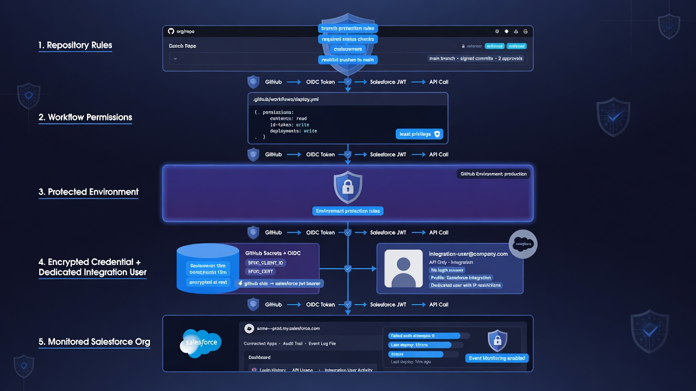
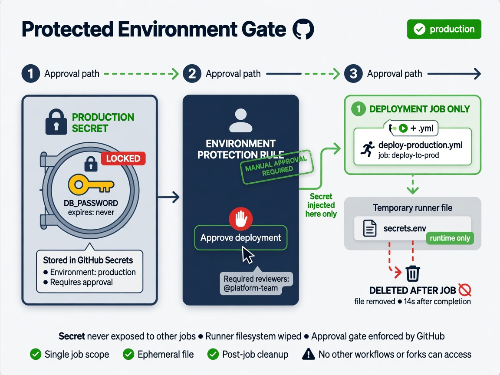

GitHub Actions Salesforce security starts with a simple fact: a workflow can hold two kinds of power at once. It may read or change a Salesforce org, and it may read or change the repository that defines what the workflow does. A weak credential, overly broad token, unsafe pull-request trigger, or compromised third-party action can turn convenient automation into a path across both systems.

The answer is not to avoid automation. It is to design each workflow as a small service with a named purpose, limited identity, reviewed dependencies, protected secrets, observable behavior, and a tested way to revoke access. A nightly metadata snapshot should receive different authority from a pull-request validator. A production deployment should not expose its credentials until the appropriate gate has passed.

This guide focuses on the security decisions around connecting Salesforce and GitHub Actions. It does not declare one authentication method universally correct. The right implementation depends on Salesforce capabilities, GitHub plan features, licensing, and the organization's security policy. The durable principles are separation, least privilege, short exposure, traceability, and recoverability.

*Repository rules, workflow permissions, protected secrets, and a dedicated integration user.*

## Model what the workflow can harm

Security reviews improve when they begin with concrete assets and failure modes rather than a generic best-practices list.

The workflow may have access to:

- Salesforce metadata that reveals business logic and security design;
- a Salesforce identity capable of retrieval, validation, or deployment;
- a private key, authorization artifact, or other authentication secret;
- repository source, history, branches, issues, and workflow files;
- the GitHub-provided `GITHUB_TOKEN`;
- logs, artifacts, caches, and job summaries;
- metadata diffs that expose object names, permissions, integrations, or internal terminology;
- notification webhooks and external storage destinations.

Plausible threats include credential theft, malicious workflow modification, dependency compromise, script injection from untrusted input, unauthorized production deployment, secret leakage through logs or artifacts, repository-history tampering, and accidental record-data export.

Also consider ordinary failure. A misconfigured job can delete metadata, push a partial retrieval, deploy to the wrong org, or stop taking snapshots without alerting anyone. Security includes integrity and availability, not only secrecy.

For each workflow, write a one-sentence purpose and a list of required capabilities. If a permission does not support that purpose, remove it.

## Separate snapshot, validation, and deployment identities

One Salesforce credential for every job creates a large blast radius. Divide authority by lane.

### Snapshot identity

The scheduled metadata snapshot needs API access and permission to read the approved metadata scope. It should not deploy or modify production configuration. The corresponding GitHub workflow may need repository content write access if it commits snapshots, but that write authority should not imply Salesforce write authority.

### Validation identity

A pull-request validator needs access to a non-production or validation target. It may perform dry-run deployments and execute tests. It does not need production deployment authority or permission to commit directly to the protected branch.

### Deployment identity

The production deployment identity needs only the Salesforce permissions required to deploy the approved metadata set and perform verification. It should be exposed only within the protected deployment job. Use a distinct identity or permission assignment from non-production where organizational constraints allow.

### Human break-glass identity

Emergency access should not be the same secret used by routine automation. Define who can activate it, how approval is recorded, how activity is monitored, and when access is removed.

This separation means a compromised pull-request check cannot automatically become a production deployment, and a stolen snapshot credential cannot alter the org.

## Choose an approved Salesforce authentication path

Interactive `sf org login web` is suitable for a human workstation but not an unattended hosted runner. Scheduled jobs need non-interactive authentication.

Salesforce CLI supports JWT-based login. The flow uses a client application, certificate, and private key to sign an assertion. Salesforce's [JWT authorization documentation](https://developer.salesforce.com/docs/atlas.en-us.sfdx_dev.meta/sfdx_dev/sfdx_dev_auth_jwt_flow.htm) explains its requirements. Salesforce also documents external client apps for current integration patterns, so teams should confirm their org's standards and roadmap before creating a new application.

An approved Salesforce DX authorization URL stored as a GitHub secret is another pattern sometimes used for pilots. It is operationally convenient but remains a credential that can authorize the CLI. Treat it as sensitive, limit its user, and plan rotation and revocation.

For any method:

- use an integration identity rather than a personal administrator account when possible;
- limit permission sets to the workflow's scope;
- separate production and non-production credentials;
- bind the client application as narrowly as the platform and policy allow;
- protect private keys and authorization artifacts as secrets;
- record the owner, purpose, creation date, expiry behavior, and rotation schedule;
- validate revocation during a controlled test;
- monitor authentication and deployment activity in Salesforce.

Do not assume a GitHub feature such as OIDC automatically removes the need for a Salesforce-supported trust path. OIDC can reduce long-lived cloud credentials when the target provider accepts GitHub's identity tokens, but the Salesforce integration must explicitly support the chosen exchange.

## Put secrets at the narrowest useful scope

GitHub Actions supports organization, repository, and environment secrets. Organization secrets can be shared with selected repositories. Repository secrets are available to workflows in one repository. Environment secrets are available only to jobs that reference that environment.

For a production Salesforce credential, an environment secret is often the clearest boundary. GitHub documents that when an environment requires approval, a job cannot access its environment secrets until a reviewer approves it. See [Deployments and environments](https://docs.github.com/en/actions/reference/workflows-and-actions/deployments-and-environments) for current rules and plan-specific availability.

Keep non-production credentials in a separate environment. Do not reuse identical secret names carelessly across organization, repository, and environment scopes; GitHub applies precedence rules when names collide. Its [secrets reference](https://docs.github.com/en/actions/reference/security/secrets) documents current limits and resolution behavior.

Secrets are not magic values that can never leak. Once injected into a runner, a step can read them. GitHub masks many recognized patterns in logs, but masking is a last defense, not an authorization model.

Avoid:

- printing environment variables for debugging;
- placing secrets on command lines that process listings or shell traces may expose;
- storing credentials in build artifacts or caches;
- combining a secret into a larger JSON or encoded blob that masking may not recognize;
- passing production secrets to reusable workflows or third-party actions without review;
- making secrets available at workflow scope when only one step needs them;
- retaining temporary key files after authentication.

Materialize a key only for the step that requires it, use a temporary path, restrict permissions where supported, and remove it in an always-run cleanup step.

*Production credentials stay locked until approval, then reach one job only.*

## Set `GITHUB_TOKEN` permissions explicitly

Every workflow receives a GitHub token according to repository and organization settings. Declare its intended permissions in YAML instead of relying on defaults.

GitHub recommends granting the minimum access needed with the `permissions` key. Its [workflow authentication guide](https://docs.github.com/actions/reference/authentication-in-a-workflow) describes available controls.

Examples of intended boundaries:

- a validation job commonly needs `contents: read`;
- a snapshot job that commits needs `contents: write` but may need nothing else;
- a job commenting on a pull request needs the relevant pull-request permission, not broad repository write access;
- a production deploy job may need only `contents: read` if deployment evidence is captured without repository mutation;
- an OIDC exchange requires `id-token: write`, which permits requesting an identity token and should be granted only to the job that uses it.

Start with `permissions: {}` or `contents: read` and add narrowly. Avoid `write-all`. Remember that a compromised step inherits the job's token permissions and any secrets exposed to that job.

Separate jobs when their authorities differ. A build job can create a non-sensitive artifact with read-only access. A later protected deployment job can download the identified artifact after approval and receive the production credential. This reduces the amount of code running with production authority.

## Protect workflow files as production code

A person who can change a deployment workflow may be able to redirect secrets or alter what reaches production. Protect `.github/workflows/` with the same seriousness as sensitive Salesforce metadata.

Use branch protection or repository rulesets to require pull requests, status checks, and appropriate reviews. Add a CODEOWNERS entry for workflow files and protect the CODEOWNERS file itself. Limit who can bypass rules. Review administrator and GitHub App access periodically.

The workflow review should answer:

- Did permissions expand?
- Did the trigger change?
- Can untrusted input reach a shell command?
- Was a new secret introduced or exposed to more steps?
- Did an action reference change from an immutable commit to a tag?
- Can the job now deploy to a different org or environment?
- Did artifact, cache, or log behavior change?
- Can a fork or untrusted contributor cause privileged code to run?

Require a security-aware reviewer for changes to authentication and production deployment paths. A green syntax check cannot determine whether a permission expansion is justified.

## Pin and review actions and runtimes

Actions are dependencies that execute inside the workflow. A third-party action may receive the checked-out repository, job token, network access, and any secret passed to it.

GitHub's [secure use reference](https://docs.github.com/en/actions/reference/security/secure-use) says pinning an action to a full-length commit SHA is the only way to use it as an immutable release. A tag is convenient but can move. For high-trust workflows, pin reviewed actions to verified commit SHAs and record the upstream version in a comment for maintainability.

Prefer first-party or thoroughly reviewed actions, minimize the number of dependencies, and use organization policies to restrict which actions can run. Review source and release provenance for actions that touch secrets or deployment artifacts.

Pin runtime and Salesforce CLI versions deliberately as well. An unplanned CLI update can change retrieval or deployment behavior and manufacture broad metadata diffs. Update through a pull request, test in non-production, and isolate any mechanical source-format changes from business changes.

Automated dependency update tools help discover releases, but the resulting pull request still needs review. “The bot opened it” is not evidence that the new executable is safe for production credentials.

## Treat pull-request input as untrusted

Workflow expressions can contain branch names, titles, issue text, commit messages, file contents, and other contributor-controlled values. Interpolating those values directly into an inline shell script can create command injection.

Pass untrusted values through environment variables or action inputs and quote them correctly. Avoid constructing executable shell from event context. GitHub's secure-use guidance provides current examples of safer handling.

Be especially cautious with `pull_request_target`. It runs in the context of the base repository and can access privileges unavailable to a normal fork pull request. Checking out and executing untrusted pull-request code in that context can expose secrets or write tokens. Use the ordinary `pull_request` event for validation that executes contributor code unless a carefully reviewed design requires otherwise.

Never make production Salesforce credentials available to a workflow triggered directly by untrusted pull-request content. Validation should use a constrained, disposable, or non-production target and a low-privilege identity.

## Use environments as deployment boundaries

GitHub environments can represent targets such as development, staging, and production. They can restrict deployment branches, hold environment-specific secrets, and apply approval or protection rules where supported by the repository plan.

For production:

- allow only the protected branch or approved release tags;
- require a reviewer who understands the release;
- prevent self-review when the plan and policy support it;
- keep the production credential at environment scope;
- disallow protection-rule bypass where appropriate;
- set a concurrency group so only one production deployment runs at a time;
- record the exact source commit and target environment.

GitHub notes that environment and concurrency are separate controls. Referencing the same environment does not automatically prevent overlapping deployments. Configure concurrency explicitly and decide whether a new queued deployment should cancel or wait.

Plan availability matters, particularly for required reviewers and private repositories. Confirm the organization's GitHub plan before designing a control that the repository cannot enforce.

## Keep artifacts, caches, and logs clean

Workflow artifacts and caches outlive individual steps and may have different access or retention. Do not upload key files, Salesforce authorization state, raw environment dumps, or sensitive debug logs.

For deployment artifacts:

- build from a specific commit;
- include only the reviewed metadata and manifest;
- generate a checksum;
- set an appropriate retention period;
- ensure the deployment job verifies identity and integrity;
- avoid rebuilding after approval when reproducibility matters.

Use caches for public dependencies or safe build acceleration, not credentials. Cache keys influenced by untrusted input can also create poisoning risks; design cache restore behavior carefully for privileged jobs.

Logs should be useful without revealing secrets. Record environment labels, manifest paths, component counts, test summaries, deployment IDs, and commit identifiers. Avoid full CLI debug output in routine production runs. Restrict and shorten retention for sensitive diagnostic artifacts created during an incident.

## Prevent record data from entering the repository

A Salesforce metadata workflow can accidentally widen into data export because the authenticated identity already has API access. Keep the purpose narrow.

Do not commit CSV exports, files, query results, access tokens, or diagnostic payloads containing records. If a required workflow exports data, give it a separate identity, repository or service boundary, storage destination, retention policy, and review. Metadata history and record-data backup have different security requirements.

Scan commits and pull requests for secrets and unexpected large files. Use `.gitignore`, pre-commit checks, GitHub secret scanning where available, and safety checks before an automated snapshot pushes. A `.gitignore` prevents common accidents but does not remove a secret already committed.

If a credential enters Git history, rotate or revoke it first. Removing the file from the latest commit does not make the exposed credential safe.

## Monitor security-relevant events

A green deployment is not the only signal worth keeping. Monitor:

- changes to workflow files, branch rules, environments, secrets, and repository administrators;
- Salesforce authentication failures and unexpected login locations where available;
- deployments outside the approved GitHub path;
- snapshot jobs that stop running;
- large or unusual metadata diffs;
- secret-scanning alerts;
- action and CLI dependency updates;
- use of break-glass access;
- credential age and upcoming certificate expiry;
- failed attempts to deploy from unauthorized branches.

Route events to named owners and define expected response. An alert nobody is responsible for is only a log entry.

Retain enough evidence to connect a Salesforce deployment to its repository commit, workflow run, approver, identity, manifest, and test result. Avoid retaining secrets or unnecessarily sensitive metadata in the evidence package.

## Prepare for credential compromise

The incident runbook should exist before the first production automation run. It should say how to:

1. disable the affected GitHub workflow;
2. revoke the Salesforce session, certificate, client application, or integration user's access;
3. rotate related GitHub secrets;
4. preserve workflow, repository, and Salesforce evidence;
5. identify deployments and retrievals performed during the exposure window;
6. check for workflow-file and branch-history tampering;
7. compare production metadata with a trusted independent baseline;
8. restore approved configuration if necessary;
9. re-enable automation with a new credential after review;
10. document cause and preventive changes.

Test the disable and rotation path in non-production. A credential described as rotatable is not operationally rotatable until someone has completed the procedure without breaking the system for days.

## A practical hardening sequence

Begin with a sandbox snapshot workflow. Give it read-only Salesforce access and explicit GitHub permissions. Store the non-production credential at the narrowest useful scope. Pin actions and the Salesforce CLI. Protect workflow-file changes. Make a deliberate failure and confirm the owner sees it.

Next, add pull-request validation using a separate identity. Test untrusted input handling and confirm secrets are unavailable to forked or unapproved code.

Finally, create a separate production deployment job behind a protected environment. Restrict its source branches, approvals, secret access, and concurrency. Deploy an identified artifact or commit. Run a credential-revocation drill before calling the path operational.

This sequence lets the team evaluate each authority increase with evidence rather than granting broad access at the beginning.

## GitHub Actions Salesforce security checklist

- Every workflow has one documented purpose.
- Snapshot, validation, and production deployment use separate authority.
- Salesforce integration users have least-privilege permission assignments.
- Production and non-production credentials are separated.
- Secrets are stored at the narrowest useful GitHub scope.
- `GITHUB_TOKEN` permissions are explicit and minimal.
- Workflow files and CODEOWNERS receive protected review.
- Third-party actions are minimized, reviewed, and pinned to commit SHAs.
- Salesforce CLI and runtimes are versioned deliberately.
- Untrusted pull-request values are not interpolated into privileged shell code.
- Production secrets are unavailable to untrusted triggers.
- Environment approvals and branch restrictions are configured where supported.
- Deployment concurrency prevents overlap.
- Artifacts, caches, logs, and job summaries contain no credentials or record data.
- Credential rotation, revocation, and workflow disablement have been tested.
- Monitoring connects GitHub changes to Salesforce activity.

## Frequently asked questions

### Is it safe to store Salesforce credentials in GitHub Secrets?

GitHub Secrets is designed for sensitive workflow values, but safety still depends on scope, workflow permissions, triggers, dependencies, runner behavior, and rotation. A secret becomes readable to the job when injected, so expose it only to a reviewed, narrowly authorized job.

### Should a Salesforce deployment use a System Administrator account?

Avoid personal or unnecessarily broad administrator credentials. Use a dedicated integration identity and permission assignments limited to the approved deployment duties where licensing and Salesforce policy allow.

### Are GitHub Actions tags safe enough?

Tags are convenient but movable. GitHub recommends full-length commit SHA pinning as the immutable option. High-trust deployment workflows should follow the organization's dependency policy and review pinned updates.

### Can environment approval protect a Salesforce secret?

Yes, where the GitHub plan supports the configured environment rules. GitHub documents that an environment secret is not made available to the job until required approval passes.

### What should this article link to internally?

Link to **Salesforce GitHub integration** for architecture, **Salesforce deployment validation** for the CI path, **restore Salesforce metadata from GitHub** for incident recovery, and **Salesforce metadata backup** for the metadata-versus-data boundary.
