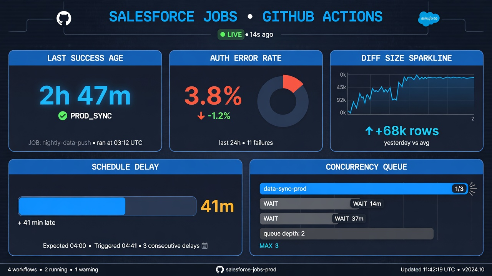
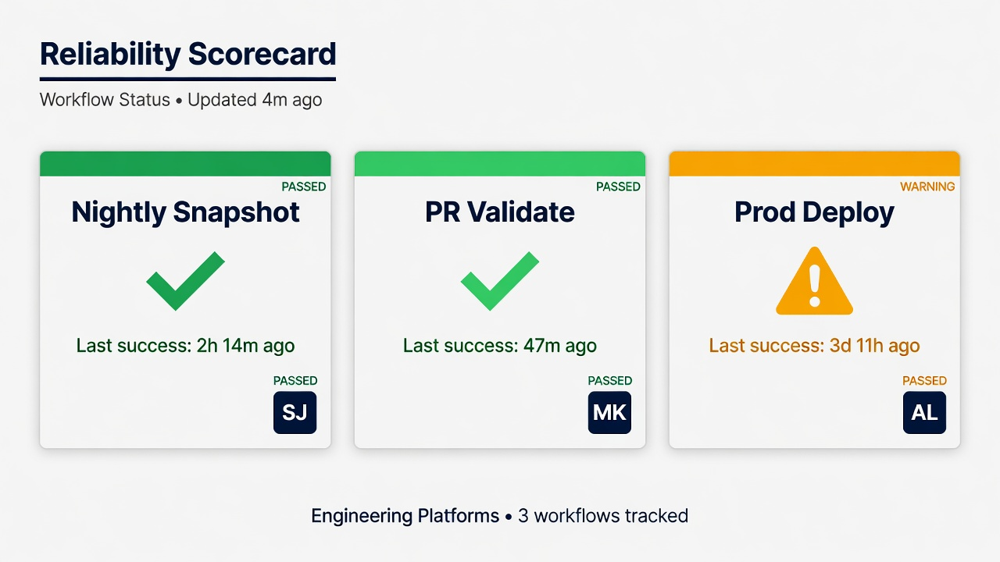
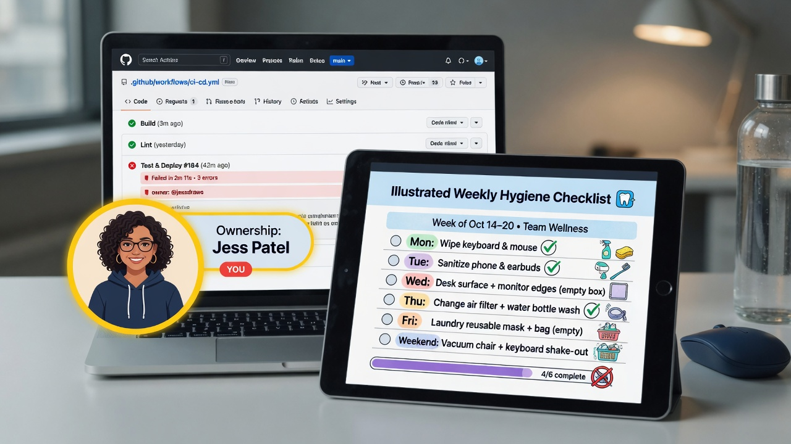

Monitor Salesforce GitHub Actions as deliberately as you monitor a batch integration that touches production-adjacent systems—because that is what these workflows are. A nightly metadata snapshot that fails quietly for eleven days is not a minor inconvenience; it is an expanding blind spot in drift detection and recovery. A validation pipeline that flakes, or a production deploy job that stalls on concurrency, erodes trust until humans bypass automation entirely.

This post covers practical signals, notification patterns at a high level, ownership, schedule delays, concurrency, optional dashboards, the special incident class of *silent* automation, acceptance criteria for operational readiness, and a light touch on Actions minutes and cost awareness. Prefer proving monitoring in non-production first. And keep the scope honest: healthy pipelines that version **metadata** still do not replace **record-data** backup monitoring on its own track.

*Watch last success age, auth failures, diff size, schedule delay, and concurrency.*

## Why “the workflow exists” is not the same as “the workflow is trustworthy”

Teams celebrate the first green run. Months later, reality looks like:

- a secret expired and every run failed at login while everyone assumed green;
- a retrieve completed with warnings and committed an incomplete tree;
- diffs grew huge because of noisy last-modified reordering, training reviewers to ignore changes;
- the schedule slipped quietly after runner contention;
- a workflow was disabled during an experiment and never re-enabled;
- notifications went to a dead Slack channel;
- success was defined as “job exit code 0” while the commit step no-op’d.

Monitoring closes the loop between *intended automation* and *actually maintained resilience*.

GitHub’s own documentation on [workflow run monitoring and notifications](https://docs.github.com/en/actions/monitoring-and-troubleshooting-workflows/monitoring-workflows) is the platform baseline. Layer Salesforce-specific signals on top.

## Core signals that matter for Salesforce-oriented workflows

### 1. Last success age

For each critical workflow (nightly snapshot, scheduled drift compare, production deploy path health check), track time since last **successful** completion that met full acceptance criteria—not merely “Actions showed a check.”

Alert when age exceeds a threshold: for example, more than 36 hours for a nightly job, or more than one missed window. Display the last success commit SHA and org target label.

### 2. Auth and identity errors

Classify failures:

- JWT or other auth failure (key, cert, user frozen, pre-authorization);
- insufficient Salesforce permissions mid-retrieve or mid-deploy;
- GitHub secret missing because environment not bound;
- API limit or invalid session mid-job.

Auth errors often need human secret or identity work; treating them like flaky network blips wastes time. Separate notification urgency: auth on a production-related integration user deserves fast attention.

Salesforce CLI auth patterns such as JWT are documented in Salesforce’s [JWT authorization flow guide](https://developer.salesforce.com/docs/atlas.en-us.sfdx_dev.meta/sfdx_dev/sfdx_dev_auth_jwt_flow.htm); your monitors should detect symptoms even if root cause analysis still requires a human.

### 3. Huge diffs

A snapshot commit that rewrites thousands of lines may indicate:

- legitimate large release;
- retrieve scope expansion;
- volatile metadata formatting;
- accidental inclusion of new metadata types;
- environment mismatch (retrieved wrong org);
- security-relevant permission model churn.

Huge diffs are not always failures, but they are always signals. Thresholds might use lines changed, files changed, or component counts from an inventory script. Route oversized diffs to owners for acknowledgment rather than auto-merging trust.

### 4. Partial retrieve or incomplete success

Dangerous middle states:

- CLI returned non-zero but a previous step already committed;
- some metadata types failed while others succeeded;
- empty commit when a change was expected after a known production edit;
- artifact upload failed after retrieve, losing evidence;
- checkout or push failed after Salesforce work succeeded, leaving org and git diverged in understanding.

Define success as an explicit conjunction: authenticated AND retrieved expected scope AND validation of tree AND commit/push (if applicable) AND notification. Anything less is `degraded` or `failed`.

### 5. Schedule delay and missed windows

GitHub schedules use cron syntax and can delay under load. Document expected windows in UTC and local business time. Monitor:

- start-time delay beyond tolerance;
- duration growth (retrieves that used to take 8 minutes now take 55);
- overlap with other heavy workflows.

See GitHub’s notes on [scheduled events](https://docs.github.com/en/actions/using-workflows/events-that-trigger-workflows#schedule) for platform behavior; design monitors that notice absence, not only failure events.

### 6. Concurrency and queue fights

If two snapshot jobs run together, you may get thrash on the same branch, concurrent pushes, or API contention. Use concurrency groups in workflow YAML so only one snapshot mutates the snapshot branch at a time. Monitor cancelled runs: a storm of cancellations can mean misconfigured concurrency or a stuck job holding the group.

Production deploys should not share concurrency groups carelessly with experimental workflows.

### 7. Deploy and validation specific signals

- validation fail rate by branch;
- average test runtime and sudden spikes;
- production deploy duration;
- frequency of manual re-runs (smell for flake);
- mismatch between validated SHA and deployed SHA (should be zero).

### 8. Repository integrity signals

- workflow file changes (especially to auth or deploy jobs)—require review and maybe extra alert;
- unexpected collaborators or permission changes (org-level monitoring);
- secret scanning alerts if enabled.

## Notifications: enough to wake a human, not a city

### Principles

- **Alert on symptoms that need human action**, not every informational log line.
- **Include context:** workflow name, run URL, branch, SHA, org label, failure class, last success age.
- **Route by ownership:** auth failures to identity/platform owners; huge metadata diffs to Salesforce app owners; deploy failures to release managers.
- **Deduplicate:** one issue per failing nightly until resolved, not 40 messages.
- **Acknowledge silence:** a heartbeat or “last success” metric catches the no-notification case.

### Channels (high level)

Common patterns include Slack or Teams channels, email distribution lists for lower urgency, and paging for production deploy failure during a release window. Exact products matter less than delivery reliability and clear ownership of the channel itself (who gets removed when they leave the team).

Avoid embedding secrets in notification payloads. Metadata names in diffs can still be sensitive—prefer counts and links to private UIs over pasting entire permission set XML into chat.

## Ownership: name the human (or rotation)

Every critical workflow needs:

- a **primary owner** (team is fine if a rotation calendar exists);
- an **escalation path**;
- a **runbook link** in the failure message;
- a **maintenance window practice** for intentional disables.

Orphan workflows are future incidents. Put owners in CODEOWNERS for `.github/workflows/` and in an operations register next to Salesforce integration users.

When people change roles, transfer monitoring subscriptions with the same seriousness as transferring admin roles in Salesforce.

## Schedule delays, runners, and duration budgets

Establish a duration budget per job class:

| Job class | Example budget | Why |
| --- | --- | --- |
| Nightly full snapshot | e.g. complete by 05:00 local | Must finish before business hours drift review |
| PR validation | e.g. p95 under N minutes | Protect developer flow |
| Production deploy | window-bound | Aligns with change calendar |

When budgets break:

- narrow metadata scope;
- parallelize carefully with API limits in mind;
- pin CLI versions that regressed;
- move to larger runners only after measuring (cost awareness);
- split workflows by package directory if architecture allows.

Self-hosted runners introduce host health monitoring: disk full on a runner looks like random Salesforce CLI failures if you only watch Actions status icons.

## Concurrency design that monitoring can trust

Recommended patterns:

- **Snapshot branch:** `concurrency: snapshot-main` with cancel-in-progress false or true depending on whether mid-run cancel leaves partial commits—often safer not to cancel blindly mid-push.
- **PR validation:** concurrency per PR number to conserve minutes.
- **Production:** concurrency group that prevents two prod deploys at once.

Monitor:

- time spent waiting for concurrency;
- cancelled run counts;
- stuck in-progress jobs older than 2× duration budget (may need manual cancel).

## Dashboards: optional, useful if maintained

You do not need a fancy dashboard on day one. A weekly manual review of Actions history beats an abandoned Grafana board. When ready, optional views:

- success rate by workflow over 30 days;
- last success timestamps;
- mean duration trends;
- failure taxonomy counts (auth / retrieve / push / validate / deploy);
- minutes consumed by workflow (cost awareness).

Sources can include GitHub’s UI, exported metrics APIs available on your plan, or simple scheduled jobs that write a status file into an internal ops repo. Prefer fewer accurate tiles over many stale ones.

*Status, last success, and a named owner for each critical workflow.*

## The incident class: automation is silent

Silent failure modes:

1. **Workflow disabled** or renamed; schedule never fires.
2. **Notifications misconfigured**; failures happen in UI only.
3. **Branch filter** excludes the branch you think you are protecting.
4. **Cron timezone confusion**; job runs at unused hours and nobody looks.
5. **Success criteria too weak**; empty retrieves “succeed.”
6. **Repository moved / renamed**; webhooks and schedules confuse operators.
7. **Org API upgrades or metadata type changes** alter retrieve contents without failing the job.

### Detection patterns for silence

- external dead-man switch: a separate checker that pages if last success age exceeds threshold;
- daily digest that must include last success times (humans notice missing digest if the digest itself is monitored—yes, meta);
- calendar reminder for weekly pipeline hygiene until automated dead-man exists;
- synthetic test: a known controlled metadata change in non-production that must appear in next snapshot.

Treat “pipeline silent for N hours” as a first-class severity in your incident taxonomy—same family as “integration feed silent.”

## Failure taxonomy and first responses

| Class | First checks | Likely owners |
| --- | --- | --- |
| Auth | cert expiry, secret, user status, pre-auth, login URL | Platform / security |
| Retrieve partial | CLI logs, type failures, API limits | Salesforce engineering |
| Huge diff | inventory, org mismatch, scope config | App owners |
| Push / git | permissions, branch protection, concurrency | Platform |
| Validation | tests, dependencies, target org drift | Feature team + release |
| Schedule miss | Actions status page, concurrency, disabled workflow | Platform |
| Silent | dead-man metrics, workflow enabled flag | Ops on-call |

Link each class to a short runbook. The best alert message is one click from the fix path.

## Logging and artifact hygiene under monitoring pressure

When jobs fail, people widen logging. Guardrails:

- never print keys, tokens, or full auth URLs with secrets;
- retain artifacts (inventories, test reports) long enough for diagnosis under retention policy;
- avoid uploading entire org retrieves as public artifacts;
- redact customer-sensitive metadata names in open channels if required.

Monitoring increases the amount of operational data you store; apply the same privacy mindset you use for the repository itself. Metadata is not record data, but it is still often confidential.

## Cost and minutes awareness (lightly)

GitHub Actions consumption can grow with:

- full-org retrieves every night;
- matrix builds for many packages;
- frequent re-runs;
- unpinned actions pulling large images;
- validation on every push instead of every PR update carefully.

Cost control is part of reliability: a pipeline turned off because billing surprised finance is a reliability event. Practices:

- measure minutes per workflow monthly;
- cache dependencies responsibly;
- fail fast on auth before heavy steps;
- use path filters so docs-only PRs skip Salesforce validate when safe;
- keep snapshot scope intentional rather than “retrieve the universe twice.”

Do not starve security validation to save coins; do cut pure waste.

Official pricing and billing docs change; use GitHub’s current [Actions billing documentation](https://docs.github.com/en/billing/managing-billing-for-github-actions/about-billing-for-github-actions) when forecasting rather than outdated numbers from a blog.

## Acceptance criteria for operational readiness

Before declaring a Salesforce GitHub Actions path “in production operations,” require:

1. **Named owner and escalation** for each critical workflow.
2. **Documented success definition** beyond exit code 0.
3. **Alerting on failure and on last-success-age breach.**
4. **Runbooks** for auth, partial retrieve, huge diff, and deploy failure.
5. **At least one non-production drill** that injects failure and proves a human gets notified.
6. **Concurrency policy** written and implemented.
7. **Duration budget** and a response if breached for two consecutive windows.
8. **Secret and identity rotation** contact path.
9. **Weekly or automated review** of pipeline health for the first 90 days.
10. **Explicit statement** that metadata pipeline health ≠ record-data backup health; data-track monitors remain separate.

If item 3 or 5 is missing, you have automation demo-ware, not operations.

## Pairing monitors with snapshot and release programs

- **Nightly snapshot:** prioritize last success age, partial retrieve, huge diff, push failure.
- **Drift detection:** prioritize signal quality (noise rate) so humans keep reading diffs.
- **PR validation:** prioritize flake rate and duration p95.
- **Production deploy:** prioritize failure pages, approval wait timeouts, SHA mismatch checks.
- **Auth rotation events:** temporary heightened sensitivity after cert changes.

When you introduce a new workflow, add its monitors in the same PR as the YAML when possible. Monitoring deferred to “phase 2” becomes never.

## Non-production first for monitoring design

Use a sandbox-targeted snapshot and a deliberately broken secret in a throwaway environment to prove:

- failure class detection;
- notification routing;
- runbook steps;
- that success criteria reject partial results.

Then clone the pattern to production-oriented workflows with stricter gates. Experimentation that disables production monitors “for a minute” is a classic outage precursor—use feature flags or separate workflow files instead.

## Defining success in the workflow itself

Monitoring is easier when the job emits explicit outcomes. Patterns that help:

- write a machine-readable summary file (`success=true`, `files_changed=N`, `auth=ok`, `sha=...`) as an artifact or step output;
- use job summaries for humans and structured lines for parsers;
- fail the job if retrieve warnings exceed a policy threshold, even when the CLI partially succeeds;
- fail if the commit step produces no commit when `expect_changes=true` for a synthetic test;
- always run a cleanup job that records final status to an external checker if you use a dead-man switch.

Ambiguous success is the enemy. “The step looked green” should not require tribal knowledge to interpret. Encode the conjunction of conditions in script logic and keep that script under the same review as other production code.

Salesforce CLI commands for project retrieve and deploy publish result codes and JSON output options in current documentation; prefer structured output when building monitors so you are not scraping ANSI logs. See the [Salesforce CLI command reference](https://developer.salesforce.com/docs/platform/salesforce-cli-reference/guide/cli_reference_unified.html) for the commands your workflows actually invoke.

## Alert fatigue and how to avoid training people to ignore you

If everything pages, nothing pages. Practical anti-fatigue rules:

- page only for production integrity jobs, production deploys, and dead-man silence;
- ticket or chat for PR validation flakes unless rates exceed a threshold;
- require acknowledgment and resolution notes for pages so ghosts do not linger;
- review top noisy alerts monthly and fix root causes (volatile metadata, flaky tests, undersized timeouts) instead of only raising thresholds;
- separate “informational digest” from “action required.”

A quiet, trusted channel beats a loud, ignored one. Measure mean time to acknowledge for pipeline pages the same way you would for customer-facing services if those pipelines protect production understanding.

## On-call integration without burning people out

Salesforce metadata automation rarely needs 24/7 human staring, but it does need known coverage:

- business-hours primary response for nightly snapshot failures in many orgs;
- amplified coverage during release windows for deploy jobs;
- clear “wait until morning” versus “wake someone” criteria (for example, production deploy failure during a live change window always wakes; a single sandbox validation flake does not);
- handoff notes when a failure spans shifts, including what was already tried.

Put these criteria in the runbook. Ambiguity creates either heroics or neglect.

## Correlating GitHub signals with Salesforce signals

Sometimes the workflow is healthy and Salesforce is not, or the reverse.

Correlate:

- Salesforce login history for the integration user with Actions auth steps;
- API usage spikes with retrieve duration growth;
- Setup Audit Trail or equivalent change history with unexpected snapshot diffs;
- deploy ids in Salesforce with Actions run URLs;
- major platform release weekends with unusual failure clusters.

This correlation turns monitoring from “red build” into operational understanding. Grant investigators access to both systems under least privilege, and remind them that metadata investigation still is not a license to export record data into tickets.

## Change management for the monitors themselves

Monitors are production software. Changes to alert thresholds, notification channels, and success criteria should be:

- proposed in pull requests when they live as code;
- announced in the ops channel when they change paging behavior;
- tested in non-production;
- documented with an owner.

Shadow mode (emit would-page events without paging) helps when introducing aggressive new rules. Turning on a hypersensitive huge-diff page on Friday afternoon is how you earn a reputation that prevents future good monitoring.

## Capacity and scaling as the org grows

As metadata volume and team count grow:

- snapshot jobs may need splitting by package directory with independent last-success metrics;
- validation queues may need concurrency limits to protect sandbox API limits;
- notification routing may need team-specific channels mapped from CODEOWNERS;
- a central platform team may own auth and runner health while product teams own diff triage.

Revisit duration budgets quarterly. What was fine for a pilot retrieve can miss the window after two years of unmanaged metadata growth. Scope discipline and package modularity are reliability features, not only architecture aesthetics.

## Example weekly hygiene checklist

- All critical workflows show success within SLA.
- No unresolved auth errors in the last seven days.
- Diff sizes within expected bands or acknowledged.
- No workflow permanently disabled without ticket.
- Actions minutes within forecast.
- On-call list matches current staffing.
- One random failure log reviewed for secret leakage.
- Data-track backup monitors (separate system) also green—do not let metadata comfort erase that check.

*Failed jobs need owners. Silent green is not the only failure mode.*

## Building a lightweight “pipeline status” page for stakeholders

Leadership may not live in the Actions tab. A simple internal status note can include:

- snapshot: last success time + “drift coverage: current / degraded”;
- validation: weekly fail rate;
- production deploys this month: count + failures;
- open pipeline incidents.

Keep language precise. “GitHub is backing up Salesforce” is still wrong if you only snapshot metadata. Prefer: “Configuration snapshot pipeline healthy as of timestamp; record backup reported separately.”

## Continuous improvement loop

When incidents happen:

1. classify signal gap vs response gap;
2. add or tune a monitor;
3. improve runbook;
4. remove noisy alerts that train teams to ignore pages;
5. share a short learning in the enablement channel.

Over time, the system should fail loudly, recover with known steps, and stay boring. Boring is the goal.

## Frequently asked questions

### What is the single most important metric if we can only track one thing?

Last success age for the nightly metadata snapshot (or your most important scheduled job), with an alert when it exceeds a threshold. That one metric catches many silent failures. Expand from there to failure taxonomy and huge-diff detection.

### Should developers be paged for every PR validation failure?

Usually no. PR validation failures should notify the PR author and show in the pull request UI. Page humans for scheduled integrity jobs, production deploys, and dead-man silence. Match urgency to blast radius.

### How do we monitor without leaking metadata details into chat tools?

Send counts, statuses, run URLs, and error classes. Keep detailed diffs inside the private GitHub UI. If chat tools retain history broadly, treat that as part of your confidential data surface.

### How does pipeline monitoring relate to Salesforce record backup monitoring?

It does not replace it. Pipeline monitors tell you whether configuration versioning and delivery automation are healthy. Record backup monitors tell you whether data protection jobs meet RPO. An incident commander should see both. Healthy git snapshots with failed data backups are still a serious data-risk state.

### Which internal articles should we link from this monitoring guide?

Link nightly snapshot operations, JWT authentication and secrets setup, Actions security hardening, deployment validation, release management with evidence, restore procedures, and the metadata-versus-data backup distinction so operators and stakeholders share the same reliability model.
