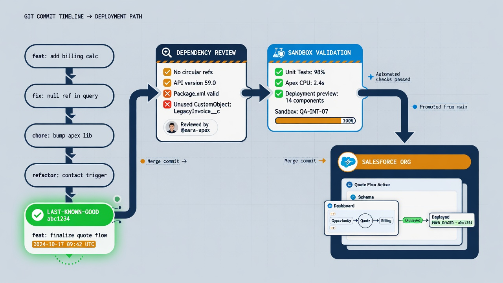

To restore Salesforce metadata from GitHub safely, you need more than an old copy of an XML file. You need to identify the last known good state, understand the affected component's dependencies, validate the proposed recovery against an appropriate org, and verify that the live configuration behaves correctly afterward.

Git makes the first part pleasantly concrete. It preserves earlier versions, timestamps, commit relationships, and the surrounding changes. Salesforce makes the second part more nuanced. Metadata components interact with fields, permissions, automation, Apex, packages, and record state. Returning one file to yesterday's version can be exactly right, or it can create a new failure if related components have moved on.

The safest mental model is that metadata restoration is a new controlled deployment whose source happens to be an earlier Git commit. It deserves a branch, a readable diff, validation, approval, deployment evidence, and a post-restore retrieval. This method is slower than clicking an imaginary rollback button, but it produces a recovery the team can explain and trust.

*Select a trusted commit, validate dependencies, then deploy as a controlled recovery.*

## What a Salesforce metadata restore can recover

A GitHub repository can preserve versions of metadata that were successfully retrieved and committed. Depending on the project's scope, this may include Apex, Lightning Web Components, custom objects and fields, Flows, validation rules, layouts, permission sets, record types, custom metadata, and other supported types.

Restoration can therefore mean several things:

- replacing a broken Apex class with its previous reviewed version;
- reconstructing a deleted field and related configuration;
- reverting a Flow to the version used before an incident;
- restoring permission-set definitions after an accidental change;
- rebuilding selected metadata in a sandbox for investigation;
- applying the exact metadata associated with an earlier release tag;
- reversing an unapproved production change after drift detection.

The repository cannot restore what it did not capture. It may not contain Salesforce records, files, credentials, runtime state, package internals, or components omitted from the retrieval manifest. A Git history is not a complete org image.

That boundary should be visible in the recovery runbook. If the incident also affects record data, coordinate with the approved data-backup process. Do not improvise by treating old CSV files in a repository as a safe, relationship-aware data restore.

## Start by defining the incident

Before choosing a commit, write down what is wrong in observable terms. “Production broke” is not specific enough.

A useful incident statement identifies:

- the behavior that changed;
- the affected users or process;
- the approximate start time;
- recent deployments and direct org edits;
- suspected metadata components;
- whether data may already have been changed by the faulty behavior;
- the current business impact;
- the person authorized to make the recovery decision.

Preserve current evidence before changing the org again. Run the approved metadata retrieval and commit or archive the resulting state on an incident branch. Save deployment identifiers, test failures, audit information, and relevant logs according to the organization's security rules. The broken state is uncomfortable, but it may be necessary for understanding the cause and proving what the recovery changed.

If the incident is active and harmful, the team may also need a containment action: deactivate a Flow, disable an integration, restrict access, or use another approved operational control. Containment and permanent recovery are related but separate decisions.

## Find the last known good version

The newest commit before the incident is a candidate, not automatically the answer. A scheduled snapshot may have captured the faulty state. A related change may have landed earlier. The repository might also contain planned work that was never deployed.

Use multiple signals:

- release tags or deployment records linking production to a commit;
- scheduled snapshot commits around the incident window;
- pull requests and work items describing intended behavior;
- `git log` for the suspected paths;
- `git blame` for a particular line or metadata member;
- diffs between the current state and candidate commits;
- Salesforce setup-audit information and deployment history;
- confirmation from the component's functional owner.

The goal is not merely to find an older version. It is to identify a version known to have operated correctly in the relevant environment.

For a single component, inspect its path history. For an incident spanning several components, compare release commits or tags. A Flow, Apex class, permission set, and custom field changed in one pull request may need to be evaluated as a unit.

Document why the selected commit is considered good. During an urgent incident, that note prevents the team from repeating the same investigation or restoring a version based on guesswork.

## Create a recovery branch, not a history rewrite

Do not reset the protected branch backward or force-push history to make the repository look as though the bad change never happened. The incident sequence is valuable evidence.

Create a recovery branch from the current trusted branch. Restore selected paths from the known-good commit, or construct a revert commit when the original change maps cleanly to the incident. The resulting diff should show exactly what will move backward while preserving unrelated current work.

This approach supports review and makes the deployed recovery a new identifiable commit. It also avoids a common mistake: checking out an entire old repository state and redeploying it over newer, valid changes.

Use a full-commit rollback only when the team has established that the entire target state must return to that release and has reviewed everything introduced since then. Most incidents are safer as a selective recovery.

The recovery branch should include any manifest changes, test adjustments, or temporary operational instructions needed for the deployment. Keep temporary work clearly labeled and remove it through a follow-up pull request rather than leaving mystery exceptions in the baseline.

[IMAGE PROMPT: Side-by-side Git diff concept showing current branch, known-good commit, and a narrow recovery branch that restores only a Flow and permission set while preserving newer unrelated Apex work; editorial code visualization without tiny literal code, 4:3]

## Map dependencies before deploying

Salesforce metadata rarely lives alone. A component can reference fields, classes, labels, named credentials, permission definitions, record types, and other automation. Its behavior can also depend on record data that Git does not contain.

Ask these questions for each restored component:

- What metadata does this version reference?
- Do those dependencies still exist with compatible names and definitions?
- Did a newer release change the inputs or outputs?
- Will the older version compile under the current API and org features?
- Are profiles or permission sets expected to grant access to restored elements?
- Could the restore delete or hide data-bearing fields?
- Does the component call external services or use environment-specific configuration?
- Which Apex tests and functional checks exercise the behavior?

Restoring a deleted custom field is a good example. The field definition may be only one part. Layouts, permission sets, record types, formulas, reports, validation rules, Flows, Apex, integrations, and data recovery may all matter. Recreating the field does not automatically repopulate deleted values.

A Flow rollback can also be subtle. The earlier version may depend on a field that has since changed, or it may reintroduce behavior that is inappropriate for records created after the original release.

Use dependency analysis, repository search, deployment validation, and component-owner knowledge together. No single signal is a perfect dependency map.

## Build the recovery deployment set

Create an explicit manifest or source-directory selection for the components under recovery. Smaller is usually easier to reason about, but do not omit required dependencies just to make the diff look tidy.

Salesforce CLI documents `sf project deploy start` for deploying source-format metadata. The command accepts a manifest, metadata names, or source directories. Its [`--dry-run` option](https://developer.salesforce.com/docs/platform/salesforce-cli-reference/guide/cli_reference_project_deploy_start.html) validates the deployment and runs Apex tests without saving the changes to the org.

Be careful with destructive changes. Removing a component from Git does not necessarily communicate the desired deletion in a Metadata API deployment. Salesforce supports pre- and post-destructive-change manifests. Deletion can have lasting data and dependency consequences, so it needs explicit review rather than being inferred casually from `git diff --deleted`.

Do not use flags that suppress important errors merely to get a recovery through. The Salesforce CLI reference specifically warns against `--ignore-errors` for production because it can leave the org inconsistent. A recovery that partially succeeds may be harder to diagnose than the original incident.

Record the exact commit and manifest used. Avoid deploying a mutable working directory with uncommitted files.

## Validate in the right environment

The best validation target resembles production closely enough to expose dependencies but is safe for testing. A full or partial-copy sandbox may be appropriate for behavior that depends on data shape or complex configuration. A developer sandbox may be enough for a focused Apex or metadata validation.

Start with static review. Confirm the recovery diff contains only intended paths, the XML is well formed, no secret or record-data artifact is present, and the manifest matches the plan.

Then perform a Salesforce deployment dry run. Choose a test level appropriate to the change and target. Salesforce's deploy command currently supports options including `RunSpecifiedTests`, `RunLocalTests`, `RunAllTestsInOrg`, and `RunRelevantTests` where available. Current behavior and coverage requirements should be confirmed in the [official command reference](https://developer.salesforce.com/docs/platform/salesforce-cli-reference/guide/cli_reference_project_deploy_start.html), especially before relying on newer options.

A successful dry run proves that the metadata can validate at that moment. It does not prove the business behavior is correct. Add focused functional testing:

- run the user path that failed;
- test positive, negative, and permission-sensitive cases;
- inspect automation side effects;
- confirm integrations and notifications do not fire unexpectedly;
- verify that current records remain valid;
- compare the resulting metadata with the recovery branch.

If the target differs materially from production, document the gap and compensate with additional review or a production validation-only run.

## Approve the recovery as a production change

Urgency should shorten communication paths, not erase accountability. A recovery approval should identify:

- the incident and business impact;
- the known-good source commit;
- the exact recovery commit and manifest;
- validation results and remaining uncertainty;
- destructive or data-related implications;
- planned functional checks;
- deployment owner and approver;
- containment, rollback, and escalation steps.

For GitHub Actions deployments, a protected GitHub environment can restrict branches, hold environment-specific secrets, and require review before a job proceeds. GitHub documents that jobs cannot access protected environment secrets until required approval is granted. See [Deployments and environments](https://docs.github.com/en/actions/reference/workflows-and-actions/deployments-and-environments) for current behavior and plan availability.

The person approving should be able to read the meaningful part of the diff and understand the functional outcome. A ceremonial approval by someone without context does not reduce risk.

## Deploy and capture the evidence

Deploy the identified recovery commit through the established path. Prevent concurrent production deployments. Capture the Salesforce deployment job ID, start and end times, target label, test selection, component results, GitHub run, actor, and approval.

If the command returns control before the asynchronous deployment finishes, use the documented report or resume commands rather than starting an ambiguous second deployment. The Salesforce CLI deploy reference explains asynchronous job handling and deployment reports.

Watch for a technically successful deployment that does not resolve the incident. Metadata compilation and Apex tests are necessary signals, but business behavior may still fail. The functional owner should perform the predefined verification promptly.

Do not broaden the recovery during execution unless a newly discovered dependency requires it. Stop, update the branch and plan, validate again, and record the new decision. Editing files directly on a runner or administrator laptop destroys the connection between evidence and outcome.

## Retrieve again after recovery

Post-deployment retrieval closes the loop. Retrieve the monitored metadata from production and compare it with the recovery commit.

This confirms:

- the intended components reached the org;
- no unexpected files changed during the deployment;
- the source repository and live org converge under the team's authority model;
- the scheduled snapshot process can continue from a clear baseline.

If the repository is the authoritative source, merge the reviewed recovery branch according to the emergency path and tag or record the deployed commit. If production is mirrored back into the repository, ensure the snapshot does not create a confusing duplicate or overwrite the reviewed recovery history.

Close the incident only after functional verification and reconciliation, not merely when the deploy command says success.

## Handle record-data consequences separately

Metadata recovery does not reverse records created, updated, or deleted while faulty automation was active. A restored validation rule will not undo invalid data. A reverted Flow will not automatically reverse emails, tasks, integrations, or field updates it previously triggered.

Assess data consequences explicitly:

- identify the incident time window;
- determine which records passed through the affected behavior;
- preserve evidence before bulk correction;
- validate correction logic in a safe environment;
- use approved data tools and access controls;
- coordinate external-system remediation when side effects crossed the Salesforce boundary;
- retain an audit trail of data fixes separate from the metadata deployment.

This is one reason precise language matters: restoring metadata can stop or correct configuration behavior, but it is not synonymous with restoring the business state.

## Practice before an emergency

A repository becomes credible recovery infrastructure when the team has exercised it. Run a quarterly or risk-based drill using representative components.

Choose a Flow, Apex class, custom field, and permission-set change. Introduce a controlled problem in a sandbox, identify a known-good commit, create a recovery branch, map dependencies, validate, deploy, test, retrieve, and reconcile. Measure elapsed time and manual handoffs.

The drill should answer:

- Can the on-call person find the relevant history?
- Are release commits linked to production deployments?
- Does the manifest include required dependencies?
- Can credentials and approvers be reached?
- Are test and validation times understood?
- Does the recovery runbook match the current CLI and repository?
- Can the team prove the org matches the recovered state?

Update the runbook from observed gaps. A recovery plan that has never touched a real sandbox is still a hypothesis.

## Common restore mistakes

The riskiest shortcut is deploying an entire old repository state when only one component needs recovery. That can remove valid recent work.

Another mistake is treating an old file as known good because of its date. Link it to release and functional evidence.

Teams also skip dependency review, ignore record-data side effects, or use broad error-suppression flags under pressure. Some restore directly from a local working tree, leaving no reproducible commit. Others deploy successfully but never retrieve again, so the repository and org remain ambiguous.

The antidote is a narrow, versioned, validated recovery with named ownership and a final comparison.

## Salesforce metadata restore checklist

- Define and contain the incident.
- Preserve the current org state and evidence.
- Identify the last known good version using release and operational signals.
- Create a recovery branch from the current trusted state.
- Restore only intended paths and required dependencies.
- Review destructive and record-data consequences.
- Build an explicit deployment manifest.
- Run a dry-run deployment with appropriate Apex tests.
- Perform focused functional testing in a safe environment.
- Record approval, commit, target, and deployment evidence.
- Deploy without concurrent production changes.
- Verify behavior immediately.
- Retrieve metadata again and confirm convergence.
- Address data remediation through the approved process.
- Complete a retrospective and update the runbook.

## Frequently asked questions

### Can I roll Salesforce back to a Git commit?

You can deploy metadata from an earlier Git state, but Salesforce is not a simple filesystem rollback. Dependencies, current configuration, tests, packages, and record data must be evaluated. A selective recovery branch is usually safer than redeploying an entire old commit.

### Does `git revert` restore Salesforce automatically?

No. `git revert` creates a repository commit that reverses earlier changes. The resulting metadata must still be validated and deployed to Salesforce through an authorized process.

### Should recovery be tested in a sandbox first?

Yes whenever the incident and available time allow it. At minimum, run a validation-only deployment against an appropriate target and perform focused functional checks before saving changes to production.

### Can GitHub restore deleted Salesforce records?

Not through a metadata repository. Record recovery requires a separate backup or data-remediation process designed for Salesforce records, relationships, files, retention, and access requirements.

### What should this article link to internally?

Link to **Salesforce metadata backup** for coverage boundaries, **Salesforce org drift detection** for identifying the incident, **Salesforce deployment validation** for the preflight process, and **GitHub Actions Salesforce security** for production credential controls.
