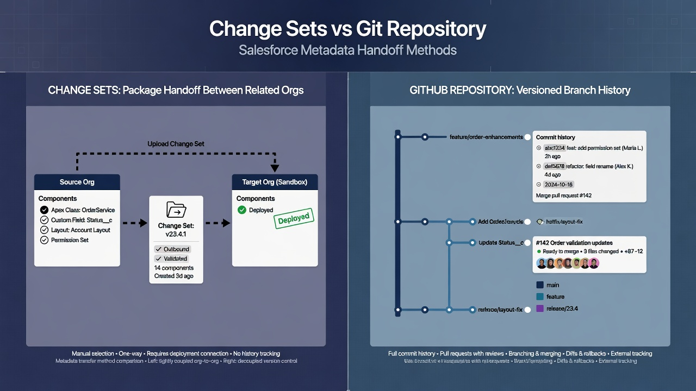
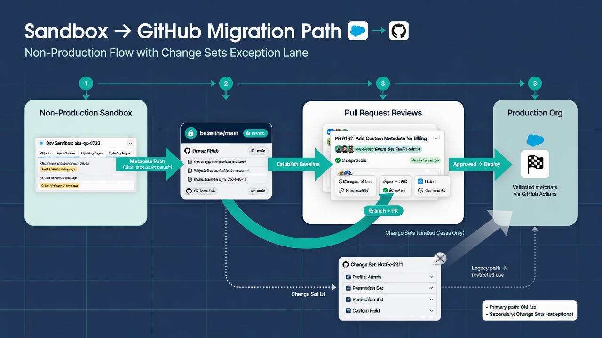
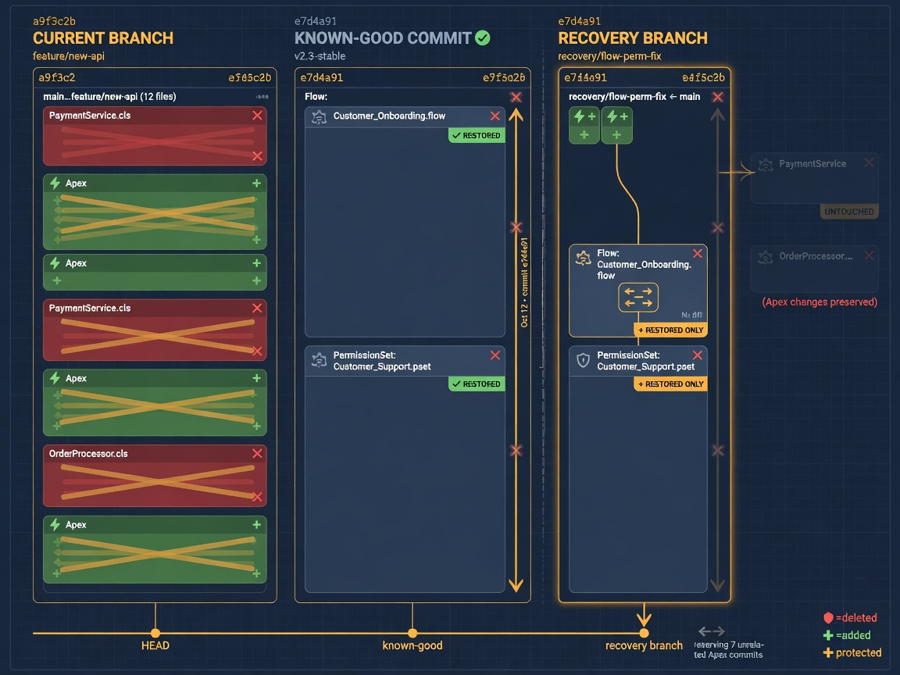

Salesforce change sets vs GitHub is less a purity contest than a practical question about how your team wants to see, review, and recover configuration work. Change Sets still move metadata between related orgs in a familiar, point-and-click way. A private GitHub repository stores Salesforce metadata as files with history, diffs, pull requests, and automation hooks. Many teams keep both for a while. The useful goal is not to declare Change Sets obsolete on day one. It is to decide which jobs source control should own, which jobs Change Sets can still cover, and how to migrate without freezing the business.

This post compares the two paths honestly: strengths, limits, dependency visibility, reviews, automation, recovery, and a migration sequence that prefers a non-production pilot first. It also repeats a boundary that matters throughout: metadata in the repository is configuration history, not a substitute for record-data backup. Accounts, Opportunities, Case comments, and uploaded files belong in approved data protection processes, not in a Git commit that happens to look thorough.

*Package handoff between orgs versus commit history, pull requests, and automation.*

## What each tool is actually for

Change Sets are a Salesforce-native packaging and deployment mechanism between connected orgs in the same production family. An administrator or developer selects components in a source org, uploads an outbound Change Set, and deploys an inbound Change Set in the target after validation. The model is operational and UI-centric. It answers “can we move this package from sandbox A to sandbox B or production?” It does not answer “what did this component look like six months ago across every release?” or “who reviewed which lines of this Flow definition?”

Git and GitHub answer a different family of questions. Git records file-level history for an approved metadata scope. GitHub adds collaboration: private repository access, pull requests, required reviewers, branch protection, CODEOWNERS, issues, and automation such as GitHub Actions. The repository becomes a durable, inspectable timeline of configuration as source. Salesforce CLI commands such as retrieve and deploy become the bridge between org and repository. Official starting points include the [Salesforce CLI project retrieve command reference](https://developer.salesforce.com/docs/platform/salesforce-cli-reference/guide/cli_reference_project_retrieve_start.html) and GitHub’s documentation on [pull requests](https://docs.github.com/en/pull-requests/collaborating-with-pull-requests/proposing-changes-to-your-work-with-pull-requests/about-pull-requests).

Neither path is magic. Change Sets can fail on dependencies, order, or API limits just as automated deploys can. Git will not invent business intent from a noisy XML diff. Both require discipline around scope, environments, testing, and who is allowed to push changes into production.

## Where Change Sets still earn their keep

It is easy to caricature Change Sets as “the old way.” For many mid-size Salesforce programs, they remain useful for a long time, especially when the team is small and the change volume is modest.

Change Sets tend to work well when:

- the change is a known set of components between related orgs;
- the people doing the work already live in Setup more than in a terminal;
- the organization has not yet invested in Salesforce DX project structure;
- a one-off hotfix must move through a familiar control path while source control is still maturing;
- auditors or change boards already understand “Change Set name + validation + deploy” as evidence;
- the dependency surface is small enough that manual selection remains trustworthy.

Change Sets also keep a social advantage: the package is a shared object inside Salesforce. Stakeholders who never open GitHub can still see that something named “Q2 Pricing Rules” was uploaded and validated. That visibility is real, even if the history is weak compared with Git.

Honest limits of Change Sets include weak long-term history, limited review of actual file contents, awkward collaboration across large teams, poor support for modern branching strategies, and little native automation for continuous validation. Reconstructing “what production looked like last quarter” from Change Set history alone is usually painful. Comparing two packages line by line is not the product’s strength. Dependency discovery often remains a human exercise: you remember the field, forget the validation rule, and learn about the omission at deploy time.

## Where GitHub becomes the better system of record

Source control starts to replace the old package path when configuration volume, team size, or risk outgrow memory and manual packaging.

GitHub is typically stronger when you need:

- a durable, searchable history of metadata revisions;
- line-level diffs of Apex, Flow XML, permission sets, and object definitions;
- pull request reviews with comments, required approvals, and status checks;
- parallel workstreams without overwriting each other’s “the package”;
- automated retrieve, validate, and deploy jobs with logs you can keep;
- recovery of a previous known-good metadata revision into a sandbox for investigation;
- ownership signals such as CODEOWNERS for objects, packages, or folders;
- release tags that pin exactly what was approved.

The repository does not automatically improve Salesforce quality. It improves the conditions under which quality work can happen. Reviewers can see what changed. Automation can prove that a revision validates. Operators can answer “when did this permission set widen?” with a commit rather than a guess.

GitHub’s model for protected branches and required checks is documented in [About protected branches](https://docs.github.com/en/repositories/configuring-branches-and-merges-in-your-repository/managing-protected-branches/about-protected-branches). Those controls matter more as the repository becomes the gate for production-bound work.

## Comparison axes that actually affect day-to-day work

### History and auditability

Change Sets leave a trail of package names, statuses, and deployment outcomes inside Salesforce. That trail is useful for “what was deployed when,” but it is a thin substitute for full configuration history. Git history preserves successive versions of files. A tagged release can reconstruct the approved metadata set associated with a launch. If the team needs forensic answers about configuration evolution, the repository wins.

Remember the scope boundary: Git history of metadata is not a full org audit of record data, user activity, or every Setup click that never entered source control. Drift detection and retrieval discipline still matter.

### Dependency visibility

Change Sets require the sender to select components. Missing a dependent field, layout, or Apex class is a classic failure mode. Git does not magically resolve dependencies either, but a repository makes the relationship surface more inspectable: package directories, manifests, object folders, and repeated co-changes in history. Teams can maintain explicit manifests for features and releases. Reviewers can ask “why is this permission set in the PR if the only Apex change is elsewhere?” Dependency pain does not disappear; it becomes visible earlier.

### Reviews

A Change Set review often means opening components in Setup or trusting a spreadsheet of names. A pull request review means reading the actual diff, asking for a smaller change set, and attaching CI results. For Apex, the value is obvious. For Flow XML and permission set XML, the value is real but requires training—reviewers must learn what noise looks like and which fields are high risk. That training investment is part of the migration cost.

### Automation

Change Sets are largely human-driven. GitHub Actions and Salesforce CLI can retrieve on a schedule, validate on pull request, deploy to a sandbox after merge, and gate production behind environments and approvals. Automation multiplies whatever quality practices you already have. If the repository is incomplete or the manifest is wrong, automation will efficiently prove the wrong thing. Start simple: snapshot and validate before full continuous delivery.

### Environments and coupling

Change Sets assume related orgs in the Salesforce deployment relationship model. Git-based pipelines can target any org the authenticated identity can reach, which is powerful and dangerous. Separate identities for snapshot, validation, and production deploy. Prefer non-production targets first. Do not hand a production deploy credential to the same workflow that only needs to retrieve metadata for a nightly snapshot.

### Recovery and rollback narrative

Neither Change Sets nor Git is a one-click “undo production.” Rollback is a plan: identify the last known-good revision, validate it in a sandbox, understand data implications, and deploy deliberately. Git makes the previous metadata revision findable. Change Sets may still exist as an emergency path for some teams, but the repository should become the authoritative place to find the revision worth restoring. Metadata restore is not record-data restore.

*Baseline the sandbox, review in GitHub, and keep Change Sets as a limited exception lane.*

## A migration path without big-bang

The teams that struggle most try to abolish Change Sets, introduce branching theory, and automate production deploys in the same quarter. A calmer path works better.

### Phase 1: Make the org inspectable

Stand up a Salesforce DX project and a private GitHub repository. Authenticate Salesforce CLI against a non-production org first. Retrieve an approved metadata scope. Commit a baseline. Document what is in scope and what is not. Explicitly state that the repository is not a record-data backup.

At this stage, production delivery can still use Change Sets. The repository’s job is visibility: nightly or on-demand retrieves, diffs against the baseline, and a place to store release notes next to metadata.

### Phase 2: Put planned work into pull requests

For new work, developers and admins land changes in branches and open pull requests. Even if production still deploys via Change Set, the PR becomes the review surface. That dual path feels redundant for a while. The redundancy is intentional. It builds review muscle without forcing the cutover.

Use a lightweight PR template: purpose, org target, risk notes, test evidence, and whether destructive changes are included. Keep PRs focused. A 400-file permission set cleanup mixed with a pricing Flow rewrite is hard to review honestly.

### Phase 3: Add validation automation

Attach GitHub Actions that run Salesforce CLI dry-run deploys against a dedicated validation sandbox or scratch-org-like target appropriate to your licensing and process. Prefer dry-run and controlled test levels before any production CD. Publish component inventories and test results on the PR. Green checks are evidence, not permission to skip human review.

Salesforce CLI deploy options, including dry-run and test levels, are documented in the [project deploy start reference](https://developer.salesforce.com/docs/platform/salesforce-cli-reference/guide/cli_reference_project_deploy_start.html).

### Phase 4: Deploy from the repository to non-production

After merge to a protected integration branch, automate deploy to a shared sandbox. Let the team live with “the branch is the package” for real features. Fix pathing, API versions, destructive changes, and secret handling while production still has a known fallback.

### Phase 5: Production path from Git with deliberate gates

Only when non-production deploys are boring should production promotion come primarily from the repository. Use protected environments, required reviewers, and a release owner who understands residual risk. Change Sets may remain as an emergency lane with explicit policy: when they are allowed, who approves, and how the repository is updated afterward so Git does not drift from production.

### Phase 6: Reduce Change Set use deliberately

Do not ban Change Sets by slogan. Retire them by making the Git path faster and safer for the common case. Keep a written exception list. If someone must use a Change Set, require a follow-up retrieve into the repository so source control remains the system of record.

## Dependency visibility and packaging discipline

Teams moving from Change Sets often discover that “select the components you remember” does not scale. Source control encourages better packaging habits:

- maintain feature-level or domain-level manifests;
- keep package directories coherent by ownership;
- prefer source format for version control;
- record API version policy in the project;
- treat profiles and permission sets as high-risk, high-noise metadata;
- call out destructive changes explicitly rather than hoping the deploy engine guesses intent.

Dependency graphs in Salesforce are not always complete in a static analysis sense. Runtime behavior, managed packages, and org-specific features still matter. The repository makes the declared deployment unit reviewable. That is progress, not perfection.

## Reviews: what improves and what still hurts

GitHub pull requests improve review for Apex and for structured configuration, provided reviewers know the risk patterns. Permission set diffs that add broad object access deserve more scrutiny than a label change. Flow changes that alter entry conditions or hard-coded IDs deserve scenario testing, not only XML skimming. Custom field type changes and validation rule edits can break data entry even when the deploy succeeds.

What still hurts: auto-generated XML noise, reordered elements, and large “re-retrieve the world” commits. Mitigations include stable retrieval scripts, consistent CLI versions, scoped manifests, and a culture that rejects unreadable mega-diffs. If a PR cannot be reviewed, split it.

Human review plus automation is the durable model. Automation catches compile and test failures. Humans catch product mistakes, permission overreach, and “this is the wrong environment.”

## Automation and release governance

Once history lives in GitHub, automation becomes natural:

- scheduled metadata snapshots from non-production, later production read-only;
- pull request validation with dry-run deploys;
- artifact retention of deployment reports;
- notifications to the release channel;
- optional promotion workflows with environment protection rules.

GitHub’s overview of [GitHub Actions](https://docs.github.com/en/actions/learn-github-actions/understanding-github-actions) is a solid primer for teams designing those workflows. Keep identities separate. Keep secrets out of the repository. Prefer least privilege. Monitor failures so a broken snapshot job does not silently stop capturing history.

Release governance improves when the release artifact is a git revision, not a loosely named Change Set assembled under time pressure. Tags, release PRs, and checklists can live next to the metadata they describe.

## When Change Sets still appear after you “switch”

Even mature teams see Change Sets occasionally:

- vendor or partner work that arrives as a package habit;
- emergency production fixes when the pipeline is unavailable;
- legacy processes owned by a team that has not onboarded to Git yet;
- org relationships where a quick sandbox-to-sandbox move is still the lowest friction path;
- temporary coexistence during a multi-team migration.

The healthy response is policy, not surprise. Document the exceptions. Require repository synchronization after any out-of-band deploy. Treat unrecorded production changes as incidents of process, not as normal life.

## Honest limits of the GitHub path

Source control will not:

- replace Salesforce’s runtime platform;
- back up record data by storing metadata;
- guarantee that a green dry-run means perfect user experience;
- remove the need for sandbox strategy and UAT;
- make bad requirements into good metadata;
- eliminate all org drift if people still edit production directly;
- review itself—someone still has to read high-risk diffs.

There are also cost and skill requirements: Salesforce CLI fluency, Git hygiene, secret management, and CI ownership. For a very small org with infrequent changes, a carefully run Change Set process plus periodic exports may still be enough. The tipping point is usually when history, parallel work, or automation becomes more valuable than the comfort of the old package path.

## Practical decision guide

Choose Change Sets as the primary path when change volume is low, the team is Setup-first, environments are simple, and leadership has not funded source control practices yet. Still consider a read-only repository snapshot for recovery visibility.

Choose GitHub as the system of record when multiple people change the same org, you need durable history, you want PR reviews and CI, or you are preparing for safer, repeatable releases. Keep Change Sets as a documented exception during transition.

Prefer hybrid during migration: Change Sets for production if needed, repository for history and review, non-production deploys from Git first, production from Git only after the pipeline is trusted.

*GitHub is the durable history; Change Sets remain a limited exception lane.*

## A week-one pilot that does not freeze delivery

Teams often stall because they imagine the migration must finish before the next release. A better frame is a week-one pilot that sits beside current delivery.

Day one and two: create the private repository, add a Salesforce DX project skeleton, authenticate Salesforce CLI to a non-production org, and retrieve a deliberately small scope—perhaps one custom object family, related permission sets, and a single Flow the team already understands. Commit the baseline with a README that states scope, org alias policy, and the metadata-versus-record-data boundary.

Day three: make a trivial known change in the sandbox, retrieve again, and confirm the diff matches expectations. If the diff is empty or enormous for the wrong reasons, fix scope and tooling before expanding.

Day four: open a pull request for a real but low-risk change. Practice description, review, and merge even if production will still use a Change Set this sprint.

Day five: write the exception policy for Change Sets and the post-exception retrieve rule. Name owners for repository access and for the eventual snapshot workflow.

That week does not replace Change Sets. It proves the repository can become the system of record without a big-bang freeze. Expand scope only after the small pilot stays boring for a few cycles.

## How to talk about the change with stakeholders

Admins may hear “GitHub” and assume they are being forced into a developer-only world. Frame the change as shared visibility. Pull requests can include screenshots, test notes, and business context. Source control is a collaboration surface, not a culture test. Offer a short paired session where an admin and a developer review the same Flow diff together so the interface feels less foreign.

Leaders may hear “automation” and assume immediate production CD. Frame the early phases as risk reduction: better history, better review, safer validation in non-production. Continuous delivery to production is optional and later. Measure early success with questions such as “can we show what changed last week?” rather than “did we eliminate every manual step?”

Security stakeholders will ask about credentials, private repositories, and what data might land in Git. Answer with least privilege, private repo defaults, secret storage outside the tree, and the metadata-versus-records boundary. Offer a sample of what is retrieved so the conversation is concrete. Invite them to review the integration user permissions and the list of excluded metadata types before any production read access is granted.

Change managers and auditors often care less about Git terminology than about evidence. Show them a pull request with approvals, a validation log from Salesforce CLI, and a tagged revision. Those artifacts usually map cleanly onto existing control language even when the packaging UI changes.

## A short operating checklist for teams in transition

- Repository private; ownership named; access reviewed.
- Non-production org used for the pilot retrieve and early deploys.
- Manifest or package scope written down and versioned.
- Metadata ≠ record data stated in the README and runbooks.
- PR template in place; large unreadable diffs rejected.
- Validation automation on PRs before any production CD ambition.
- Separate Salesforce identities for read/snapshot vs deploy.
- Production deploy gate with human approval and environment protection.
- Post-Change-Set retrieve required whenever an exception deploy happens.
- Release tags or release PRs for significant promotions.
- Monitoring for failed snapshot and validation jobs.
- Recovery exercise at least once: restore metadata revision into a sandbox and validate.

## Closing perspective

Salesforce change sets vs GitHub is really a question about whether your release path is a sequence of packages people assemble under pressure or a versioned configuration history people can inspect, review, and automate. Change Sets remain competent for bounded moves between related orgs. GitHub becomes superior as the long-term system of record for metadata when history, collaboration, and automation matter. The best migrations are progressive: baseline the repository, review in pull requests, validate with Salesforce CLI, deploy to non-production from Git, then promote production with gates—while never confusing configuration history with record-data backup.

## Frequently asked questions

### Do we need to stop using Change Sets immediately to benefit from GitHub?

No. Many teams start with a private repository and regular metadata retrieves while production still moves through Change Sets. Early value comes from history, drift visibility, and pull request practice. Cut over delivery paths only after non-production deploys from the repository are reliable.

### Is a metadata repository a backup of our Salesforce org?

It is a versioned store of approved configuration metadata, not a complete org backup and not a record-data backup. Business records, files, and many runtime artifacts require separate protection strategies. Be explicit in documentation so recovery expectations stay honest.

### What should we pilot first: production snapshot or sandbox pipeline?

Prefer a non-production org for the first retrieve, first pull request workflow, and first automated validate or deploy experiments. Add production read-only snapshots when access, scope, and security review are ready. Production write automation should be last.

### How do we keep GitHub and production from drifting if someone still uses Change Sets?

Require a post-deploy retrieve and commit for any out-of-band change, or treat unrecorded production edits as process incidents. Nightly snapshots help detect drift, but policy and ownership prevent silent divergence better than tooling alone.

### Which internal posts should readers open next for implementation detail?

For repository shape and baseline practices, link to the Salesforce source control GitHub foundation and metadata repository structure posts. For automation, link to Salesforce CI/CD with GitHub Actions and deployment validation posts. For review quality, link to the Salesforce pull request metadata review guide. For security of workflow credentials, link to the GitHub Actions Salesforce security post.
