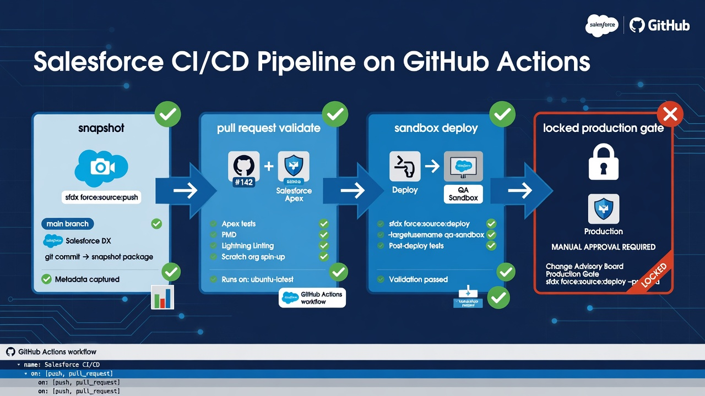
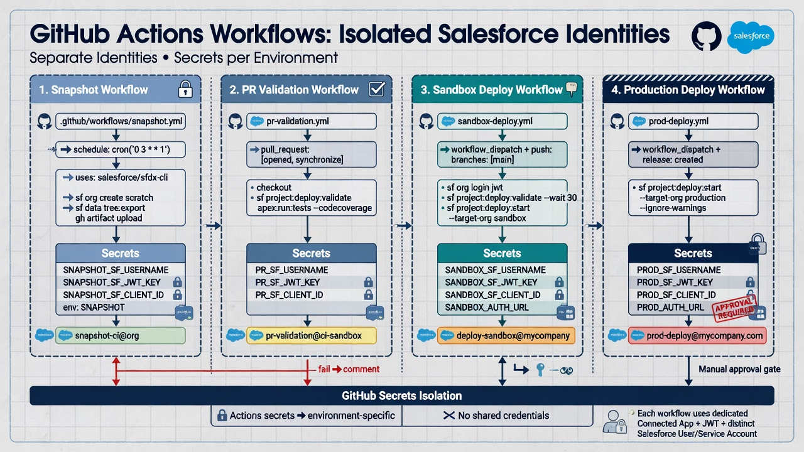

Salesforce CI/CD with GitHub Actions works best when the pipeline is progressive rather than theatrical. Teams do not need a full continuous delivery machine on day one. They need a private repository of Salesforce metadata, Salesforce CLI running in GitHub Actions with clear identities, validation that attaches evidence to pull requests, and only later a carefully gated path into higher environments. Starting with production CD is how pipelines become scary, brittle, or quietly bypassed.

This guide describes a practical design: retrieve and snapshot, validate on pull request, deploy through deliberate gates, keep workflows and credentials separated, choose test levels intentionally, retain artifacts, monitor failures, and add acceptance checks that Salesforce dry runs cannot cover. Throughout, treat metadata automation as configuration control—not record-data backup. Prefer non-production orgs until the process is boring.

*Snapshot, validate, sandbox deploy, then a locked production gate.*

## What “CI/CD” should mean for Salesforce metadata

In application software, continuous integration often means build and test on every change, and continuous delivery means that same revision is always releasable. Salesforce metadata inherits those ideas imperfectly. There is no single binary artifact. There are package directories, manifests, destructive changes, org-shaped dependencies, Apex tests, Flows that only fail in user journeys, and permission models that dry runs do not fully prove.

A practical definition for this domain:

- Continuous integration: every proposed metadata revision is retrieved or assembled consistently, inspected, and validated with Salesforce CLI against a known target under a known test policy.
- Continuous delivery (later): the same reviewed revision can be promoted through environments with automation and human gates, without hand-rebuilding the package.
- Continuous deployment to production is optional and often inappropriate early. Many mature teams still require a release owner click for production.

GitHub Actions is the orchestration layer. Salesforce CLI is the tool that talks to the org. Git history is the system of record for what was proposed and approved. Official orientation materials include GitHub’s [Understanding GitHub Actions](https://docs.github.com/en/actions/learn-github-actions/understanding-github-actions) and the Salesforce CLI references for [project retrieve start](https://developer.salesforce.com/docs/platform/salesforce-cli-reference/guide/cli_reference_project_retrieve_start.html) and [project deploy start](https://developer.salesforce.com/docs/platform/salesforce-cli-reference/guide/cli_reference_project_deploy_start.html).

## Design principle: progressive lanes, not one mega-workflow

A single workflow that snapshots production, validates pull requests, and deploys to production creates a large blast radius and confusing permissions. Split the pipeline into lanes with different identities, triggers, and secrets.

### Lane 1: Retrieve / snapshot

Purpose: keep the repository honest about org state for an approved metadata scope.

Typical trigger: schedule (nightly) plus manual workflow_dispatch.

Typical target: start with a non-production org; add production as read-only later after security review.

Identity: a Salesforce user or integration principal that can read the approved metadata scope and cannot deploy.

GitHub permissions: enough to commit snapshot branches or open snapshot PRs if that is your pattern; no production deploy secrets available to this workflow.

Outputs: commit or PR of retrieved metadata, summary of changed components, optional drift report against the main branch.

Honesty check: a snapshot is not a full backup of the org and is not a record-data export. Document scope.

### Lane 2: Pull request validation

Purpose: prove that the proposed revision is deployable under policy before merge.

Typical trigger: pull_request to protected branches.

Typical target: a dedicated validation sandbox or other non-production org that approximates production shape for the components you care about.

Identity: deploy-capable only in the validation org, never production.

Checks often include: project shape validity, static lint if you have it, manifest construction, `sf project deploy start --dry-run` with an explicit test level, and a printed component inventory.

Outputs: job summary, deployment report artifact, status check required by branch protection.

GitHub documents [branch protection](https://docs.github.com/en/repositories/configuring-branches-and-merges-in-your-repository/managing-protected-branches/about-protected-branches) as the place to require those status checks before merge.

### Lane 3: Deploy gate (non-production first)

Purpose: apply merged revisions to shared sandboxes so integration testing uses the same source of truth as the repository.

Typical trigger: push to an integration branch, or workflow_dispatch with an environment approval.

Identity: sandbox deploy principal, separate from validation if feasible.

Outputs: deploy result, post-deploy smoke notes, link to commit SHA deployed.

### Lane 4: Production promotion (only when ready)

Purpose: deploy a known git revision to production under human and technical gates.

Typical trigger: manual or release event, never every merge by default for most Salesforce programs.

Controls: GitHub Environment protection rules, required reviewers, restricted secrets, change ticket reference, frozen manifest or tag.

Identity: production deploy principal with least privilege, monitored, rotatable.

This lane should reuse the same source that passed validation—not a newly assembled folder that “looks like” the PR.

## Pipeline shape that scales from pilot to program

### Stage A: Foundation without CD

1. Salesforce DX project in a private repository.
2. Documented metadata scope and exclusions.
3. CLI authentication pattern approved by security.
4. Manual retrieve and commit from a non-production org.
5. Basic PR template and CODEOWNERS for high-risk paths.

No Actions required yet. Many failures at later stages are really foundation failures.

### Stage B: Snapshot automation

Add the retrieve lane on a schedule. Alert if it fails. Review noisy diffs so you do not normalize giant meaningless commits. Pin Salesforce CLI version in the workflow so “it worked last month” remains true.

### Stage C: PR dry-run validation

Add the validation lane. Require the check on protected branches. Keep the validation org healthy; a broken sandbox produces false failures that train people to ignore CI.

### Stage D: Automated sandbox deploy

Deploy from main or release branches to a shared sandbox. Let QA and admins test against repository-backed state. Capture feedback on test levels, component selection, and destructive changes.

### Stage E: Production gate

Introduce production deploy with environment approvals. Keep it deliberate. Measure success by calm releases, not by how often the button is automatic.

*Snapshot, validation, sandbox deploy, and production deploy should not share one super-user.*

## Separate workflows and identities in practice

### Why separation matters

If a pull request from a fork or a compromised dependency can reach production credentials, you have a serious incident pattern. Even without malice, a misconfigured matrix or reused secret can deploy to the wrong org. Separation is operational safety.

### Suggested identity map

- Snapshot identity: metadata read on specific orgs; no modify-all aspirations; no production write.
- Validation identity: deploy and test rights on validation sandbox only.
- Sandbox deploy identity: deploy rights on shared sandboxes.
- Production deploy identity: minimal rights required for approved production releases; used only by the production workflow and environment.

On the GitHub side, use environment-scoped secrets, restrict which branches can use the production environment, and keep `GITHUB_TOKEN` permissions as narrow as the job allows. Prefer OpenID Connect or other modern patterns where your policy supports them; whatever you choose, document rotation and ownership.

### Authentication notes

Salesforce CLI login for automation commonly uses JWT-based flows with a connected or external client app and a certificate. Salesforce’s [JWT bearer flow guidance](https://developer.salesforce.com/docs/atlas.en-us.sfdx_dev.meta/sfdx_dev/sfdx_dev_auth_jwt_flow.htm) explains platform requirements. Store private keys in GitHub secrets or a secret manager, never in the repository. Rotate on a schedule and after personnel changes.

## Dry-run as the default proof on pull requests

A Metadata API dry run validates without saving changes in the target. That is the right default for pull request CI. It exercises compilation, many dependency checks, and Apex tests under the selected test level without mutating the validation org on every experiment—though org state still matters for what “valid” means relative to existing configuration.

Use `sf project deploy start` with `--dry-run`, an explicit manifest or metadata selection, and an explicit test level. Print:

- commit SHA;
- target org alias (not secrets);
- API version policy;
- component inventory;
- test level and key test results;
- whether destructive changes were included.

A green dry run is strong evidence. It is not proof of correct business behavior, correct permissions for end users, safe data migration, or integration correctness. Those gaps belong in release checklists and acceptance tests.

## Test levels: choose on purpose

Salesforce deploy test levels are not interchangeable. Teams often default to “run local tests” in higher environments and something lighter in sandboxes, but the right policy depends on risk, org size, and how long CI can take.

Consider:

- No tests: only for narrow non-Apex metadata in low-risk sandboxes, if policy allows—never as a silent production default.
- Run specified tests: useful when the change set is Apex-focused and you maintain a mapped test suite; dangerous if the mapping is stale.
- Run local tests: common production-oriented choice for many orgs; can be slow.
- Run all tests in org: expensive; sometimes required by policy or platform rules depending on context.

Document the policy per environment. Do not let a workflow silently fall back to a weaker level when a flag is missing. Make missing configuration fail the job.

Apex tests still miss Flow paths, UI behavior, sharing quirks, and integration credentials. Complement CI with scenario tests in sandboxes.

## Environments, branches, and what maps to what

A simple model that works for many teams:

- feature branches → PR validation only;
- `main` or `develop` → deploy to a shared integration sandbox after merge;
- `release/*` tags or branches → candidate validation against a staging sandbox that mirrors production more closely;
- production → manual promotion of a tag with environment approval.

Avoid inventing ten long-lived org-tracking branches that nobody merges. Prefer trunk-ish flow with short-lived features if the team can manage it. If Salesforce work is admin-heavy, train on small PRs rather than weekly mega-branches.

Keep environment URLs, aliases, and secret names obvious in workflow files so operators can see intent. Obscurity is not security.

## Artifacts worth keeping

CI without artifacts forces people to re-run jobs to understand history. Retain for a defined period:

- deploy and validate reports from Salesforce CLI;
- component lists used for the job;
- test result summaries;
- maybe SARIF or lint output if you add static analysis;
- links from job summaries to the exact commit.

Do not upload secrets, auth files, or full org dumps. Do not accidentally archive record data exports in a metadata pipeline. Be careful with logs that might print tokens if a script is sloppy.

GitHub Actions artifact and log retention should match your compliance story. Name artifacts with commit SHA and environment.

## What not to do at the start

Do not begin with production continuous deployment. Do not share one Salesforce credential across all workflows. Do not validate by deploying a random superset of the whole package directory if that hides the real change and times out every PR. Do not allow unprotected branches to access production environments. Do not treat a green check as a substitute for reading high-risk permission set or Flow diffs. Do not store JWT keys in the repo “just for the pilot.” Do not claim the pipeline backs up customer records.

The pilot should feel slightly underpowered and very clear. Clarity beats cleverness.

## Monitoring and operability

Pipelines fail. The failure modes that hurt most are silent ones: snapshot jobs that stop running, validation that is no longer required on the branch, or a sandbox that expired.

Operational practices:

- alert on workflow failure for snapshot and production-related jobs;
- dashboard or scheduled review of Actions run history;
- owners for workflow files listed in CODEOWNERS;
- runbook for revoked credentials and emergency pipeline disable;
- periodic restore drill: take a known metadata revision and deploy it to a sandbox to prove recovery of configuration;
- track mean time to fix red main validation.

When CI is red for days, people invent side paths. Keep the main path green and trusted.

## Acceptance tests beyond the Metadata API

Design explicit non-CI or post-deploy checks for things dry runs cannot prove:

- critical user journeys in a sandbox (lead conversion, order path, service case);
- permission smoke tests for key personas;
- integration connectivity where safe;
- data migration dry runs on anonymized samples if a release includes data work;
- performance checks for heavy automations if that is a known risk.

Automate what you can with browser or API tests later. Early on, a written acceptance checklist executed against the sandbox that received the git revision is enough to prevent “CI was green so we skipped UAT.”

## Example control narrative for a release

1. Developer or admin opens a PR with a focused metadata change and test notes.
2. GitHub Actions runs dry-run deploy to the validation org with the team’s test level.
3. Reviewers read the diff; CODEOWNERS for permission sets must approve if those files change.
4. PR merges only with required checks and approvals.
5. Integration branch deploys to shared sandbox automatically.
6. QA executes acceptance checklist.
7. Release owner creates a tag from the approved commit.
8. Production workflow runs only against that tag, with environment approvals and ticket reference.
9. Post-deploy monitoring window and snapshot job continue to track drift.

Every step leaves evidence: PR, checks, artifacts, tag, Actions run, and change record.

[IMAGE PROMPT: Editorial timeline of a Salesforce release controlled by GitHub from pull request through sandbox acceptance to a production environment approval gate, with artifact icons at each stage; calm navy and soft green, 16:9]

## Component selection strategies for CI speed and correctness

Whole-package validation is simple and sometimes correct for release candidates. For daily PRs, prefer a logical unit:

- changed metadata plus required companions;
- a feature manifest maintained with the feature;
- a package directory with clear ownership.

Profiles and permission sets are frequent sources of pain: large diffs, merge conflicts, and security impact. Prefer permission sets over editing profiles when you can, and review them carefully. Flows and custom objects need metadata-aware selection because source format decomposition does not always match deploy unit boundaries.

The workflow should fail if it cannot determine a deploy set, rather than defaulting to “everything” without saying so.

## Destructive changes and pipeline safety

Deletes need explicit manifests and explicit review. A pipeline that applies destructive changes because a file vanished from a retrieve can be dangerous if the retrieve scope was wrong. Separate “source no longer present in git” from “we intend to delete in the org.” Require a human-labeled destructive path in the PR template and a distinct validation step that prints what will be removed.

Prefer non-production proof of destructive changes before production. Metadata deletion is not the same as deleting business records, but it can strand or break record usage in the org.

## Security baseline for Actions and Salesforce

- private repository for organization metadata;
- least-privilege Salesforce principals;
- environment-scoped secrets;
- pinned action versions (commit SHA pinning where policy requires);
- restricted permissions for `GITHUB_TOKEN`;
- careful handling of `pull_request_target` and fork PRs;
- no echo of secrets in scripts;
- audit access to who can approve production environments.

Security is part of pipeline design, not a later polish pass.

## Measuring whether the pipeline is helping

Useful signals:

- time from PR open to first meaningful validation result;
- rate of production incidents tied to unreviewed metadata;
- percentage of production changes that match a git revision;
- number of emergency Change Set or Setup-only production edits;
- snapshot job success rate;
- reviewer ability to describe what a PR changes without opening Setup.

If CI is slow and noisy, people will work around it. Invest in selection logic and a healthy validation org before adding more stages.

## Pilot definition of done

Before anyone argues about production continuous deployment, agree what “the pipeline works” means in non-production terms:

- A scheduled snapshot workflow has succeeded on multiple nights against the pilot org and fails loudly when credentials or scope break.
- A pull request with intentional Apex or Flow changes receives a dry-run result, a component inventory, and a human review comment—not only a green icon.
- A merged commit can be deployed to a shared sandbox by workflow without hand-building a Change Set.
- Production deploy secrets are absent from pull request workflows and reachable only through a protected GitHub Environment.
- Documentation states that metadata history is not record-data backup and lists the approved retrieval scope.
- A second teammate can disable a workflow and rotate a Salesforce integration credential using a written runbook.

When those checks pass for several sprints, the team has earned the conversation about production gates. Until then, keep shipping through whatever safe path you already operate, and keep improving the repository path in parallel.

## Closing perspective

Salesforce CI/CD with GitHub Actions should grow like a scaffold: repository foundation, snapshot visibility, pull request dry runs, sandbox deploys, then a gated production promotion. Separate workflows and identities. Prefer non-production until the process is trusted. Keep artifacts and monitoring so the system remains operable. Never confuse metadata pipelines with record-data backup. The goal is not maximum automation. The goal is repeatable evidence that the same reviewed configuration can move safely through environments.

## Frequently asked questions

### Should every merge deploy straight to production?

Usually not at the beginning, and often not ever for high-risk Salesforce orgs. Prefer automatic validation and sandbox deploys first. Production promotion can remain a deliberate, approved workflow against a tag even when everything else is automated.

### Can GitHub Actions replace Apex tests or UAT?

No. Actions orchestrate Salesforce CLI validation and deploys. Apex tests cover coded logic under the chosen test level. User acceptance and persona permission checks still catch Flow behavior, usability, and business-rule mistakes that compile cleanly.

### How do we handle secrets for multiple orgs?

Use separate GitHub Environments and secrets per org or per lane. Do not reuse production credentials in pull request workflows. Document rotation owners. Keep private keys out of git history entirely.

### What is a sensible first pilot?

Private repo, non-production retrieve, one scheduled snapshot workflow, and one PR dry-run validation workflow with a required status check. Add sandbox deploy after those two are reliable. Defer production CD.

### Which internal articles pair well with this pipeline guide?

Link to the Salesforce source control foundation post for repository setup, the deployment validation post for dry-run detail, the GitHub Actions Salesforce security post for hardening, the change sets versus GitHub comparison for migration context, and the pull request metadata review guide for human gates that sit beside CI.
