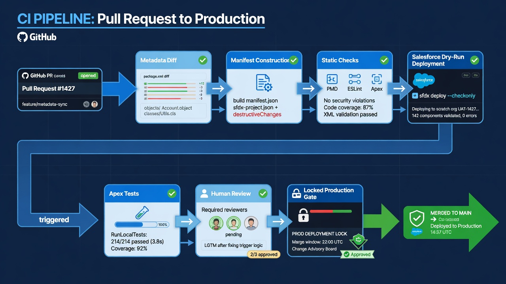

Salesforce deployment validation with GitHub Actions gives a team an answer to a practical question before production changes: can this exact metadata revision pass Salesforce validation against the intended target under a known test policy? It turns a manual preflight into a repeatable check attached to the pull request or release commit.

That answer is useful, but it is narrower than “the release is safe.” A Metadata API dry run can verify component validity, dependencies Salesforce detects, Apex compilation, and selected tests without saving the deployment. It cannot prove every user journey, integration, data migration, permission outcome, or operational side effect. Good CI presents validation as strong evidence inside a broader release decision.

The goal is a workflow whose green result is reproducible and legible. Reviewers should know which commit, components, target, API version, test level, and command produced it. The eventual deployment should use the same reviewed source—not a newly assembled folder that merely resembles what passed.

*Diff, static checks, dry-run, tests, human review—then a separate production gate.*

## What Salesforce deployment validation proves

Salesforce CLI's `sf project deploy start` command supports `--dry-run`, which validates a deployment and runs Apex tests without saving the changes in the target org. The current [Salesforce CLI command reference](https://developer.salesforce.com/docs/platform/salesforce-cli-reference/guide/cli_reference_project_deploy_start.html) documents manifests, source directories, metadata selectors, test levels, asynchronous behavior, destructive-change inputs, and result formats.

A successful dry run can establish that:

- the selected source can be interpreted as deployable Salesforce metadata;
- referenced components available in the target satisfy validation-time requirements;
- Apex in the deployment compiles;
- the chosen Apex tests pass and required coverage is met under that test mode;
- destructive-change manifests are structurally acceptable;
- the authenticated identity has enough access to perform the validation;
- the deployment package fits current platform limits and target capabilities.

It does not necessarily establish that:

- users have the correct functional access after deployment;
- Flows, validation rules, or automation produce desired business outcomes;
- integrations are configured correctly for the target environment;
- current production data satisfies new constraints;
- a data migration is safe or complete;
- asynchronous work, scheduled jobs, or external calls behave correctly;
- the production org remains unchanged after validation but before deployment;
- the artifact later deployed is byte-for-byte the same as the validated source.

Treat those limitations as inputs to the release plan rather than reasons to dismiss validation.

## Validate the right unit of change

The easiest CI workflow deploys an entire package directory for every pull request. That can be slow and can hide the actual change in a sea of unrelated components. The smallest possible file selection can fail in the opposite direction by omitting dependencies.

Choose a logical deployment unit. It might be:

- all metadata changed by the pull request plus required companions;
- a maintained feature manifest;
- one package directory with coherent ownership;
- an explicit release manifest assembled and reviewed for the release;
- a full-org deployment set for a final production preflight.

Different stages can use different units. Pull requests benefit from fast, focused feedback. A release candidate may require broader validation against the production target.

Do not assume every changed XML file corresponds one-to-one with a deployable component. Salesforce source format decomposes some metadata for version control, while deployment behavior may operate at a parent component or bundle level. Profiles, permission sets, custom objects, and Lightning bundles require metadata-aware selection.

The workflow should print a human-readable inventory of components it intends to validate. A reviewer needs more than “47 files changed.”

## Begin with a stable Salesforce DX project

CI should run the same project and commands developers use locally. The repository needs a valid `sfdx-project.json`, source-format metadata in known package directories, manifests or selection logic, a pinned API-version policy, and exclusions for transient files.

Salesforce describes source format as optimized for version control, with `sfdx-project.json` identifying the Salesforce project. Its [source format guidance](https://developer.salesforce.com/docs/platform/code-builder/guide/codebuilder-source-format.html) provides the conceptual foundation.

Before automating validation:

- retrieve and deploy representative components manually in a sandbox;
- confirm package-directory ordering and dependencies;
- remove local authorization files and caches from the repository;
- choose how manifests are maintained;
- pin and test Salesforce CLI and runtime versions;
- document target aliases without committing credentials;
- separate metadata normalization changes from feature changes.

If a local one-component validation is not reproducible, GitHub Actions will make the uncertainty faster, not smaller.

## Choose validation targets deliberately

A target org supplies configuration, installed packages, features, permissions, and data shape that influence validation. One org rarely answers every question.

### Development validation target

A developer sandbox, scratch org, or other non-production environment can provide quick feedback. It is appropriate for syntax, compilation, focused tests, and early dependency checks. It may not resemble production closely enough for final confidence.

### Integration target

A shared integration environment can include the combined work of multiple features and expected dependencies. It can expose collisions that isolated development targets miss. It also introduces mutable shared state, so results must identify the target state.

### Staging or UAT target

A production-like sandbox can support broader functional and permission testing. Its refresh age, data differences, and active parallel work affect how closely it represents production.

### Production validation target

A dry run against production provides the strongest platform-level preflight for the current production configuration without saving metadata. It requires production authentication and careful secret controls. It still does not lock the org state between validation and deployment.

Use separate Salesforce integration identities and GitHub environments for each tier. A pull request from untrusted code should never receive production credentials merely because production would be the most accurate validation target.

## Decide when the workflow runs

Common triggers serve different purposes:

- `pull_request` provides feedback as a change is reviewed;
- pushes to the protected branch can validate the merged state;
- `workflow_dispatch` supports an authorized release preflight or rerun;
- release or tag events can validate a named candidate;
- a scheduled workflow can detect dependency or target drift even when source has not changed.

For pull requests, handle forked and untrusted contributions safely. GitHub does not pass ordinary secrets to workflows from forks in the same way it does for trusted branches. Do not work around this by exposing production secrets through `pull_request_target` while executing untrusted code.

Use path filters carefully. Skipping deployment validation for documentation changes is reasonable. A change to manifests, workflow logic, package configuration, or shared scripts may need validation even when no metadata XML changed.

Cancel superseded pull-request runs to reduce noise, but do not cancel an active production deployment simply because a newer commit arrived. Use distinct concurrency policies for CI and deployment.

## Authenticate with the least privilege needed

The validation identity needs access to the target and permission to validate the selected metadata. It does not need authority to perform routine production deployment when the command uses dry-run behavior.

Use a dedicated integration identity where possible. Separate non-production and production credentials. Store secrets at environment or repository scope according to risk. Restrict production validation to trusted branches and reviewed jobs.

GitHub environments can hold target-specific secrets and apply branch or approval rules. GitHub's [deployments and environments documentation](https://docs.github.com/en/actions/reference/workflows-and-actions/deployments-and-environments) explains current protection behavior and plan availability.

Give the workflow's `GITHUB_TOKEN` only the access it needs. Validation usually starts with `contents: read`. Add checks or pull-request write permission only if the job must publish a structured result. Do not grant repository content write access merely because another workflow in the same repository creates snapshot commits.

Keep credential material out of logs, caches, artifacts, and job summaries. Clean temporary key or authorization files even when validation fails.

[IMAGE PROMPT: Security-aware validation architecture showing a read-only pull request job using non-production credentials, then a separately approved production preflight job receiving an environment secret only after review; technical editorial style, white background, 4:3]

## Build a validation workflow in clear stages

A maintainable job has a visible sequence.

### 1. Check out the identified commit

Validate the pull-request head or release SHA explicitly. Record it in the job summary. Avoid validating one commit and reporting the result on another after the branch advances.

### 2. Set up pinned tooling

Install reviewed versions of the runtime, Salesforce CLI, and important actions. Pin third-party actions according to the organization's supply-chain policy. Tool upgrades should arrive through their own pull requests and non-production tests.

### 3. Run repository checks

Validate JSON, XML, YAML, project configuration, manifests, and naming conventions. Scan for secrets and prohibited files. Run Apex linting, JavaScript tests, Lightning tests, or formatting checks that apply to the changed source.

These checks are fast and produce clearer feedback than discovering a malformed file deep inside a deployment.

### 4. Determine the deployment set

Generate or select the manifest. Expand parent components and required dependencies. Print the proposed component list and preserve the manifest as a non-sensitive artifact or job-summary section.

### 5. Authenticate and verify the target

Authenticate using the protected secret. Confirm the org identity against an expected non-secret identifier or environment mapping. A valid credential for the wrong org is still a dangerous failure.

### 6. Start the dry run

Run `sf project deploy start --dry-run` with the selected manifest or source directory, target org, explicit test policy, and machine-readable result option. Choose a timeout appropriate to the target and package.

### 7. Capture asynchronous results

Salesforce deployments are asynchronous. If the CLI returns a job ID before completion, use the documented report or resume path. Preserve the deployment ID so an operator can investigate without starting a duplicate validation.

### 8. Publish a concise result

Summarize the commit, target label, manifest, API version, test level, component counts, elapsed time, deployment ID, warnings, failures, and links to appropriately protected logs. Make the failing component or test easy to find.

### 9. Clean up

Remove credential files and sensitive temporary output in an always-run step. Apply an appropriate retention policy to results.

## Choose an Apex test policy

Test selection is not a cosmetic flag. It determines validation time, coverage evaluation, and the kinds of regression evidence produced.

Salesforce CLI currently documents test levels including `NoTestRun` for eligible development deployments, `RunSpecifiedTests`, `RunLocalTests`, `RunAllTestsInOrg`, and `RunRelevantTests` where available. Exact behavior, defaults, beta status, and coverage requirements can evolve, so use the [official deploy reference](https://developer.salesforce.com/docs/platform/salesforce-cli-reference/guide/cli_reference_project_deploy_start.html) as the implementation authority.

Practical patterns include:

- focused tests on pull requests for quick feedback, with dependency-aware selection;
- local tests on release candidates to approximate production deployment behavior;
- full test runs when risk, package interaction, or policy requires them;
- separate non-deployment unit checks for JavaScript and other repository code.

Specified tests can reduce runtime, but someone must maintain the mapping between metadata and meaningful tests. A passing tiny test list is weak evidence if it avoids the changed behavior. Broad test runs increase confidence but may be slow or flaky.

Track duration, failure rate, and flaky tests. Do not normalize rerunning until green. A flaky required check is an engineering problem because it trains reviewers to distrust CI.

## Handle destructive changes explicitly

Deletion deserves its own review surface. Salesforce deployments can use pre- and post-destructive-change manifests. Whether deletion occurs before or after the main package can affect dependencies.

For every destructive change, report:

- component type and full name;
- why it is being removed;
- references and dependents checked;
- data-bearing implications;
- whether a backup or export is required;
- pre- versus post-deployment ordering;
- recovery plan if downstream behavior fails.

Do not infer production deletion blindly from every path removed in Git. A file can disappear because of a rename, project restructure, manifest change, or retrieval problem.

Salesforce's deploy reference warns that `--ignore-errors` can produce an inconsistent production org and should never be used for production deployments. CI should surface warnings and failures for judgment rather than suppressing them to preserve a green badge.

## Turn validation into review evidence

A status check named “Salesforce validation” is too opaque on its own. The pull request should connect intent, metadata, and result.

Use a pull-request template asking for:

- business purpose and work item;
- affected metadata types and user paths;
- target environments;
- test and validation plan;
- permission and security implications;
- destructive changes;
- data migration or remediation;
- deployment and backout notes;
- screenshots or evidence where declarative behavior benefits from them.

GitHub documents pull-request templates, CODEOWNERS, protected branches, and rulesets in its guide to [managing and standardizing pull requests](https://docs.github.com/en/pull-requests/collaborating-with-pull-requests/getting-started/managing-and-standardizing-pull-requests).

CODEOWNERS can route workflow files, Apex, permissions, or critical automation to appropriate teams. Required reviews should match actual expertise, not just repository membership.

## Prevent validation-to-deployment drift

The strongest validation is wasted if production receives different bytes.

Common drift sources include:

- rebuilding from a later branch head after approval;
- regenerating a manifest differently during deployment;
- updating dependencies between stages;
- editing files on the runner;
- deploying uncommitted local changes manually;
- target-org changes after validation;
- merging another release into the same branch before deployment.

Build an immutable or at least identified release artifact from the validated commit. Include the manifest and checksum. Promote that artifact or reconstruct only from the exact commit with pinned tooling. Require production deployment to state the validated SHA.

A production dry run can become stale when the org changes. Define a freshness window based on release volume and risk. Revalidate when the source commit, deployment set, target baseline, or test policy changes.

Salesforce supports quick deployment of a recently validated deployment under platform conditions. If the team uses that capability, capture the validation ID and confirm current eligibility and timing rules in Salesforce documentation. Do not advertise a guaranteed quick deploy without handling expiry and target changes.

## Add functional checks after platform validation

Metadata validation is one layer. Add tests that match the change:

- Apex tests for programmatic behavior;
- Lightning component tests where applicable;
- browser or API smoke tests in an integration environment;
- permission checks using representative personas;
- Flow tests and focused business scenarios;
- integration contract tests with safe endpoints;
- checks for reports, dashboards, or layouts that are hard to infer from XML;
- post-deployment synthetic transactions.

Keep tests deterministic and protect test data. Production validation should not create records or trigger side effects when a dry run is expected to be non-mutating.

Record which checks are blocking, advisory, or manual. A release owner should know whether the green status covers deployment mechanics, functional behavior, or both.

## Measure the validation system

Useful metrics include:

- median feedback time for pull-request validation;
- validation success rate on the first attempt;
- failures by category: dependency, test, permission, manifest, target drift, or tooling;
- flaky-test rerun rate;
- percentage of production deployments tied to a successful validation on the same commit;
- age of validation at deployment time;
- deployment failures that validation should have caught;
- false confidence events where validation passed but functional behavior failed.

Optimize for trustworthy feedback, not merely faster green checks. A five-minute validation that omits the relevant dependencies can cost more than a twenty-minute one that prevents a failed release.

## A practical adoption sequence

Start with a manual dry run from a developer workstation against a sandbox. Record the command, manifest, test level, and result. Move the exact command into GitHub Actions with a non-production secret and `workflow_dispatch`.

Next, run it on trusted pull requests with a focused deployment set. Publish a readable job summary. Add stable static checks and Apex tests as required status checks.

Then create a separate production preflight workflow behind an environment gate. Validate an identified release commit with the intended production test policy. Preserve the deployment ID and evidence. Only after that process is dependable should the team automate the saving deployment.

## Frequently asked questions

### Does a Salesforce dry run change the org?

The `--dry-run` option validates the metadata and runs tests without saving the deployment. Workflows should still avoid separate steps that create records or change configuration during the validation job.

### Should every pull request validate against production?

Usually no. Use non-production targets for routine feedback. Reserve production credentials and validation for trusted release candidates behind appropriate controls.

### Can a successful validation be deployed later without retesting?

Salesforce provides quick-deploy capabilities for eligible recent validations. Eligibility and timing rules apply, and the target may change. Confirm current platform requirements and preserve the validation deployment ID.

### What should happen when validation times out?

Capture the Salesforce deployment ID and query its status with the documented report or resume command. Do not automatically start another identical deployment and lose track of the first job.

### What should this article link to internally?

Link to **Salesforce GitHub integration** for the overall workflow, **GitHub Actions Salesforce security** for credentials and triggers, **Salesforce repository structure** for manifests and package directories, and **restore Salesforce metadata from GitHub** for recovery validation.
