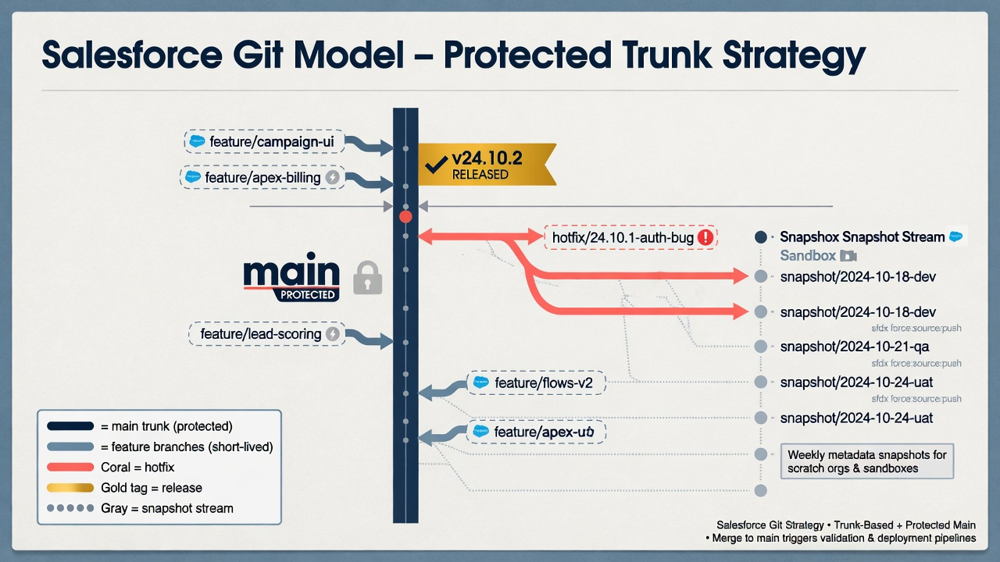
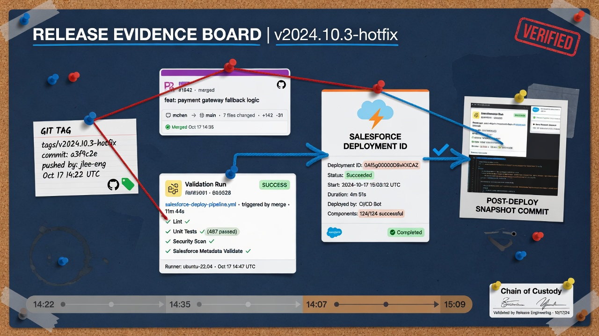
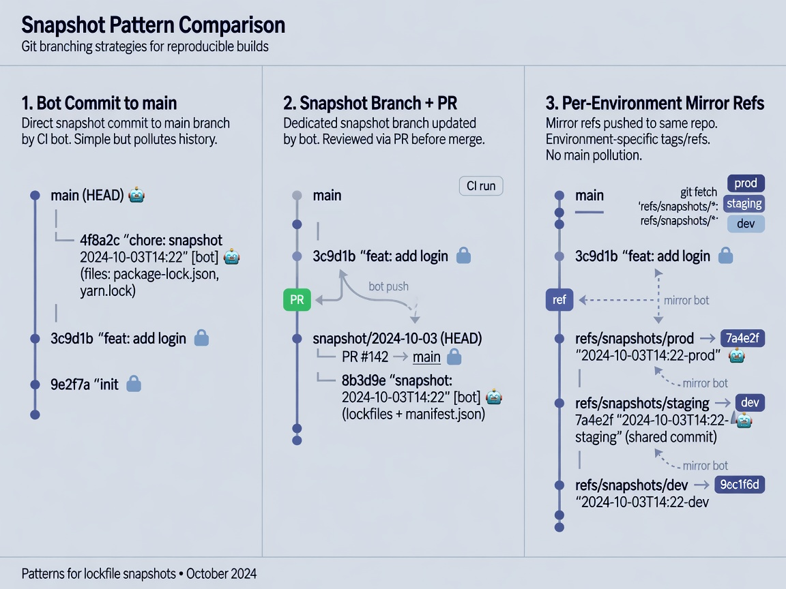

A workable Salesforce git branching strategy starts from how Salesforce orgs actually change, not from a generic Git diagram copied out of a large product-engineering handbook. Metadata moves through planned projects, urgent production fixes, admin configuration in sandboxes, package upgrades, and quiet direct edits that nobody intended to make permanent. If the branch model ignores those realities, the repository becomes either theater or a second source of chaos.

Git is excellent at preserving history, isolating work, and creating reviewable change sets. Salesforce is excellent at letting many people shape a shared business system quickly. The tension between those strengths is the design problem. The answer is rarely “implement classic GitFlow with six permanent environment branches.” For most teams, a trunk-ish protected default branch, short-lived feature branches, deliberate release evidence, a separate observational snapshot path, and strong GitHub rulesets produce more truth with less ceremony.

This article maps branching choices to environment promotion, hotfixes, long-lived sandbox drift, small-team practicality, and repository protection. It assumes a private GitHub repository of Salesforce metadata and related automation, and it keeps the usual boundary clear: branching strategy governs configuration history and release process, not record-data backup.



*Short-lived features, protected main, and a separate snapshot stream.*

## What “matches how orgs actually change” means

Salesforce change is multi-channel:

- developers ship Apex, Lightning components, and unlocked-package work through planned tickets;
- admins adjust Flows, validation rules, page layouts, and permissions in sandboxes or even production;
- integrators change named credentials, remote site settings, and platform events;
- release managers coordinate windows, tests, and approvals;
- automated jobs retrieve metadata and commit what they see;
- incidents force narrow, fast corrections.

A branching strategy has to make those channels visible without pretending they are identical. Planned feature work benefits from pull requests and validation. Emergency fixes need a fast path that still leaves evidence. Observational snapshots need a place to land without blocking human delivery. Long-lived sandboxes need a way to reconcile drift without turning every environment into a permanent branch museum.

If the model only supports “developer opens feature branch, merges to develop, promotes to release, promotes to main,” admin-led and incident-led reality will route around Git. If the model only supports “nightly dump to main,” planned engineering work will fight the automation. Good design makes both planned and discovered change first-class.

## Prefer a trunk-ish default over heavyweight GitFlow

For many Salesforce programs, especially small and mid-size teams, a protected `main` (or `master` if historical naming remains) should be the integration trunk:

- it represents the best known shared metadata baseline the team agrees to maintain;
- pull requests merge reviewed work into it;
- release candidates are identified by commits, tags, or short-lived release branches;
- production deploy authority is gated by environment protection and approvals, not by the mere existence of a `prod` branch.

Classic GitFlow—with long-lived `develop`, `release/*`, `hotfix/*`, and perpetual environment branches—can work for large product factories with dedicated release engineering. It is often over-engineered for a Salesforce team of a few admins and developers. The cost shows up as:

- merge debt between environment branches;
- uncertainty about which branch is authoritative;
- production-only commits that never return cleanly;
- ceremony that encourages people to keep editing the org directly.

Trunk-ish does not mean careless. It means the default branch is stable, protected, and continuously integrative, while complexity is added only where the release process truly needs it.

GitHub’s guidance on [protected branches and rulesets](https://docs.github.com/en/repositories/configuring-branches-and-merges-in-your-repository/managing-protected-branches/about-protected-branches) is more useful here than any branded branching methodology. Protection and review quality matter more than the number of permanent branch names.

## Feature branches for planned work

Planned work should still isolate risk.

### Naming and lifetime

Use short-lived branches named after the work item or outcome, for example:

- `feature/service-case-routing`
- `fix/opportunity-validation-message`
- `chore/api-version-64`

Keep lifetimes measured in days or a small number of weeks. Long-lived feature branches accumulate org drift and painful rebases, especially when snapshot automation or other features land on the trunk frequently.

### What belongs on a feature branch

- metadata intentionally changed for the work item;
- tests and fixtures related to that change;
- manifest updates required for the deploy or validation scope;
- documentation updates for operators;
- workflow or script changes needed to support the feature.

What usually does not belong:

- unrelated formatting of half the repository;
- silent API version migrations;
- credentials or environment secrets;
- broad snapshot noise from a personal sandbox retrieve mixed into feature commits.

### Review and validation

Every feature branch should open a pull request into the protected trunk. Require:

- human review appropriate to the blast radius;
- automated validation against a non-production org where the team has that pipeline;
- a clear description of org impact, test evidence, and rollout notes;
- CODEOWNERS involvement for shared platform paths, security-sensitive metadata, and workflows.

Salesforce CLI validation and test execution belong in CI when feasible. GitHub’s [GitHub Actions documentation](https://docs.github.com/en/actions) covers workflow building blocks; keep deployment credentials out of feature-branch forks and untrusted events according to the organization’s security model.

## Snapshot branch patterns without poisoning delivery

Metadata snapshots are one of the highest-value automation patterns for Salesforce repositories. They also create a branching design question: where do machine commits go?

### Pattern A: direct commits to the trunk on a controlled path

Some teams allow a bot to commit snapshot changes directly to `main` when:

- the job only updates known metadata paths;
- commit messages are standardized;
- branch protection allows a specific actor or bypass under audit;
- humans still use pull requests for intentional work;
- noisy or sensitive paths are excluded.

This keeps history simple: the trunk always reflects the latest retrieved baseline plus merged human work. The risk is entangled history if humans and bots collide, or if protection rules become too loose.

### Pattern B: snapshot branch with periodic promotion

Other teams write snapshots to `snapshot/main` or `org/production-mirror` and open a pull request or scheduled merge into the trunk.

Benefits:

- human review of unexpected drift before it becomes the default baseline;
- clearer separation between observational commits and feature delivery;
- easier emergency pause of snapshot merges.

Costs:

- extra process;
- potential lag between org reality and trunk;
- more branch hygiene work.

### Pattern C: environment-specific snapshot refs

Large programs sometimes maintain observational refs per monitored org, such as `snapshot/uat` and `snapshot/prod`. These are mirrors for comparison, not development branches. Do not let them become places where features are built.

Whatever pattern you choose, document it. The worst outcome is a repository where nobody can tell whether a commit means “we intended this change” or “the org looked like this at 02:00.”

Also remember: a snapshot of metadata is still not a record-data backup. Observational branches improve configuration history; they do not replace data protection products or processes.



*Bot commit, snapshot PR, or per-environment mirrors—pick one and document it.*

## Map environments without a branch per org by default

Salesforce environments—developer sandboxes, partial copies, full copies, staging, production—do not automatically deserve permanent Git branches. Environment mapping is primarily about:

- which org a workflow authenticates to;
- which secrets and GitHub environments hold those credentials;
- which manifests and test levels apply;
- which approvals gate deploy jobs;
- which differences are intentional configuration rather than metadata source divergence.

A healthy default:

- one authoritative metadata source on the protected trunk;
- deployment targets selected by workflow inputs and GitHub Environments;
- release tags or commit SHAs identifying what was validated and deployed;
- documented exceptions for metadata that truly differs by environment and cannot live as pure shared source.

Permanent `dev`, `qa`, `uat`, and `prod` branches often start as a comfort model and decay into four slightly different truths. Merges become archaeology. Production hotfixes land only on `prod`. Sandboxes keep receiving partial backports. Months later, “which branch is Salesforce?” has no honest answer.

If the organization already depends on environment branches, do not rip them out overnight. Instead:

1. Declare which branch is authoritative for new work.
2. Stop committing unique features only to downstream environment branches.
3. Represent production releases as tags or release records on the authoritative line.
4. Use reconciliation retrieves to retire long-lived divergence.
5. Move environment-specific values toward secrets, post-deploy configuration, or reviewed custom metadata patterns.

GitHub [Environments](https://docs.github.com/en/actions/deployment/targeting-different-environments/using-environments-for-deployment) are usually a better place to encode deployment stage controls than a forest of long-lived branches.

## Hotfixes: fast, narrow, and fully evidenced

Production incidents do not excuse invisible change. They require a faster path with equal or greater evidence quality.

A practical hotfix flow:

1. Create a branch from the commit that production actually runs, or from the protected trunk if that is known to match.
2. Apply the narrowest safe metadata change.
3. Validate in an appropriate non-production org if time allows; at minimum run automated validation and targeted tests.
4. Peer-review with whoever can assess risk quickly.
5. Deploy through the production-protected pipeline.
6. Merge the hotfix back to the trunk immediately so the next release does not reintroduce the bug.
7. Open follow-up work for root cause, tests, and process gaps.

Avoid:

- editing production and promising to “put it in Git later” with no ticket;
- force-pushing history to hide the incident;
- hotfixes that also include unrelated refactors;
- leaving the trunk behind the production hotfix for days.

If snapshot automation later retrieves the hotfix from production, that should confirm the repository already contains the change—not be the first time Git learns about it.

## Long-lived sandbox drift is a process issue, not only a Git issue

Sandboxes drift because people use them. That is normal. Problems begin when drift is treated as a branching strategy.

Symptoms:

- a shared UAT sandbox contains months of unrecorded configuration;
- a project sandbox became the de facto source of truth for one team;
- refresh cycles wipe tribal knowledge that never entered Git;
- “merge sandbox to production” becomes a manual metadata scavenger hunt.

Branching responses that help:

- retrieve sandbox metadata onto a comparison branch and open a drift pull request;
- require that durable configuration land on the trunk through normal review even if first explored in a sandbox;
- schedule sandbox refreshes with a pre-refresh retrieve for any sandbox that holds valuable unfinished configuration;
- map each active project to a branch and a sandbox, then close both when the project ends.

Branching responses that usually hurt:

- one permanent branch per sandbox forever;
- developers committing directly to environment mirror branches as if they were feature branches;
- using sandbox-only history as production release evidence without reconciliation.

Prefer non-production orgs for experimentation, but promote durable intent through the same review path that production trusts. The sandbox is a laboratory. The protected trunk is the contract.

## Keep the model small enough for the team that must run it

Over-engineering is a governance failure mode.

A three-person Salesforce team does not need:

- dual permanent integration branches;
- mandatory release-branch windows for every permission-set tweak;
- manual cherry-picks across five environment lines;
- a wiki page that only the original consultant understands.

That same team does need:

- a protected default branch;
- pull requests for intentional changes;
- clear rules for automation commits;
- a hotfix path;
- deploy gates for production credentials;
- documentation that names owners and exceptions.

Scale complexity with pain. Add a short-lived release branch when multiple features must freeze together for a coordinated production window. Add environment mirror refs when comparison value exceeds hygiene cost. Add CODEOWNERS and stricter rulesets when review misses increase. Do not start from the maximum diagram.

## Rulesets and branch protection that reinforce the strategy

Branching diagrams fail quietly when repository settings disagree with them.

Useful protections for the default branch:

- require pull requests before merging;
- require a minimum number of approvals for higher-risk paths;
- require status checks for validation workflows when available;
- restrict force pushes and deletions;
- limit who can push snapshot commits, if direct bot pushes are allowed;
- require linear history only if the team is ready to live with that rebase culture;
- apply CODEOWNERS for workflows, project config, and shared packages.

GitHub [rulesets](https://docs.github.com/en/repositories/configuring-branches-and-merges-in-your-repository/managing-rulesets/about-rulesets) can target branches by pattern, which is helpful for `release/**`, `snapshot/**`, or `hotfix/**` conventions without hand-maintaining one-off protection on every ref.

Pair rules with cultural clarity:

- admins know how their declarative work enters a pull request;
- developers know not to bypass CI for convenience;
- release managers know which commit SHA production ran;
- security reviewers know which workflows can touch which orgs.

Protection without education creates shadow processes. Education without protection creates optional governance.

## Suggested default model for most teams

If you need a concrete starting point, use this and adjust with evidence:

```text
main                    # protected trunk, authoritative metadata baseline
feature/*               # short-lived planned work
fix/*                   # short-lived corrections
hotfix/*                # production emergency branches merged back immediately
snapshot/prod           # optional observational mirror for production retrieves
tags: vYYYY.MM.DD-*     # release evidence pointers
```

Operating rules:

1. Humans change Salesforce intent through pull requests into `main`.
2. Production deploys reference a commit or tag on the authoritative line.
3. Snapshot automation writes to an observational ref or a tightly controlled bot path.
4. Hotfixes always return to `main`.
5. No standing `prod` development branch unless a documented exception remains during migration.
6. Sandbox experiments that must survive are retrieved and reviewed, not left as org folklore.
7. Metadata history is not described as full data backup.
8. Non-production validation precedes production authority whenever incident constraints allow.

This is intentionally ordinary. Ordinary systems get used.

## How to migrate from a painful model

If the repository already has environment-branch sprawl:

1. Publish a one-page decision: future authoritative branch, freeze rules for legacy branches, and timeline.
2. Tag the last known production deploy on each relevant line before changing habits.
3. Move CI production deploy keys so only the new path can use them.
4. Run a production metadata retrieve into a reconciliation branch and compare with the nominated trunk.
5. Stop merging feature work into legacy environment branches.
6. Keep legacy branches read-only for reference, then archive.
7. Train the team with one real change through the new path before declaring victory.

Migration fails when tooling changes but incentives do not. If production can still be edited freely with no repository consequence, branching strategy remains aspirational.

## Release evidence beats branch mythology

The point of a salesforce git branching strategy is not aesthetic graphs. It is trustworthy answers to operational questions:

- What metadata did we intend to change?
- What exactly was validated?
- What exactly was deployed?
- What did the org look like afterward?
- What drifted outside the release process?
- Can we reconstruct the decision trail?

Those answers come from pull requests, tags, workflow logs, deployment IDs, snapshot commits, and protected environments. Branches are only one structure inside that system. Design them to support evidence, not to imitate a process from a different kind of software organization.

## Admin-led change and the branching model

Many Salesforce programs are admin-heavy. A branching strategy that only fits IDE-driven developers will be bypassed. The goal is not to force every layout tweak through a heavyweight ceremony. The goal is to make the durable path obvious and the risky path visible.

Practical accommodations:

- provide a simple “retrieve my sandbox change onto a branch” script or documented command sequence;
- accept that some exploratory sandbox work will happen before a branch exists, then require retrieval before the change is considered real;
- use pull request templates with admin-friendly language: what changed, who is affected, how it was tested in the sandbox, whether permissions changed;
- keep review SLAs short for low-risk declarative changes so Git does not become the bottleneck that drives people back to direct production edits;
- pair admins with developers for the first few pull requests until the mechanics are boring.

If production direct-edit culture remains strong, fix incentives and access before adding more branch types. Extra branches do not create discipline by themselves.

## Coordinating package upgrades and platform releases

Salesforce platform releases and installed package upgrades introduce change that is not authored like a feature branch. Teams still need a branching response.

A sensible pattern:

1. Read release notes and identify metadata or behavior likely to change.
2. Refresh or provision a non-production org that will receive the upgrade first when that is available to the program.
3. Run a pre-upgrade metadata snapshot to a comparison branch or observational ref.
4. Apply the upgrade in the lower environment.
5. Retrieve again and review the diff for unexpected configuration drift.
6. Open work items for remediation on normal feature branches.
7. Repeat with production timing and post-upgrade snapshots.

Do not invent a permanent `salesforce-release` branch that accumulates unrelated work. Use dated comparison branches or snapshot refs, then fold intentional remediations into the trunk through pull requests. The branching model should absorb platform change, not pretend the platform never moves.

## Pull request templates that match Salesforce risk

Generic software templates miss Salesforce-specific risk. A lightweight template can ask:

- Which orgs were used for build and validation?
- Which metadata types and business processes are affected?
- Did permissions, sharing, or integration configuration change?
- What automated tests and manual checks were run?
- Is there a deploy manifest path for this change?
- Is there a rollback or recovery plan if behavior is wrong?
- Does this change affect record data interpretation even if it is “only metadata”?

That last question keeps the metadata-versus-data boundary alive during ordinary delivery. A validation rule or Flow change can harm data quality without any CSV leaving the building.

## When a short-lived release branch is worth it

Trunk-ish delivery does not outlaw release branches. It asks that they earn their keep.

Create a short-lived `release/yyyy-mm-dd` branch when:

- multiple features must freeze together for one production window;
- late fixes must be applied without accepting unrelated trunk work;
- several validators need a stable SHA while trunk continues;
- the release train is long enough that “just deploy main” is ambiguous.

Rules for those branches:

- branch from a known good trunk commit;
- only accept fixes intended for that release;
- tag the final deployed commit;
- merge release fixes back to trunk immediately;
- delete the branch after production confirmation and post-deploy snapshot.

If release branches live for months and become parallel products, the team has recreated environment-branch sprawl under a different name.

## Measuring whether the strategy is working

Branching debates become religious when nobody measures outcomes. Useful signals include:

- time from first commit to production for ordinary changes;
- number of production metadata changes with no corresponding pull request;
- age of open feature branches;
- frequency of hotfix branches and whether they merge back same day;
- snapshot jobs failing silently or producing unowned diffs;
- count of permanent environment branches still receiving commits;
- mean time to identify what production is running after an incident.

Improve the model when the signals worsen. Resist changing the diagram only because a new team member prefers a different textbook flow.

## Communication artifacts that support the graph

A one-page “how we branch” document in the repository should include:

- the authoritative branch name;
- feature, fix, hotfix, and snapshot conventions;
- where production deploy authority lives;
- what tags mean;
- what not to do (force-push, long-lived sandbox branches, production-only commits);
- links to workflow docs and CODEOWNERS;
- the metadata-versus-data reminder in plain language.

New contractors should read that page on day one. If the page disagrees with repository rulesets, fix the disagreement immediately. Written process that the tooling does not enforce becomes fan fiction.

## Putting it together for a pilot team

If the team is still connecting its first sandbox, do not wait for a perfect enterprise branching model. Start with:

- protected `main`;
- feature branches and pull requests for intentional work;
- manual or scheduled snapshot commits with clear messages;
- no production branch;
- a written promise to revisit branching when a second org or production deploy path is added.

That sequence matches how enablement usually lands: first history, then review habits, then promotion controls. Branch complexity should trail operational need by a small margin, not lead it by a year.



*A release is only trustworthy when the proof chain is easy to reconstruct.*

## Frequently asked questions

### Should every Salesforce sandbox have its own long-lived Git branch?

Usually no. Sandboxes are working environments, not automatically authoritative sources. Use short-lived project branches, comparison retrieves, and a protected trunk. Add persistent environment mirror refs only when comparison value clearly exceeds the merge and ownership cost.

### Is GitFlow required for Salesforce release governance?

No. Some large programs benefit from release branches and strict stage lines. Many teams get better results from a trunk-ish model, short-lived feature and hotfix branches, tags for release evidence, and GitHub environment protections. Choose ceremony proportional to team size and risk.

### Where should nightly metadata snapshots land?

Either on a controlled bot path into the trunk or on a dedicated snapshot branch that is reviewed or auto-merged under policy. The important part is labeling observational commits clearly and preventing snapshot noise from becoming an unreviewed feature delivery channel.

### Does a solid branching strategy back up Salesforce record data?

No. Branching and metadata history help with configuration lineage, review, and recovery of retrieved metadata. Record data, files, and relationship-aware business information need separate backup and restoration processes.

### What should this article link to internally?

Link to **Salesforce source control foundation** for the overall model, **Salesforce metadata repository structure** for trunk content layout, **Salesforce deployment validation** for pull-request checks, **Salesforce org drift detection** for snapshot interpretation, and **Connect a Salesforce sandbox to GitHub** for the safe first integration path that makes branching real.
