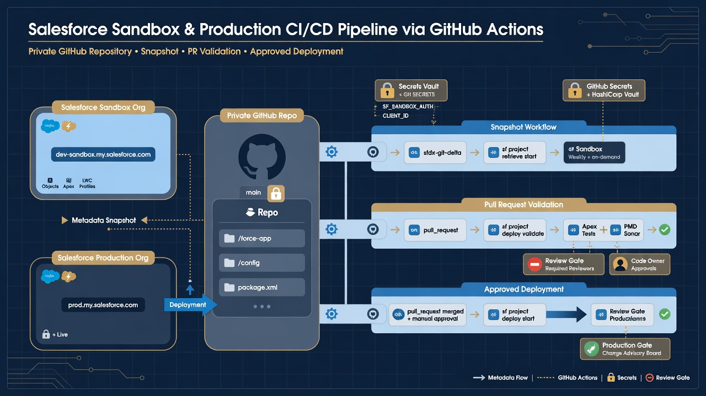
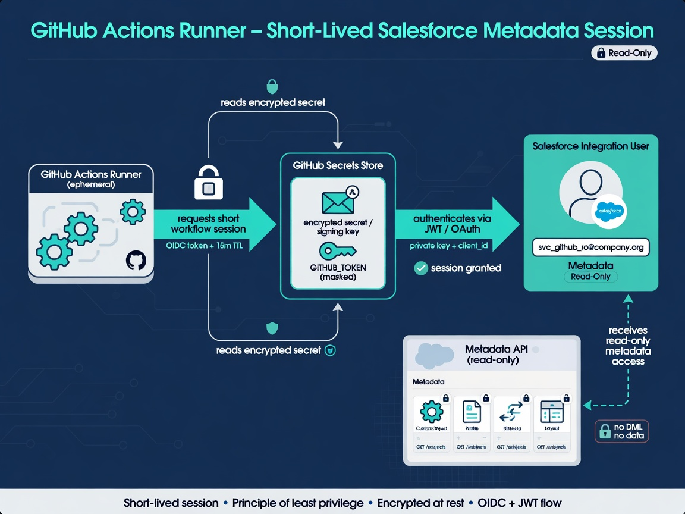

A Salesforce GitHub integration becomes useful when it does more than prove two platforms can exchange credentials. The practical goal is to turn Salesforce metadata into a dependable repository history: retrieve a known scope, show meaningful differences, protect the main branch, and give a team a repeatable place to review and automate change.

GitHub Actions is a natural orchestration layer because the workflow definition, Salesforce project, change history, reviews, and run logs can live in one private repository. A scheduled job can snapshot an org. A pull request can validate proposed metadata. An approved merge can eventually trigger a controlled deployment. Those capabilities should be introduced separately, even if they share the same plumbing.

The architecture is straightforward, but the operational details matter. Authentication must be approved and rotatable. The retrieval must fail safely. The workflow needs only the permissions it uses. The metadata scope must be explicit. A green run should mean something a human can explain.

*Separate lanes for snapshot, pull request validation, and approved deployment.*

## What the integration should accomplish

Start with outcomes rather than YAML. A sensible first version should let the team:

- create a reviewed metadata baseline from a development org or sandbox;
- retrieve the same approved scope on demand;
- schedule a retrieval and commit only meaningful changes;
- see failures without searching through the Actions interface;
- identify which org, manifest, API version, and workflow produced a commit;
- keep Salesforce credentials and business records out of Git history;
- recover an earlier component version and validate it safely;
- expand into pull-request validation without rebuilding the foundation.

Notice what is not required initially: automatic production deployment. Retrieval and version history provide value on their own. Separating the read path from the write path also lets security and release owners evaluate production deployment as a distinct decision.

The repository should represent configuration metadata, automation code, and operating documentation. If Salesforce record exports are required, they need an approved data destination with their own access, retention, encryption, and restore controls. GitHub is not a convenient default simply because the workflow already runs there.

## The four workflow lanes

A mature Salesforce GitHub integration usually contains four lanes. Teams can adopt them one at a time.

### Baseline retrieval

An operator authorizes a non-production org, retrieves the approved manifest into a Salesforce project, inspects the output, and creates the first commit. This is an inventory and normalization exercise. It proves that the project structure and manifest behave as expected.

### Scheduled snapshot

A GitHub Actions workflow authenticates non-interactively, retrieves the same scope, checks for suspicious output, and commits a diff when something changed. Its purpose is visibility and historical evidence, not deployment.

### Pull-request validation

Planned work enters a branch. A workflow identifies the changed metadata, runs static checks and tests where appropriate, and performs a validation-only deployment against a suitable target. The pull request presents both the human-readable diff and machine results.

### Approved deployment

An explicit event—often an approved merge, a release, or a manual dispatch tied to an environment—deploys a reviewed artifact. Production credentials, environment approval, concurrency, and evidence belong in this lane. Do not let a scheduled snapshot accidentally acquire deployment authority.

These lanes can use reusable components, but they should remain distinguishable in permissions and purpose. A job that only validates source should not receive the same Salesforce or GitHub authority as a production deployment.

## Build the Salesforce project first

GitHub automation is easier to reason about when the same commands work locally. Create a Salesforce DX project with an intentional package-directory structure. Add a `package.xml` manifest for the first retrieval scope. Include a README that names the source environment, the purpose of the repository, and important exclusions.

Salesforce's current CLI uses commands in the `sf` style. The official [`sf project retrieve start` reference](https://developer.salesforce.com/docs/platform/salesforce-cli-reference/guide/cli_reference_project_retrieve_start.html) documents retrieval by manifest, metadata name, or source directory. A manifest is usually the clearest starting point for a snapshot because its scope can be reviewed as code.

Run the retrieval locally against a development org or sandbox. Make a small known change, retrieve again, and inspect the diff. Repeat until the file placement and output are predictable. If a one-field change rewrites hundreds of files, solve that normalization problem before putting the command on a schedule.

The repository also needs an appropriate `.gitignore`. Exclude local authorization state, CLI caches, temporary retrieval directories, environment files, certificates, private keys, coverage output, and editor-specific files that do not belong to the shared project. Treat diagnostic logs as potentially sensitive because they can expose org identifiers, queries, paths, or payload fragments.

## Choose the authentication model deliberately

Local development can use an interactive web login. Unattended GitHub Actions needs a non-interactive method that the Salesforce and security owners approve.

Salesforce CLI supports JWT login. The flow uses a client application, a certificate, and a private key to sign the assertion. Salesforce documents the requirements in its [JWT authorization guide](https://developer.salesforce.com/docs/atlas.en-us.sfdx_dev.meta/sfdx_dev/sfdx_dev_auth_jwt_flow.htm). Current Salesforce guidance also describes external client apps as an option for integrations, so confirm the organization's platform policy and current documentation before standardizing a new connection.

Another possible pilot pattern is an approved Salesforce DX authorization URL stored as an encrypted GitHub secret and supplied to the CLI at runtime. It can reduce initial setup, but it is still a powerful credential artifact. The team needs a named owner, storage policy, rotation procedure, disable procedure, and a decision about whether the pattern is acceptable for production.

Whatever method is chosen:

- use a dedicated integration user where licensing and policy allow;
- grant only the org permissions needed for the job;
- separate non-production and production identities;
- store credentials in GitHub environment or repository secrets, never in files;
- avoid printing commands in a way that echoes secret values;
- document certificate or token rotation before the first production run;
- test how to revoke access and confirm the workflow fails closed.

OIDC is often discussed as a way for GitHub Actions to avoid long-lived cloud credentials. GitHub's [OIDC reference](https://docs.github.com/en/actions/reference/security/oidc) explains how workflows obtain identity tokens for cloud providers that trust GitHub. Do not assume that pattern directly replaces Salesforce authentication unless the chosen Salesforce integration path explicitly supports it.

*Encrypted secret, dedicated identity, and read-only metadata access by default.*

## Give GitHub Actions the minimum repository permission

GitHub provides a `GITHUB_TOKEN` to workflows. Its capabilities can be constrained with the `permissions` key at workflow or job level. GitHub recommends granting the token only the access required for the task; its [workflow authentication documentation](https://docs.github.com/actions/reference/authentication-in-a-workflow) shows how to set those permissions.

A snapshot job that commits to the repository needs `contents: write`. A pull-request validation job may only need `contents: read`, plus narrowly selected permissions if it posts a check or comment. A deployment workflow may not need repository write access at all if it deploys an immutable artifact and records evidence through a separate mechanism.

Set permissions explicitly. Defaults can vary with organization and repository settings, and a future maintainer should be able to see the intended authority in the workflow file. Avoid `write-all`. If an action requires an unexpected permission, understand why before granting it.

Third-party actions run code inside the workflow context. Pin important actions to a full commit SHA where policy requires stronger supply-chain control, review their source and publisher, and limit which actions can run at the organization level. GitHub's [secure use reference](https://docs.github.com/en/actions/reference/security/secure-use) is the appropriate current guide for hardening workflow composition.

## Design the snapshot job as a transaction

A naive job retrieves directly over the tracked project and commits whatever changed. That can be dangerous. An authentication problem, manifest error, CLI regression, or partial response might appear as mass deletion.

Use a transaction-like sequence:

1. Check out the expected default branch and verify the repository state.
2. Install a pinned, reviewed Salesforce CLI version.
3. Materialize the credential in a temporary location with restrictive handling.
4. Authenticate to the expected org.
5. Verify org identity without logging sensitive values.
6. Retrieve the approved manifest into a controlled project location.
7. Check that the command succeeded and expected directories exist.
8. Measure additions, modifications, and deletions.
9. Stop for review if change volume crosses a sensible safety threshold.
10. Remove temporary credentials and files.
11. Commit only when the validated diff is non-empty.
12. Push the commit through the intended protected-branch mechanism.
13. Emit a concise run summary and failure notification.

For stronger isolation, retrieve into a temporary project and compare or synchronize only after validation. The exact design depends on metadata decomposition and project structure, but the principle is stable: an unverified retrieval must not become the new trusted baseline automatically.

Commit messages should identify automation, the source environment label, and a timestamp or run identifier. Include a linkable Actions run in the commit body when practical. Do not put credential details or sensitive org information into the message.

## Schedule for reliability, not theater

GitHub Actions supports POSIX cron schedules and manual `workflow_dispatch` triggers. GitHub's [workflow syntax documentation](https://docs.github.com/actions/using-workflows/workflow-syntax-for-github-actions#onschedule) notes that scheduled runs use the latest commit on the default branch. GitHub also warns that schedules may be delayed during periods of high load.

For most metadata-history use cases, nightly is a useful starting point. Choose an off-minute rather than `0 * * * *`, add a manual trigger, and use a concurrency group to prevent overlapping snapshots. A job should not promise exact-to-the-minute capture unless a separate scheduler and service design can support that claim.

The schedule is only as valuable as its monitoring. A workflow that stops running can look quiet instead of broken. Track the age of the last successful snapshot and alert when it exceeds the expected interval. Route failures to a named owner, not a channel nobody is responsible for watching.

## Make diffs meaningful

Metadata XML is readable, but not every diff is useful. Tool upgrades and API-version changes can reorder, reformat, add, or remove large amounts of generated detail. Separate those mechanical changes from business changes.

Useful practices include:

- pinning Salesforce CLI and runtime versions, then updating through reviewed pull requests;
- pinning the project API version according to a documented policy;
- keeping one consistent source format and package structure;
- isolating mass normalization in a clearly labeled commit;
- excluding transient files and retrieval archives;
- adding diff tooling for metadata types that are hard to read in raw XML;
- reviewing unexpected bulk deletions before commit;
- recording manifest changes as first-class changes to coverage.

The goal is not a perfectly pretty diff. It is a diff small and stable enough that a reviewer can recognize the operational change among the XML.

## Protect the default branch without breaking snapshots

GitHub protected branches and rulesets can require pull requests, reviews, status checks, conversation resolution, or code-owner approval. The [protected branches guide](https://docs.github.com/en/repositories/configuring-branches-and-merges-in-your-repository/managing-protected-branches/about-protected-branches) describes current options and availability.

There are two common snapshot patterns.

The workflow can push directly to a protected branch through a narrowly allowed automation identity. This is simple, but it gives the job authority to change the trusted baseline without human review.

Alternatively, the workflow can create or update a snapshot branch and open a pull request. This makes every org drift event reviewable but can generate operational overhead in busy orgs. Automation can help group expected changes and escalate large or sensitive ones.

The right choice depends on whether the repository is primarily an observational mirror or the authoritative release source. Document the choice. Do not quietly let direct org changes overwrite planned source without a reconciliation rule.

## Add pull-request validation as a separate workflow

Once planned changes enter branches, a validation workflow can check formatting, scan for secrets, inspect the metadata diff, run relevant tests, and perform a validation-only deployment against a suitable org.

Keep validation deterministic. The workflow should state which target it used, which tests ran, which metadata was included, and whether the result is still fresh enough to trust. Use unique job names if branch rules require status checks; GitHub warns that duplicate job names across workflows can make required-check results ambiguous.

CODEOWNERS can route sensitive paths to the correct people. A permission-set change might require a security reviewer, while Apex and Flow changes may have different owners. GitHub's [CODEOWNERS documentation](https://docs.github.com/en/repositories/managing-your-repositorys-settings-and-features/customizing-your-repository/about-code-owners) explains file placement and review behavior.

Do not make every check blocking on day one. Run new checks in advisory mode, learn their false positives and runtime, then promote reliable controls to required status.

## Keep deployment behind an explicit gate

The retrieval workflow proves read access. Production deployment is a material expansion of authority. Use a separate Salesforce identity or permission set, GitHub environment, required reviewers, and workflow file.

Deploy an identified commit or artifact, not whatever happens to be in a mutable working directory. Use concurrency to prevent overlapping production changes. Record the actor, approval, source commit, target environment, command result, tests, and post-deployment verification. Preserve a manual stop and recovery path.

An integration can be successful without automated production deployment. If the organization prefers a human-run deployment from the reviewed repository, the source-control, validation, and evidence benefits still stand.

## Define acceptance tests for the integration

Before calling the Salesforce GitHub integration operational, demonstrate:

- a known sandbox change creates the expected small diff;
- a no-change snapshot creates no commit;
- an invalid credential produces a visible failure and no repository change;
- a partial or unexpectedly destructive retrieval stops before commit;
- the scheduled and manual triggers both work;
- overlapping jobs cannot corrupt the baseline;
- secrets are absent from files, logs, artifacts, and Git history;
- tool-version updates happen through review;
- a previous component version can be validated in a safe org;
- repository and Salesforce access can be revoked and rotated;
- an owner receives and resolves a simulated failure alert.

These tests turn a clever workflow into an operated service.

## The foundation is the product

The most valuable part of a Salesforce GitHub integration is not the cron expression or authentication command. It is the dependable connection between an org state, a repository state, and a team decision.

Once that connection is trustworthy, the team can add drift reports, pull-request previews, automated tests, release notes, code ownership, audit evidence, deployment gates, and recovery tooling. Without it, every additional feature sits on uncertain plumbing.

Build the read path first. Keep metadata separate from records. Make failure loud. Protect credentials and history. Prove recovery in a sandbox. Then expand the integration according to real operational needs rather than a generic DevOps maturity chart.

## Frequently asked questions

### Can GitHub Actions connect directly to Salesforce?

Yes. A workflow can install Salesforce CLI and authenticate using an approved non-interactive method. The credential must be stored as a GitHub secret, scoped to a dedicated use, and kept out of logs and repository history.

### Should the snapshot workflow deploy metadata too?

No. Keep snapshot retrieval and deployment as separate workflows with separate permissions. A read-oriented scheduled job should not gain production write authority simply for convenience.

### Does every workflow need `contents: write`?

No. A job needs that permission only when it must change repository contents. Validation and deployment jobs can often use `contents: read`. Set the `GITHUB_TOKEN` permissions explicitly for each workflow or job.

### Is a scheduled workflow guaranteed to run at the exact cron time?

No. GitHub documents that scheduled workflows can be delayed during high-load periods. Design monitoring and recovery objectives around successful runs, not the cron expression alone.

### What should this guide link to internally?

Link to the **Salesforce source control** pillar for the overall model, **Salesforce metadata backup** for recovery boundaries, **Salesforce org drift detection** for snapshot interpretation, and **GitHub Actions Salesforce security** for the detailed hardening checklist.
