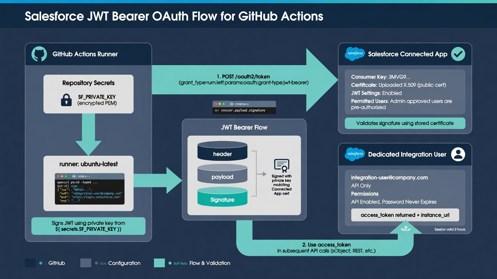
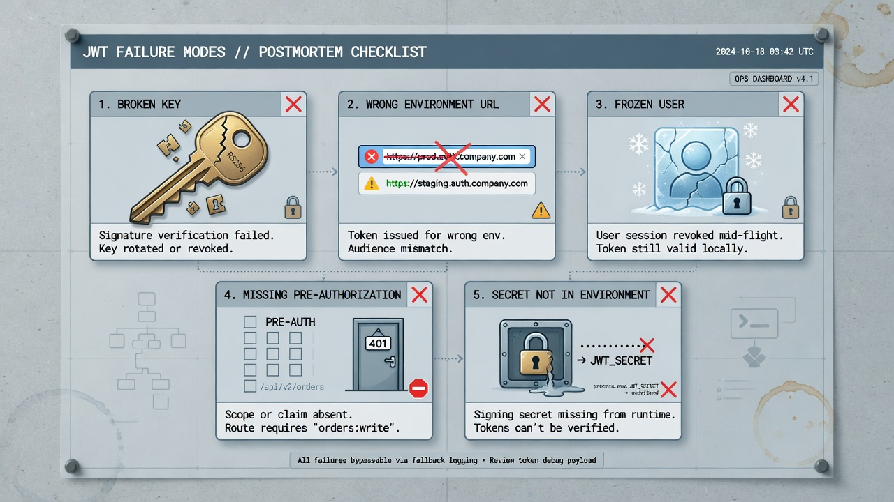
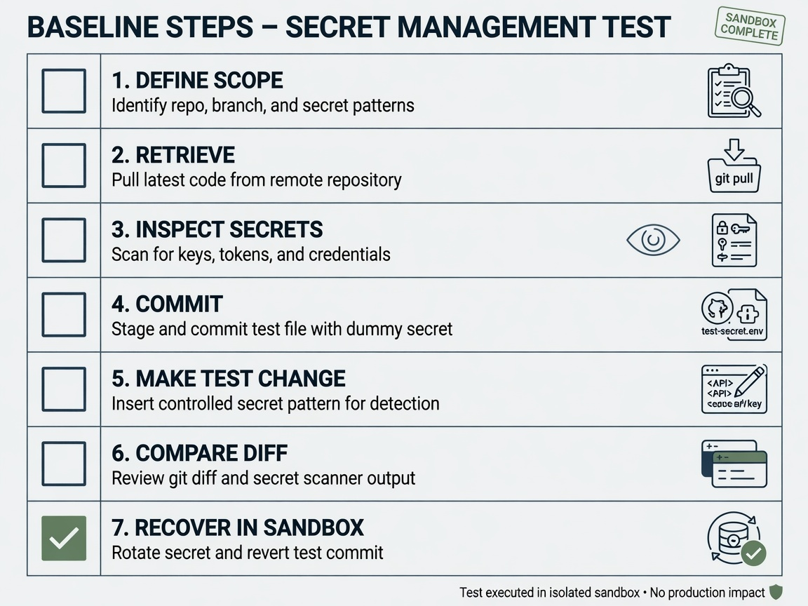

Salesforce JWT authentication for GitHub Actions is the pattern many teams reach for when a scheduled or pull-request workflow must talk to an org without a human in the browser. The JWT bearer flow lets Salesforce CLI (or another approved client) present a signed assertion instead of interactive login. Done carefully, it is auditable and rotatable. Done casually, it becomes a long-lived superuser key sitting next to workflow YAML.

This guide walks through the concepts and operational choices: connected app (or external client app) design, certificate and private key handling, integration user scope, GitHub secrets and environment protection, least privilege, rotation, failure modes, logging hygiene, and high-level alternatives. It does not claim one universal method for every org. Licensing, security policy, API versions, and platform roadmaps differ. Prefer a non-production org for the pilot, and remember that metadata automation is not a substitute for record-data backup.

*Encrypted secret, signed JWT, connected app, and a dedicated integration user.*

## What the JWT bearer flow is actually doing

At a high level, the JWT bearer OAuth flow works like this:

1. Your automation holds a private key that pairs with a certificate registered on a Salesforce client application.
2. The job constructs a JWT (JSON Web Token) that asserts a subject (usually the integration user’s username), an audience, an issuer (the client id / consumer key), and an expiry.
3. The private key signs the JWT.
4. Salesforce validates the signature against the registered certificate, checks that the user is pre-authorized for the client app, and issues an access token if policy allows.
5. Salesforce CLI or your script uses that token for API calls such as metadata retrieve or deploy validation.

Salesforce documents the flow for headless and CI scenarios in its [JWT-based authorization guidance](https://developer.salesforce.com/docs/atlas.en-us.sfdx_dev.meta/sfdx_dev/sfdx_dev_auth_jwt_flow.htm). Read that page for current parameter names, audience values, and CLI flags; they evolve. Treat this post as an operational design guide layered on top of official docs, not as a replacement for them.

The important security properties are:

- **No interactive browser** on the runner.
- **No long-lived password** stored in GitHub if you avoid password-based patterns.
- **Proof of possession of the private key**, which must be protected as carefully as any production credential.
- **Binding to a specific client application and user**, which you can scope and revoke.

The weak property, if you misconfigure it, is that a stolen private key plus client id plus username may mint tokens until you revoke or rotate. That is why secrets placement, environment gates, and least privilege matter as much as “getting login to work.”

## Prefer a non-production pilot before production

Before any production integration user exists:

- Practice the full path in a sandbox or scratch org: create the client app, upload the certificate, authorize the user, store secrets in a non-production GitHub environment, run Salesforce CLI login, retrieve a small metadata set, and log out / clean up.
- Confirm that the workflow identity cannot write where it should only read (for snapshot jobs).
- Confirm failure behavior: wrong key, expired cert, unauthorized user, missing pre-authorization.
- Document who owns the certificate lifecycle and who can approve production promotion.

A pilot that only proves “we got a green check once” is incomplete. The pilot should also prove revocation, rotation rehearsal, and log review.

## Building blocks: client app, certificate, integration user

### Client application (connected app or external client app)

Salesforce has evolved how integrations are registered. Teams may still use classic connected apps or newer external client app patterns depending on org standards. Whatever your security team approves, the client application is where you:

- identify the integration to Salesforce;
- associate the certificate used to verify JWT signatures;
- control which profiles or permission sets may use the app;
- set policies such as IP restrictions if your security model uses them;
- obtain the consumer key (client id) that becomes part of the JWT issuer claim.

Keep the client app purpose-specific when policy allows. A snapshot-only client app with a read-focused integration user is easier to reason about than one shared by snapshot, validation, deployment, and ad-hoc admin scripts.

### Certificate and private key

You generate a certificate and private key pair outside Salesforce (commonly with OpenSSL or an approved enterprise PKI process). The public certificate is uploaded to the client application. The private key never goes to Salesforce and never belongs in the repository.

Operational rules:

- Generate keys on a trusted machine or via an approved secrets pipeline—not on a shared laptop without process.
- Prefer algorithm and key sizes required by current Salesforce documentation and your security baseline.
- Store the private key only in a secrets manager or GitHub encrypted secrets (or better, an external vault injected at runtime if your platform supports it).
- Track certificate expiry on a calendar with owners, not only in a wiki nobody opens.
- Plan rotation before expiry, not after the nightly job starts failing silently.

### Integration user

Use a dedicated machine / integration user, not a named administrator’s personal account. Personal accounts change roles, leave companies, accumulate unrelated privileges, and make audit trails ambiguous.

Design the integration user for the workflow’s purpose:

- **Snapshot / retrieve:** API-enabled, metadata read access for the approved package scope; no deploy or broad setup authority if avoidable.
- **Validation:** access to the non-production or validation target sufficient for dry-run deploy and tests.
- **Deployment:** only what production deployment requires, exposed only in the production environment job.

Assign permission sets deliberately. Start narrower than you think you need, then add only what failed operations prove is required. Record every expansion with a reason. Least privilege is not a slogan; it is a change log.

Salesforce’s identity and access model is documented across its security and identity resources; for OAuth concepts more broadly, the [Salesforce OAuth authorization flows overview](https://help.salesforce.com/s/articleView?id=sf.remoteaccess_oauth_flows.htm&type=5) is a useful map of where JWT fits among other flows.

## GitHub secrets storage: what belongs where

GitHub provides encrypted secrets at repository, environment, and organization levels. For Salesforce JWT authentication in GitHub Actions, a common practical layout is:

- **Client id (consumer key):** secret, because it participates in token minting and is not public marketing material.
- **Private key:** secret, highest sensitivity; often stored as a PEM string or base64-encoded PEM depending on how the workflow injects it.
- **Username of the integration user:** secret or configuration—many teams store it as a secret to avoid advertising the exact identity in workflow logs.
- **Login URL / instance URL / audience-related values:** configuration or secret depending on whether they reveal internal topology; production and sandbox values should not be interchangeable by accident.
- **Any authorization URL artifacts** if you use alternate patterns: treat as credentials.

GitHub’s documentation on [encrypted secrets](https://docs.github.com/en/actions/security-guides/using-secrets-in-github-actions) covers scoping, naming, and the rule that secrets are not available to workflows triggered from forks in the same way—important if you ever open contribution paths.

### Not putting keys in the repository

Never commit:

- private keys (`.key`, `.pem`, PKCS#8 material);
- full certificate bundles that include private material;
- `.sfdx` or local auth files from developer machines;
- env files with live credentials;
- temporary files written during a failed experiment that later get `git add -A`.

Add explicit ignore rules for common Salesforce CLI local artifacts. Run secret scanning if your GitHub plan or third-party tools provide it. If a key ever lands in git history, rotation alone is not enough until history handling and revocation are complete—assume compromise from the moment of push.

### Environment protection for production

Use GitHub Environments for production (and optionally for staging) so that:

- production secrets are not available to every workflow on every branch;
- required reviewers can gate jobs that obtain production Salesforce tokens;
- wait timers or branch restrictions match your change policy;
- deployment history attaches to a named environment auditors can inspect.

A pull-request workflow on a feature branch should not be able to read the production private key. That single design choice removes an entire class of accidents and a large portion of malicious workflow risk from untrusted branches.

## Least privilege in three dimensions

Least privilege for this setup is not only “permission sets on the user.” It has three dimensions.

### 1. Salesforce authority

- Limit object, setup, and metadata access to what the job needs.
- Separate identities for snapshot, validate, and deploy when organizational cost allows.
- Prefer non-production targets for exploratory automation.
- Avoid “System Administrator” as the default integration profile because it is convenient.

### 2. GitHub token and workflow permissions

The default `GITHUB_TOKEN` permissions should be minimal for the job. A retrieve-and-commit snapshot may need contents write; a validation-only job may need only contents read and pull-requests write for status. Do not grant `write-all` out of habit. Pin third-party actions by commit SHA when your security standard requires it, and review what those actions can access.

### 3. Secret reachability

A secret that every workflow can read is a secret with a large blast radius. Scope secrets to environments and to the workflows that need them. Prefer one purpose per credential where rotation and operational overhead allow.

## Rotation: treat it as a product feature, not an emergency drill only

Rotation covers certificates, private keys, and sometimes client apps or users.

A workable rotation runbook:

1. Generate a new key pair under the same change control as production credentials.
2. Upload the new certificate to the client application according to Salesforce’s supported process (some setups allow multiple certificates during transition—verify current behavior in your org).
3. Add the new private key to GitHub as a new secret name (for example, suffix with version) without deleting the old one yet.
4. Point a non-production workflow at the new secret and prove login and a representative operation.
5. Schedule the production workflow cutover during a known window.
6. Monitor the first few scheduled runs.
7. Revoke or remove the old certificate and delete the old secret.
8. Record the change in your access register: who, when, ticket id, environments updated.

Rotate when people with access leave high-privilege roles, when a runner or laptop that handled the key is suspect, when a workflow file is maliciously modified, or when policy mandates a schedule. Do not wait only for calendar expiry.

## Failure modes you should expect

JWT setups fail in patterned ways. Teach the team the signatures.

### Authentication failures

- Wrong private key or corrupted PEM formatting (extra quotes, missing newlines when stored as a single-line secret).
- Certificate not uploaded or not the pair of the private key.
- Incorrect client id.
- Username mismatch or user frozen / locked.
- User not pre-authorized on the client app.
- Audience or login URL pointing at the wrong environment (sandbox vs production).
- Clock skew severe enough to invalidate `exp` (rare on GitHub-hosted runners, still worth knowing).

### Authorization failures after login

- Integration user lacks API access or metadata permissions for the requested types.
- IP restrictions on the client app block GitHub-hosted runner ranges (self-hosted runners or policy exceptions may be required—handle with security review, not silent disablement).
- API limits or concurrent request limits during large retrieves.

### Operational failures

- Secret not available because the job did not target the environment that holds it.
- Workflow running from a context where secrets are suppressed.
- Partial retrieve succeeding while auth is fine—do not misread as credential failure.
- Someone rotates the certificate in Salesforce but not the GitHub secret (or the reverse).

For each failure class, decide: retryable or not, who is paged, and whether the job should open an issue automatically. Silent red X’s on Actions for a week are a governance failure, not only a technical one.

*Most auth outages are boring configuration misses—make them easy to diagnose.*

## Logging hygiene

Workflow logs are useful and dangerous.

Do:

- Log which environment, org alias label (not full secret values), branch, commit SHA, and high-level operation succeeded or failed.
- Log Salesforce CLI version and key non-secret flags.
- Emit structured summaries for “auth succeeded,” “retrieve started,” “commit pushed,” with timestamps.

Do not:

- Echo private keys, client secrets, or full JWTs.
- Print authorization headers.
- Dump entire env dumps for debugging in production workflows.
- Upload key material as artifacts “just for the weekend debug.”

When debugging PEM issues, reproduce with redacted shapes (line counts, header presence) rather than pasting secrets into tickets. Prefer temporary elevated logging in a non-production environment under change control.

Also remember that metadata diffs themselves can be sensitive: object names, field labels, named credentials references, and permission structures reveal design. Keep the repository private, limit collaborators, and treat large unexpected diffs as both operational and security signals.

## Alternatives at a high level (no universal winner)

JWT bearer is popular for Salesforce CLI automation, but it is not the only pattern organizations use.

- **Salesforce DX authorization URL / auth URL secrets:** sometimes used in pilots for convenience. Still a credential; still needs rotation, scope, and environment protection. Evaluate against your security team’s standards.
- **Other OAuth flows with carefully brokered tokens:** may fit enterprise identity strategies, often with more moving parts.
- **Self-hosted runners with hardware or OS-level secret injection:** can reduce exposure of keys to GitHub’s secret store but shift trust to runner host security.
- **External secret managers** (cloud KMS/vault products): centralize rotation and audit; require reliable injection into Actions.

Choose based on threat model, compliance, staffing, and platform support—not blog-post fashion. Document the decision so the next engineer does not “simplify” production into a personal sandbox auth file committed by mistake.

Whatever method you use, the durable requirements stay the same: dedicated identity, least privilege, secrets outside git, production gates, rotation, monitoring, and clear ownership.

## Wiring Salesforce CLI login in the workflow (conceptual)

Exact flags change; always verify against current Salesforce CLI reference docs for `sf org login jwt` (or the successor command names in your CLI version). Conceptually the job:

1. Checks out the repository.
2. Installs or uses a pinned Salesforce CLI version.
3. Writes the private key from a secret to a temporary file with restricted permissions, or passes it in the supported manner for your CLI version.
4. Runs JWT login against the correct login URL with client id, username, and key.
5. Executes the retrieve, validate, or deploy operation.
6. Revokes or logs out if your standard requires, and deletes temporary key files in an always-run cleanup step.

Pin CLI versions. Unpinned `latest` on a Friday can turn into Monday’s incident. Record the CLI version in job summaries for auditability.

For command behavior and auth-related commands, use the official [Salesforce CLI command reference](https://developer.salesforce.com/docs/platform/salesforce-cli-reference/guide/cli_reference_unified.html) as the source of truth.

## Ownership and access register

Write down:

- owner of the client application;
- owner of each integration user;
- who can read production secrets in GitHub;
- who can approve production environment deployments;
- rotation cadence and last rotation date;
- which workflows use which identity;
- break-glass procedure if Actions or JWT auth is unavailable.

This register is part of security, not paperwork theater. When someone leaves the company, the register tells you what to rotate without archaeology in YAML.

## How this fits metadata automation (and what it is not)

JWT auth enables automation that backs org **metadata** to a private GitHub repository, opens reviews, validates deployments, and supports recovery of configuration. That is valuable. It is still not a backup of **record data**—Accounts, custom object rows, Files, and the rest of the business’s transactional information. If stakeholders hear “we authenticated GitHub to Salesforce and snapshot nightly,” some will incorrectly infer full org backup. Correct that early. Metadata and data are different tracks with different tools, RPO expectations, and compliance implications.

Prefer starting JWT-backed automation against non-production, then promote patterns and separate production credentials under change control.

*Vaulted certificate on one side, limited integration user on the other.*

## Acceptance checklist before calling JWT “done”

You are ready for routine use when:

- pilot org login works repeatedly, not once;
- production secrets live only in protected environments;
- integration users are dedicated and scoped;
- private keys never appeared in git history;
- rotation has been rehearsed once;
- failure notifications reach a human owner;
- logs are free of secret material in a deliberate review;
- runbooks cover revoke, rotate, and break-glass;
- stakeholders understand metadata automation scope vs record-data backup.

If any item is missing, you have a partial integration—not a finished authentication design.

## Step-by-step pilot sequence (non-production)

Use this sequence when the pilot is starting from zero automation. Adjust names to match your repository conventions.

1. **Create the integration user** in a sandbox with a clear username pattern such as an automation-style identity your naming standard allows. Assign only API-enabled access and a minimal permission set for a small retrieve. Freeze unused login methods if policy recommends it.
2. **Generate the certificate and private key** under change control. Store the private key in a temporary secrets location that is not the git working tree. Upload the certificate to the client application and record the consumer key.
3. **Pre-authorize the integration user** on the client application according to your org’s connected app or external client app policy. Confirm profiles or permission sets required for access policies.
4. **Prove interactive or local CLI JWT login** from a trusted workstation using Salesforce CLI against the sandbox. Do not skip this step and jump straight to Actions; local success isolates runner problems later.
5. **Create a GitHub Environment** named for the sandbox or pilot, with environment secrets for client id, username, private key, and login URL. Restrict which branches can deploy to that environment if your plan supports it.
6. **Add a minimal workflow** that only authenticates, runs a harmless identity or org display command, and writes a job summary without printing secrets. Trigger it with `workflow_dispatch` first.
7. **Expand to a tiny retrieve** of a known low-risk metadata type into an ignored or disposable path, still without committing if you want an even smaller first slice. Confirm logs remain clean.
8. **Add commit-and-push** only after retrieve quality checks exist (non-empty result, expected folder structure, no auth files). Protect the target branch.
9. **Inject controlled failures**: wrong key material, wrong username, missing environment. Confirm the job fails clearly and that owners are notified.
10. **Document the access register** and schedule the first rotation rehearsal before any production cutover conversation.

This sequence produces evidence you can show security reviewers: not only that login works, but that failure, scope, and cleanup were considered.

## PEM and secret formatting pitfalls

Many first-time JWT failures are formatting, not Salesforce policy. Common issues include:

- storing a private key in a GitHub secret with smart quotes or YAML indentation artifacts when people paste from chat tools;
- losing newline characters so the PEM becomes one unreadable line without a deliberate base64 or escaped-newline strategy;
- including the certificate (public) where the CLI expects the private key, or the reverse;
- wrapping the key in JSON without careful escaping;
- trailing whitespace or BOM characters introduced by certain editors;
- using a password-protected key file when the automation path expects an unencrypted key (or the opposite of what your enterprise PKI issued).

Establish a single approved way to store and materialize the key for your organization. Document it next to the workflow so every engineer does not invent a new encoding. When debugging, compare public certificate fingerprints and key modulus identifiers using local tools rather than pasting private material into tickets.

If you use base64-encoded secrets, make the workflow’s decode step obvious and test it in non-production after every rotation. Rotations fail more often from copy mistakes than from cryptography.

## IP restrictions, runner networks, and policy tension

Security teams sometimes enable IP restrictions on client applications or user login policies. GitHub-hosted runners use a large and changing set of outbound addresses. That combination can produce intermittent or total auth failure that looks like “JWT is broken” when the real issue is network policy.

Options, all of which need security review rather than quiet exceptions:

- use self-hosted runners with stable egress IPs your Salesforce policy allows;
- maintain allow lists using GitHub’s published meta IP ranges with an ownership process for updates;
- prefer restrictions that still meet policy without blocking CI, such as tighter Salesforce user permissions instead of brittle IP lists;
- document why IP restriction was waived for a specific automation identity if that is the approved outcome.

Do not disable MFA or throw away login policies globally to make a demo work. Solve the automation path with a dedicated identity and explicit exceptions that auditors can understand.

## Coordinating with secret scanning and repository rules

Enable secret scanning and push protection where your GitHub plan provides them. They will not catch every Salesforce-specific secret shape, but they reduce accidental commits of private keys and tokens. Combine with:

- `.gitignore` entries for `.sfdx`, `.sf`, local key files, and env files;
- CODEOWNERS on `.github/workflows/` so pipeline changes get platform review;
- rulesets or branch protection that prevent force-pushes rewriting history on protected branches after a leak response;
- a written response playbook when scanning alerts fire.

JWT material that never enters git is still at risk through fork PRs, malicious workflow edits, or over-broad `pull_request_target` patterns. Pair this authentication guide with your broader Actions hardening practices.

## Hand-off notes for production promotion

When promoting from the pilot to production:

- create **separate** production integration user, client app binding, certificate, and GitHub environment rather than reusing sandbox secrets with a different login URL;
- re-run the failure injection tests against production-shaped configuration in a lower environment that mirrors production policy as closely as you can;
- align change tickets for the first production-scheduled job;
- confirm monitoring for auth failures and last-success age is live before the first unattended night run;
- brief release managers that production JWT secrets must not be copied into personal notes or temporary workflow debug forks.

Production promotion is a security event, not only a DevOps convenience milestone.

## Frequently asked questions

### Why not just use a personal admin account with a stored password?

Personal accounts blur ownership, accumulate privileges, and create messy offboarding. Passwords and interactive patterns are a poor fit for hosted runners. A dedicated integration user with JWT or another approved non-interactive method produces clearer audit trails and cleaner revocation.

### How often should we rotate the JWT certificate and private key?

Follow your security policy first. If policy is silent, choose a defined cadence (for example, aligned with other service credentials), plus immediate rotation on personnel changes in secret-access roles, suspected leakage, or workflow compromise. Rehearse rotation once before you need it under pressure.

### Can the same JWT credentials serve snapshot, validation, and production deploy?

They can technically, but they should not if you can avoid it. Shared credentials expand blast radius and confuse least-privilege reviews. Separate identities or at least separate production vs non-production credentials, and gate production secrets with environment protection.

### What should we do if a private key may have been committed or pasted into a ticket?

Treat it as compromised: revoke or remove the certificate association in Salesforce, disable or freeze the integration user if misuse is possible, generate new keys, update GitHub secrets, review Actions logs and org login history for unexpected use, and remediate git history according to your incident process. Then fix the pipeline that allowed the leak.

### Which internal articles should we link from this setup guide?

Link your pieces on GitHub Actions Salesforce security hardening, non-production-first enablement, nightly metadata snapshots, deployment validation workflows, and metadata-versus-data backup boundaries. Those pages give operators the surrounding controls so JWT setup does not stand alone as “the security model.”
