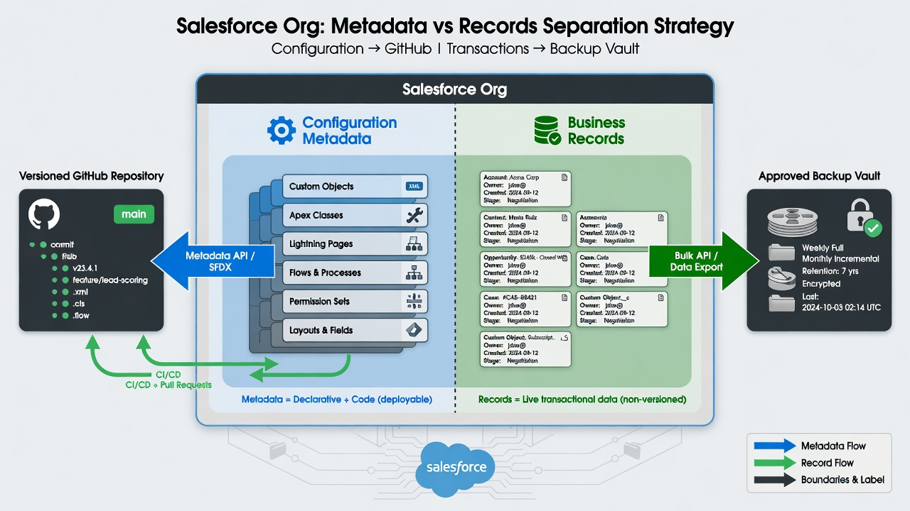
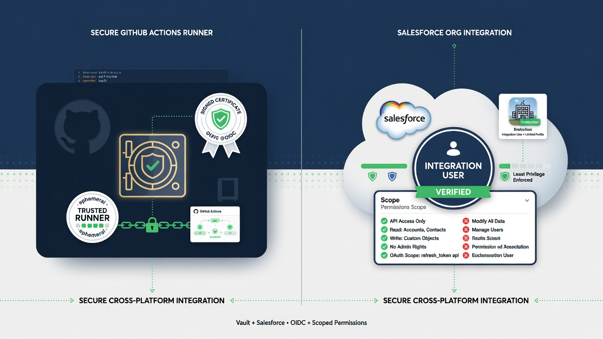

A Salesforce metadata backup in GitHub can give a team something it often lacks: a durable, inspectable history of configuration. If a Flow changes, a field disappears, or a permission definition drifts, the repository can show earlier versions and the commits between them. That is genuinely useful protection, provided everyone understands what was captured and what “restore” means for that component.

The important qualifier is metadata. GitHub is naturally good at versioning source-like text files. It is not automatically a Salesforce record-data backup, a managed disaster-recovery platform, or a promise that every file can be pushed back into production with one click. Treating those very different capabilities as interchangeable creates a comfortable but dangerous gap.

A better approach is to define the recovery outcome first, retrieve an explicit metadata scope, preserve it on a dependable schedule, and practice recovery in a safe org. Then the phrase “metadata backup” refers to a tested capability rather than a folder full of XML that nobody has tried to use.

*Version configuration in GitHub; keep business records in approved storage.*

## What counts as a Salesforce metadata backup?

In practical terms, it is a series of repository states containing metadata retrieved from a Salesforce org. The first successful retrieval creates a baseline. Later retrievals create commits only when tracked files change. Git preserves the older versions and GitHub makes them easier to compare, review, protect, and automate.

The captured files might include custom-object definitions, custom fields, Apex, Lightning Web Components, Flows, validation rules, layouts, permission sets, custom metadata types, and other supported components. The actual list depends on the manifest, API version, org features, installed packages, permissions, and the behavior of each metadata type.

Salesforce's `sf project retrieve start` command can retrieve components named in a manifest or selected with metadata and source-directory flags. The [Salesforce CLI reference](https://developer.salesforce.com/docs/platform/salesforce-cli-reference/guide/cli_reference_project_retrieve_start.html) also notes that production orgs do not support source tracking. In production, a repeatable retrieve-and-diff process is therefore especially important.

A repository is a useful backup artifact when four statements are true:

1. The team knows which org and metadata scope it represents.
2. Retrievals run reliably and failures are visible.
3. Repository history is protected from casual rewriting or deletion.
4. Selected components have been recovered and validated in a non-production environment.

Without those properties, the repository may still be a useful archive, but its recovery value is uncertain.

## Metadata backup is not record-data backup

The word “Salesforce” can make two entirely different kinds of material sound like one system image.

Metadata describes configuration and code. Record data is the business content created inside that configuration: Accounts, Contacts, Cases, Opportunities, custom-object records, files, and activity history. The two layers have different tools and risks.

Record exports can contain personal information, financial details, contracts, health information, customer communications, or other sensitive material. Putting CSV exports in a source repository expands the number of copies, changes the access model, complicates deletion and retention, and can expose the data in forks, local clones, logs, or old commits.

Keep the architecture explicit:

- Retrieve and commit approved metadata to a private repository.
- Send required record-data exports to storage approved for that data classification.
- Document encryption, retention, access, monitoring, and restore procedures for the record-data destination.
- Commit only non-sensitive manifests or checksums when the metadata workflow needs evidence that a separate export occurred.

This separation is not a limitation of the strategy. It is what keeps the strategy defensible.

## Decide what you need to recover

“Back up the org” is too broad to test. Useful recovery objectives are narrower and observable.

Examples include:

- Recover the previous version of an Apex class after a faulty hotfix.
- Reconstruct a deleted custom field and its associated permission-set changes.
- Compare a Flow with last week's working version and deploy the approved prior definition.
- Identify every metadata file changed during an unplanned production edit.
- Rebuild a selected configuration set in a clean sandbox for investigation.
- Produce the exact metadata commit associated with a named release.

Each objective implies a required scope. Recovering a custom field may also require its parent object definition, permissions, layouts, record types, and dependent automation. A single XML file may not be a complete recovery unit.

This is why a manifest should be treated as a maintained recovery inventory. Review it when the org gains new features, teams, packages, or metadata types. A nightly job can be perfectly green while omitting the component someone later needs.

## Build a trustworthy baseline

The initial retrieval deserves more care than a routine scheduled run because every later comparison depends on it.

Start with a development org or sandbox whose contents the team understands. Create a Salesforce project, define package directories, and build an explicit manifest. Retrieve the scope and inspect it locally before creating the remote repository.

Review the baseline for:

- authorization files, access tokens, certificates, private keys, or `.env` files;
- record-data exports and debug logs that may contain business data;
- generated folders, caches, temporary archives, and machine-specific settings;
- components that appear unexpectedly absent;
- very large or binary artifacts that will make history difficult to operate;
- environment-specific values that need a documented handling policy;
- managed-package material the team cannot meaningfully deploy or maintain.

Add a README that identifies the source org by a non-secret label, the manifest path, retrieval command, API version policy, owners, schedule, exclusions, and intended recovery outcomes. Record the date of the baseline and the tool versions used.

Then make a controlled change in the source org. Retrieve again and inspect the diff. The team should be able to point to the changed file and explain how its XML corresponds to the setup change. Reverse the change and repeat. This small exercise catches project-structure and normalization problems before production history depends on them.

*Define scope, retrieve, inspect, commit, test a change, then practice recovery.*

## Schedule snapshots without manufacturing noise

A scheduled workflow should retrieve the same scope into the same project structure. When files change, it creates a commit with a predictable message and enough context to investigate. When nothing changes, it exits successfully without creating an empty commit.

GitHub Actions is a convenient runner because the workflow and history live together. Scheduled workflows run from the default branch. GitHub also warns that schedule events can be delayed during high-load periods, particularly near the start of an hour. See GitHub's current [schedule event behavior](https://docs.github.com/actions/using-workflows/events-that-trigger-workflows#schedule) before promising an exact recovery point based only on cron timing.

For many orgs, a nightly snapshot is a reasonable baseline. Higher-change or higher-risk environments may justify more frequent retrieval, while quiet sandboxes may need less. Frequency should follow a recovery-point objective: how much unrecorded metadata change could the organization tolerate?

Keep the workflow operationally legible:

- Add `workflow_dispatch` so an authorized operator can run it manually.
- Avoid the first minute of the hour when choosing a schedule.
- Use concurrency control so two retrievals do not write the same working tree.
- Pin runtime and action versions deliberately and review updates.
- Log the org alias, manifest, API version, and retrieval result without printing secrets.
- Fail when retrieval is incomplete; do not quietly commit a partial or empty tree.
- Notify a named owner on failure.
- Make commit authorship clearly attributable to automation.

The workflow should never delete broad sections of the baseline just because authorization failed or a CLI command produced unexpected output. Retrieve into a controlled location, verify the result, and only then replace or update the tracked source.

## Protect the history that provides the protection

If anyone can force-push or delete the default branch, the repository is a fragile backup. Use organization ownership, private visibility, least-privilege roles, branch protection or rulesets, and an independent retention strategy appropriate to the business requirement.

GitHub can require pull requests, reviews, status checks, conversation resolution, signed commits, or restrictions on updates and deletions. The available choices are described in GitHub's [branch protection documentation](https://docs.github.com/en/repositories/configuring-branches-and-merges-in-your-repository/managing-protected-branches/about-protected-branches). Configure the smallest set that clearly protects history without preventing the snapshot workflow from operating.

Be precise about the automation identity. A workflow that commits snapshots needs repository content write access; most other jobs may need only read access. GitHub recommends setting `GITHUB_TOKEN` to the least required permission using the workflow or job-level `permissions` key. The [workflow authentication guidance](https://docs.github.com/actions/reference/authentication-in-a-workflow) explains this control.

Repository protection is still not the same as independent backup. Git hosting incidents, account compromise, accidental repository deletion, and retention requirements may justify a mirror or archive under separate administrative control. Decide this from the organization's recovery and compliance requirements, not from a generic checklist.

## Understand the recovery path before an incident

Git can recover a prior file in seconds. Salesforce recovery may take much longer because metadata has dependencies, validation rules, tests, access constraints, and environment-specific state.

A controlled metadata recovery typically looks like this:

1. Identify the incident window and affected components.
2. Compare the current org snapshot with the last known good commit.
3. Confirm that the earlier metadata is actually the intended state.
4. Create a recovery branch from the trusted commit or restore selected files onto a new branch.
5. Review destructive implications and dependent components.
6. Validate deployment against a sandbox or appropriate validation target.
7. Obtain the required approval.
8. Deploy the selected recovery set.
9. Run focused functional checks.
10. Retrieve the org again and confirm the repository reflects the recovered state.
11. Record the incident, decision, commit, deployment result, and follow-up work.

The process is intentionally not a blind rollback button. Salesforce metadata changes can be additive, destructive, or entangled with data. Reintroducing an old validation rule might block current records. Removing a new field could cause data loss. Rolling back one Flow without a related Apex or permission change might create a different failure.

Recovery is an informed change, and it should pass through the same controls as other high-risk changes—only faster and with a clearly assigned incident owner.

## Test recovery at the component level

A recovery test should prove more than “the file exists in Git.” Pick representative components and rehearse the full path.

For example, choose a small custom object with fields, a validation rule, and a permission set. Capture the current baseline. Make and record a controlled change. Restore the earlier files on a branch. Validate and deploy them to a sandbox. Confirm the setup state and run a small functional test. Retrieve again to prove the recovered org matches the expected repository state.

Repeat with a Flow and a simple Apex change because different metadata families expose different dependencies and validation behavior. Record the time, manual steps, missing prerequisites, and errors. The test will often reveal that the manifest needs related components or that the runbook assumes knowledge held by one person.

Do not use production as the first place to discover those facts.

## Set honest recovery objectives

Two common terms help frame the conversation:

- **Recovery point objective (RPO):** how much recent change the team can tolerate losing from the recorded history. A nightly retrieval suggests up to roughly a day of metadata change may be absent, plus scheduling or failure delays.
- **Recovery time objective (RTO):** how long the team expects it to take to identify, approve, validate, deploy, and verify a recovery.

The repository schedule influences RPO, but only if runs succeed and failures are handled. The runbook, dependencies, test duration, access, and human approval path all influence RTO.

Avoid inventing aggressive targets based on one successful demo. Measure recovery drills, then state what the process has demonstrated. If the business requires contractual restore times, point-in-time record recovery, or vendor-operated incident response, a managed backup platform may be the appropriate control alongside the Git repository.

## What to monitor

An unnoticed failure can widen the gap between the org and its last recorded state. Monitor the process as a small production system.

Useful signals include:

- timestamp and result of the last successful retrieval;
- expected versus retrieved component counts where meaningful;
- unusually large additions, changes, or deletions;
- authentication expiry or authorization errors;
- commits created outside the automation and approved pull-request paths;
- workflow or dependency version changes;
- repository visibility, branch-rule, and administrator changes;
- age of the last completed recovery drill.

A dashboard is optional. A dependable issue or Slack alert routed to an owner may be enough. The important part is that a failure creates work someone is expected to close.

## When GitHub metadata history is enough—and when it is not

This approach is a strong fit when the main need is visibility into configuration change, the team can operate GitHub and Salesforce CLI, recovery can be a controlled engineering process, and record-data backup is handled separately.

It is not sufficient by itself when the organization needs point-in-time record recovery, automated relationship-aware data restore, legal retention guarantees, vendor support during an incident, comprehensive coverage commitments, or contractually defined recovery service levels.

The options are not mutually exclusive. A managed Salesforce backup product can protect records and provide supported restore workflows, while GitHub remains the best collaboration surface for metadata, automation, reviews, and release evidence.

## A metadata backup readiness checklist

Before describing the repository as a working metadata backup, confirm:

- The source org, manifest, project structure, and API-version policy are documented.
- The initial baseline was inspected for secrets, record data, and generated noise.
- Scheduled retrievals produce visible failures and no empty commits.
- Broad unexpected deletions stop the workflow for review.
- The repository has named organizational owners and protected history.
- Workflow permissions and Salesforce access follow least privilege.
- Credentials can be rotated and the workflow can be disabled quickly.
- Representative Apex, declarative, and permission components have been recovered in a safe org.
- Recovery evidence and observed timing are recorded.
- Record-data backup requirements have a separate, approved answer.

If several of these are missing, that is not a reason to abandon the work. It is a reason to describe the current state as a metadata snapshot pilot and close the gaps deliberately.

## Frequently asked questions

### Can GitHub restore an entire Salesforce org?

Not by itself. It can preserve versions of retrieved metadata. Reconstructing an org also depends on metadata coverage, dependencies, packages, environment configuration, credentials, record data, files, and a tested deployment sequence.

### How often should Salesforce metadata be backed up?

Match frequency to the amount of metadata change the organization can tolerate losing from history. Nightly is a practical starting point for many teams, but a high-change production org may need more frequent snapshots and stronger monitoring.

### Should every metadata type be retrieved?

Aim for the scope required by documented recovery goals. Broad coverage can be valuable, but metadata types vary in support and behavior. Start with understood, high-value components and expand through testing.

### Does a successful retrieval prove the metadata can be restored?

No. Retrieval proves that files were captured. A recovery drill proves that selected versions can pass validation, deploy with dependencies, and produce the intended org behavior.

### What should this article link to internally?

After publication, link to the **Salesforce source control** pillar, the **Salesforce GitHub integration** implementation guide, the **Salesforce org drift detection** article, and the focused guide to **restoring Salesforce metadata from GitHub**.
