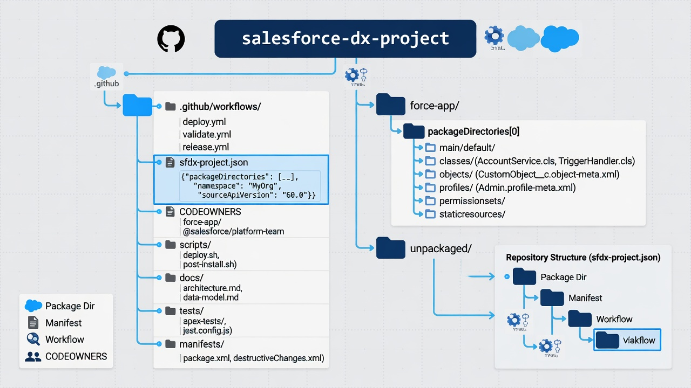

A good Salesforce metadata repository structure makes the org easier to understand before it makes deployment faster. A teammate should be able to open the project and find the metadata, retrieval scope, automation, ownership rules, and operating documentation without learning one consultant's laptop habits.

Salesforce DX provides the technical container: an `sfdx-project.json` file identifies the project, package directories hold source-format metadata, and manifests select components for retrieval or deployment. GitHub adds history, pull requests, ownership, rules, automation, and release evidence. The repository structure connects those capabilities.

There is no universal folder tree for every Salesforce program. A small admin-led org and a multi-team product platform should not look identical. The durable design goal is coherence: directories should reflect ownership and release boundaries, generated artifacts should stay out of source, and every automation path should operate on an explicit slice of the project.



*Project root, package directories, manifests, automation, and ownership in one layout.*

## Start with source format and a real DX project

Salesforce source format is designed for version-control workflows. It decomposes certain metadata into files that produce more useful diffs than a single large metadata-format artifact. The `sfdx-project.json` file tells Salesforce tooling that the directory is a project and defines properties such as package directories and source API version.

Salesforce's [`sf template generate project` reference](https://developer.salesforce.com/docs/platform/salesforce-cli-reference/guide/cli_reference_template_generate_project.html) describes the generated structure and default `force-app` package directory. Salesforce also explains that [source format is optimized for version control](https://developer.salesforce.com/docs/platform/code-builder/guide/codebuilder-source-format.html).

A simple repository might begin like this:

```text
salesforce-org/
├── .github/
│   ├── workflows/
│   ├── CODEOWNERS
│   └── pull_request_template.md
├── config/
│   └── project-scratch-def.json
├── docs/
├── force-app/
│   └── main/
│       └── default/
├── manifest/
│   ├── package.xml
│   └── release/
├── scripts/
├── .forceignore
├── .gitignore
├── README.md
├── SECURITY.md
└── sfdx-project.json
```

The exact files can differ. What matters is that Salesforce tooling recognizes the project, shared source has a predictable home, and operational material is separated from metadata without being separated from its history.

## Understand what belongs at the root

Root-level files establish project identity and behavior.

### `sfdx-project.json`

This is the project configuration. Keep it reviewed and stable. Changes to package directories, namespace, plugins, or source API version can alter retrieve and deploy behavior across the repository.

Treat API-version changes as migrations. Run retrieval and validation in a sandbox, inspect broad XML changes, and commit mechanical normalization separately from feature work.

### `README.md`

The README should answer operational questions, not merely repeat the project name:

- What org or program does this repository represent?
- Is Git the authoritative release source, an observational mirror, or both?
- Which package directories and manifests matter?
- How does a developer authenticate locally without committing credentials?
- How are metadata retrieval, validation, and deployment run?
- Who owns workflows, access, failures, and releases?
- Which artifacts are intentionally excluded?
- Where are recovery and emergency-change procedures?

A new teammate should reach a safe first validation without private oral history.

### Ignore files

`.gitignore` handles general local and generated files. `.forceignore` controls what Salesforce commands exclude during relevant operations. They solve different problems.

Exclude local authorization state, private keys, `.env` files, caches, logs, temporary retrieval archives, test output, coverage, generated deployment results, and editor files that do not belong to the team.

Ignore rules are guardrails, not secret management. Scan before push and rotate any credential that enters history.

### Security and contribution files

`SECURITY.md` can describe how to report credential or workflow concerns. Contribution guidance can explain branching, commit expectations, tests, and pull-request review. Keep the documents short enough to be used.

## Choose package-directory boundaries based on change

The generated `force-app` directory is a fine starting point. A small team does not need artificial modularity. As the org and contributor count grow, multiple package directories can express meaningful boundaries.

Possible boundaries include:

- a customer-service application;
- a revenue-operations capability;
- a shared platform or common metadata layer;
- integration-specific Apex and configuration;
- one independently released unlocked package;
- temporary migration metadata with a defined retirement plan.

Salesforce describes the package development model as organizing unpackaged metadata into well-defined package directories that are versionable and maintainable. See its [package development model overview](https://developer.salesforce.com/docs/platform/code-builder/guide/codebuilder-package-dev-model.html).

Do not split directories only by metadata type, such as putting all Apex in one package and all objects in another, when those artifacts change and deploy as one feature. That arrangement can make ownership and dependency reasoning harder.

Useful boundaries have at least one of these properties:

- a team can own them;
- they can be validated as a coherent unit;
- they have a distinct dependency direction;
- they follow a release cadence;
- they may later become a package;
- they reduce conflict and review noise.

If every change crosses every directory, the modular design is decorative.

## Make dependency direction visible

Multiple package directories need an intentional order. Shared metadata should not casually depend on a feature package that also depends on shared metadata. Cycles make isolated validation and future packaging difficult.

Document dependencies in `sfdx-project.json`, diagrams, or a short table. Name directories by business capability rather than cryptic team abbreviations that will age quickly.

A conceptual layout could be:

```text
packages/
├── platform-core/
├── identity-access/
├── service-operations/
└── revenue-operations/
```

`platform-core` might provide common objects and Apex used by higher layers. `identity-access` might own reusable permission sets and groups. Business packages depend on those foundations, not on each other unless the relationship is explicit.

Unpackaged metadata can still use package-directory discipline. The team does not need to adopt second-generation packaging immediately to benefit from smaller ownership and validation surfaces.


*Platform core at the bottom; business capabilities depend upward only.*

## Treat manifests as product artifacts

A `package.xml` manifest defines a metadata selection for retrieve or deploy operations. One enormous wildcard manifest is easy to create but hard to reason about.

Maintain manifests by purpose:

```text
manifest/
├── baseline.xml
├── snapshot.xml
├── validation.xml
├── recovery-critical.xml
└── release/
    ├── 2026-07-service-update.xml
    └── 2026-08-permissions.xml
```

Names should describe intent. The baseline or snapshot manifest defines coverage for history and drift detection. A validation manifest may cover a package or release candidate. A recovery-critical manifest can support drills but should not imply that unlisted components are unimportant.

Review manifest changes as coverage changes. Removing a type from `snapshot.xml` reduces what the team can detect and recover. Adding a broad wildcard can introduce noise, timeouts, or sensitive internal configuration.

Salesforce's [`sf project retrieve start` documentation](https://developer.salesforce.com/docs/platform/salesforce-cli-reference/guide/cli_reference_project_retrieve_start.html) covers manifest-based retrieval. Metadata families vary in wildcard and folder behavior, so test manifests against a real org.

Generated release manifests can be useful, but preserve the generated result with the release evidence. A dynamic script that produces a different selection later weakens reproducibility.

## Keep environment differences out of random branches

Salesforce environments differ: endpoints, feature settings, credentials, named credential targets, connected apps, data, and sometimes metadata. Scattering production-specific XML across branches makes merging and recovery confusing.

Prefer one shared metadata source with explicit environment configuration patterns. Depending on the component and policy, environment differences may be handled through:

- protected GitHub environment variables and secrets;
- post-deployment configuration steps;
- custom metadata records with reviewed environment values;
- named credentials or external credentials configured per org;
- manifests that include or exclude known environment-only components;
- documented manual controls when a setting cannot be safely automated.

Do not commit actual secrets. Avoid a permanent `production` branch whose contents silently diverge from `main` unless the team has a disciplined promotion and reconciliation model.

Document intentional differences in a table naming the component, reason, owner, implementation, and verification. An unexplained environment exception becomes future drift.

## Put automation beside the project

Store GitHub Actions workflows under `.github/workflows/`. Use distinct files for distinct authorities:

```text
.github/workflows/
├── metadata-snapshot.yml
├── pull-request-validation.yml
├── release-validation.yml
└── production-deploy.yml
```

The snapshot retrieves and records metadata. Pull-request validation checks proposed changes in non-production. Release validation performs the approved preflight. Production deploy uses a protected credential and explicit gate.

Shared shell logic can live under `scripts/`, but keep workflows readable. A reviewer should be able to follow permissions, triggers, secrets, environments, and the command being run without opening ten abstraction layers.

Organize scripts by responsibility:

```text
scripts/
├── retrieve/
├── validate/
├── deploy/
└── report/
```

Scripts should accept explicit targets and manifests, fail on errors, produce machine-readable results, and avoid hidden state. Test them locally and in a sandbox.

Do not store generated credentials or Salesforce CLI authorization state under `scripts/` simply because automation uses them.

## Add ownership where it changes review quality

CODEOWNERS can request reviews based on paths. GitHub's [CODEOWNERS documentation](https://docs.github.com/en/repositories/managing-your-repositorys-settings-and-features/customizing-your-repository/about-code-owners) explains supported locations and branch behavior.

Possible ownership rules include:

- security team ownership for workflow files and access metadata;
- platform team ownership for `sfdx-project.json` and shared packages;
- business application teams for their package directories;
- release engineering ownership for production manifests;
- repository administrators for the CODEOWNERS file itself.

Do not assign every path to five teams. GitHub code-owner approval typically requires an approval from an eligible owner, not every listed expert. Pair CODEOWNERS with a pull-request template and review culture that brings in additional specialists when a change crosses domains.

Keep ownership tied to durable teams rather than individuals where possible. Review the file during reorganizations and access audits.

## Design the docs directory for operations

Documentation beside source changes with the system. Useful documents include:

```text
docs/
├── architecture.md
├── authentication.md
├── metadata-scope.md
├── release-runbook.md
├── recovery-runbook.md
├── credential-rotation.md
├── emergency-change.md
└── environment-differences.md
```

Avoid copying full vendor documentation. Link to current Salesforce and GitHub references and document the organization's choices: exact owners, manifests, commands, approvals, and exceptions.

Every runbook should identify prerequisites, expected inputs, safe target, stopping conditions, evidence, and escalation. Test procedures periodically. A beautiful recovery document that references a retired CLI command is not operational documentation.

Architecture decision records can capture why the team selected multiple package directories, a particular authentication method, or direct snapshot commits. Those choices are easier to revisit when the original tradeoff is preserved.

## Keep tests near the behavior they protect

Apex test classes naturally live with Apex source. Lightning component tests can live with component tooling according to the framework convention. Repository-level scripts can validate manifests, XML, naming, prohibited files, dependency rules, and workflow structure.

Organize tests so a contributor can predict what runs for a changed path. A package directory should ideally have an identifiable validation command. Shared tests should say which packages they protect.

Do not use a `/tests` folder as a junk drawer for screenshots, manual notes, old deployment results, and executable tests. Put durable evidence under a clearly named documentation or release-evidence path, or retain it as a protected GitHub artifact with an appropriate lifespan.

## Decide what not to commit

A Salesforce repository should generally exclude:

- access tokens, private keys, authorization URLs, and session files;
- `.env` and local Salesforce CLI state;
- broad record-data exports;
- logs containing record values or authentication details;
- temporary metadata ZIP files;
- node, Python, or CLI dependency caches;
- generated coverage and test-result folders unless intentionally published;
- editor and operating-system clutter;
- build artifacts reproducible from source;
- unmanaged screenshots without documentation value.

Some generated artifacts belong in releases rather than Git history. An immutable deployment package, checksum, validation report, and manifest can be stored with a GitHub release or approved artifact-retention system.

Be cautious with large binary files. Git is optimized for versioned text, and cloning a repository pulls its history. Store business documents and data in appropriate systems and link them from the work item when necessary.

## Migrate a messy repository in reviewable steps

Do not reorganize every file while delivering a business feature. Structural migrations produce large diffs and can obscure behavior changes.

Use a staged sequence:

1. Record the current project, commands, and target behavior.
2. Add or correct `sfdx-project.json` and ignore rules.
3. Establish a clean baseline and tag it.
4. Move one metadata family or feature boundary at a time.
5. Validate retrieval and deployment after each move.
6. Commit mechanical path changes separately.
7. Update manifests, scripts, CODEOWNERS, and docs with each boundary.
8. Run a full non-production validation before adopting the new structure.

Salesforce's source-format guidance warns that bulk conversion from legacy metadata format can make history difficult for Git to detect cleanly and recommends smaller conversion steps. Preserve traceability by isolating moves and avoiding simultaneous formatting edits.

## Evaluate the repository as a new contributor

A practical structure passes a few human tests:

- A new admin can find the metadata for a named Flow.
- A developer can identify the package and dependencies for a class.
- A release owner can find the exact manifest and validation workflow.
- A security reviewer can see which job receives the production secret.
- An operator can find the last successful snapshot and recovery runbook.
- A reviewer can tell whether a large diff is business change or project normalization.
- A repository owner can identify responsible teams without searching chat history.

If those tasks require tribal knowledge, improve naming and documentation before adding more tooling.

## A maintainable starting structure

For a small team, keep one package directory, a baseline manifest, separate snapshot and validation workflows, CODEOWNERS for sensitive paths, and five concise documents: README, metadata scope, authentication, release, and recovery.

Add package directories when ownership or release boundaries become real. Add manifests when a recurring operation needs a stable scope. Add scripts when repetition justifies them. Keep the architecture proportional to the org.

The repository should feel boring in the best way. Every important file has a purpose, every credential stays outside it, and every workflow makes its target and authority visible.

## Frequently asked questions

### Should every Salesforce repository use multiple package directories?

No. One `force-app` directory is appropriate for many small teams. Split when business ownership, dependency direction, validation, release cadence, or future packaging creates a meaningful boundary.

### What is the difference between `.gitignore` and `.forceignore`?

`.gitignore` controls what Git leaves untracked. `.forceignore` tells applicable Salesforce tooling which local files or metadata paths to ignore. Teams often need both.

### Should `package.xml` be committed?

Yes when it defines a repeatable retrieval, validation, deployment, or recovery scope. Review manifest changes because they change what the operation covers.

### Should production have its own Git branch?

Not automatically. Permanent environment branches often drift. Prefer a protected main source plus identified release commits or tags and explicit environment configuration unless a documented promotion model requires otherwise.

### What should this article link to internally?

Link to the **Salesforce source control** pillar, **Salesforce GitHub integration** for workflow architecture, **Salesforce deployment validation** for CI, and **Salesforce metadata backup** for baseline and recovery coverage.
