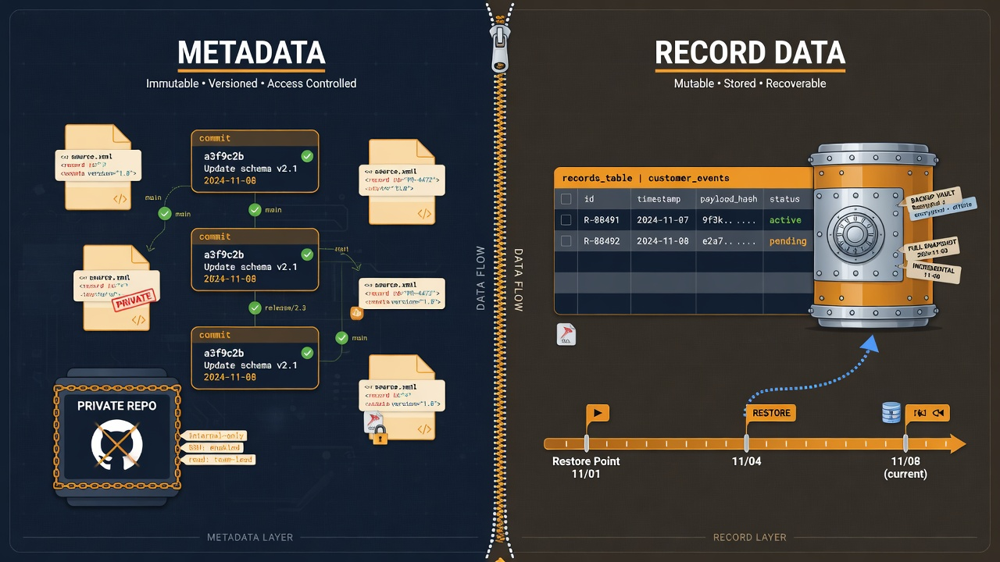
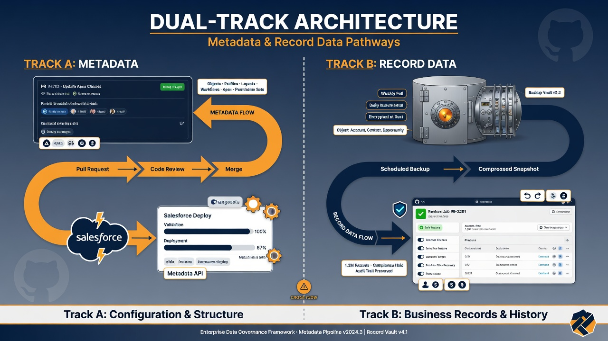

Salesforce metadata vs data backup is a distinction teams often blur until the first real incident. Someone says “we’re backed up to GitHub,” leadership hears “the org can be restored,” and what actually exists is a private repository of configuration source—profiles, objects, Apex, Flow definitions, and related metadata—without a tested path to rehydrate millions of records. The inverse mistake also happens: a thorough record-backup product exists, yet nobody can rebuild the automation and security model that made those records usable.

This article draws a clean line. It defines metadata and record data in practical terms, explains what a GitHub-centered metadata practice does well, what record-oriented backup products are for, why CSV and bulk exports do not belong in git as a casual strategy, how to run a dual-track architecture, how to speak honestly about RPO and RTO, how compliance conversations change by track, and how to drill recovery for each path. Prefer non-production experiments first. And keep repeating the sentence that prevents false confidence: **metadata backup is not record-data backup.**

*Configuration history in Git is not the same as record recovery.*

## Clear definitions (the working versions)

### Metadata

In Salesforce day-to-day language, metadata is the configuration and code that shapes how the org behaves: custom objects and fields, validation rules, Flows, Apex classes and triggers, Lightning components, permission sets, profiles (with all their operational baggage), custom metadata types, layouts, reports and dashboards as metadata components, connected app settings you manage as deployable configuration, and much more. Salesforce describes metadata management and retrieval through tools such as Salesforce DX and the Metadata API; the [Metadata API Developer Guide](https://developer.salesforce.com/docs/atlas.en-us.api_meta.meta/api_meta/meta_intro.htm) is the canonical map of types and behaviors.

Metadata answers: *What is this system designed to do, and under which rules?*

### Record data

Record data is the business content stored in objects: Accounts, Contacts, Opportunities, Cases, custom object rows, field values, and related files and content where your backup scope includes them. It is the accumulating history of the business operating inside the designed system.

Record data answers: *What has happened, and what is the current state of each business entity?*

### Why the blur happens

Both live “in Salesforce.” Both hurt when lost. Both can be exported in some form. Both appear in disaster-recovery slide decks. Under stress, people collapse them into “backup.” Precision here is kindness to future-you.

## What GitHub does well for metadata

A private GitHub repository, fed by disciplined retrieve or source-driven development, is strong at:

- **Version history** of configuration with diffs, blame, and commit messages;
- **Review workflows** (pull requests) before configuration lands on trunk or deploys;
- **Traceability** from change request to commit to deployment validation;
- **Recovery of known configuration states** by redeploying a reviewed revision (with caveats about environment-specific values and non-metadata setup);
- **Drift detection** when nightly snapshots show unreviewed changes in the org;
- **Automation** via GitHub Actions for snapshot, validate, and governed release paths;
- **Access control** through repository permissions, branch protection, and environment secrets—not perfect, but intelligible to many IT orgs.

Git history is an excellent audit companion for *how the system definition changed*. Salesforce’s own source-centric workflows and Salesforce CLI project structures assume configuration can live as files; see the [Salesforce DX developer guide](https://developer.salesforce.com/docs/atlas.en-us.sfdx_dev.meta/sfdx_dev/sfdx_dev_intro.htm) for how projects and source format fit together.

GitHub is not automatically strong at:

- point-in-time restore of billions of field values;
- reconstructing ownership and sharing driven purely by data;
- restoring ContentVersion bodies at scale;
- guaranteeing that a metadata revision matches the data shape customers currently need without migration work;
- serving as a compliance archive for personal data retention rules.

If your only “backup” is git, you have a metadata resilience practice—not a full org resilience practice.

## What record backup products and platform features do

Record-oriented backup and restore capabilities (whether Salesforce-native options available to you, AppExchange backup products, enterprise data-protection platforms, or exports into approved data lakes) focus on:

- scheduled copies of object data;
- retention policies;
- granular or bulk restore;
- sometimes comparison and anonymization;
- storage outside the production org’s primary failure domain.

Their job is to answer: *If records are deleted, corrupted, or maliciously altered, can we return to a known good dataset within an agreed window?*

They typically do not replace source control for Apex and Flow. Restoring yesterday’s records onto a broken automation landscape may restore numbers while re-breaking processes. Dual-track thinking prevents that false comfort.

Exact product capabilities change; evaluate against your contracts, residency requirements, and tested restore procedures—not against marketing checkboxes alone. Official Salesforce Trust and help resources, and your backup vendor’s restore runbooks, should drive the data track. For platform backup-related capabilities Salesforce documents for your edition, start from current Help articles on data export and backup rather than assumptions from an old blog post.

## The risk of putting CSV exports and bulk dumps in git

Teams sometimes “split the difference” by committing CSV dumps, anonymous data samples that grew too real, or weekly Data Loader extracts into the same repository as metadata. This is usually a mistake.

### Why it goes wrong

- **Repository size and performance:** large binary-ish dumps and wide CSVs inflate clones, slow CI, and frustrate developers.
- **Secret and PII exposure:** records contain personal data, financial fields, health-adjacent information, or credentials stored where they should never have been. Git multiplies copies across laptops and backups of the VCS itself.
- **Access model mismatch:** engineers who need metadata history may not be cleared for production personal data.
- **False restore story:** a CSV in a commit is not a managed restore pipeline. It lacks referential integrity tooling, partial restore UX, and retention governance.
- **Merge noise:** data dumps create unreviewable diffs that hide real metadata changes.
- **Legal retention:** deleting data from Salesforce but leaving it in git history can violate deletion commitments unless history is rewritten—an expensive operation.

If you need sample data for tests, use deliberate, minimized, synthetic, or properly scrubbed fixtures stored under a clear policy—not unmanaged production extracts. Prefer non-production orgs and synthetic datasets for development.

### When data-adjacent files appear anyway

Static reference content that is truly configuration (for example, small seed lists maintained as metadata or as carefully governed repo fixtures) should be explicit, reviewed, and free of production personal data. If a file would be uncomfortable in a breach notification, it does not belong in the metadata repository.

## Dual-track architecture

Draw two tracks on one diagram and keep them separate in tooling and ownership.

### Track A — Metadata resilience (GitHub-centered)

**Sources of truth options:**

- org-first with scheduled snapshot commits; or
- git-first with deploy pipelines; or
- hybrid with clear rules per metadata type.

**Controls:**

- private repository;
- branch protection and CODEOWNERS;
- authenticated automation with least privilege;
- validation workflows;
- release evidence;
- documented restore-via-redeploy procedures.

**Success looks like:** you can reconstruct configuration intent, review changes, and redeploy a known revision to a target org with tested caveats.

### Track B — Record data resilience (backup platform-centered)

**Sources of truth:**

- scheduled backups of production (and sometimes full sandboxes);
- retention tiers;
- immutable or access-controlled storage as policy requires.

**Controls:**

- access limited to operations and compliance-approved roles;
- encryption and residency controls;
- tested restore to sandbox first;
- integration with incident response.

**Success looks like:** you can restore defined objects and time ranges within stated RPO/RTO without pretending git will do it.

### Shared governance layer

- incident commander knows which track to invoke for which symptom;
- stakeholders receive status that names the track;
- drills exercise both;
- funding and vendors are not forced into one tool that claims to do everything at mediocre quality.

*Track A is configuration history. Track B is record recovery. Keep them separate.*

## RPO and RTO honesty

**RPO (recovery point objective)** is how much data loss you can tolerate, measured in time: “up to 24 hours of changes may be gone.”

**RTO (recovery time objective)** is how long recovery may take before operations are acceptably restored.

### Metadata track realities

- Nightly snapshots imply roughly a one-day RPO for *uncommitted org-only changes* unless you also require git-based development for all production configuration.
- If developers work only in git and deploy through pipelines, RPO for configuration may be “last merged commit,” which can be excellent—until someone hot-fixes directly in production.
- RTO for metadata is not “git clone.” It includes identifying the good revision, validating against the target, deploying, re-applying environment-specific post-steps, and verifying. A day of careful redeploy may be honest even when files are instantly available.

### Data track realities

- Backup frequency sets a floor on RPO. Continuous or near-continuous replication differs sharply from weekly exports.
- RTO depends on volume, restore granularity, sandbox availability, validation of restored data, and business acceptance testing.
- Partial corruption (bad automation mass-updating records) may need surgical restore, which is a different skill from full-org reload.

### Do not publish a single org-wide RPO

Publish objectives **by track and by scenario**:

- accidental production metadata change;
- malicious metadata change;
- bulk record delete;
- ransomware-style encryption of exports;
- lost sandbox used as a release rehearsal.

Honesty beats a single green number on a slide.

## Compliance and regulatory tone

Compliance officers care about personal data, retention, access, residency, and proof. Metadata repositories still need access control—source can reveal security models—but record backups usually attract stricter scrutiny.

Practices that help:

- Keep production personal data out of the metadata git repository.
- Document processors and subprocessors for backup vendors.
- Align retention of backups with legal holds and deletion obligations.
- Separate duties: who can restore data vs who can deploy metadata.
- Capture evidence from both tracks during audits: commit history and PR reviews for configuration; backup job logs and restore tests for data.

When regulations require deletion of an individual’s data, check both Salesforce and any backup copies under your retention design. Git history of metadata rarely contains that individual’s records if you kept dumps out; backups almost certainly do.

GitHub’s own security and compliance documentation for enterprise cloud, such as [GitHub’s security overview materials](https://docs.github.com/en/code-security), helps you describe repository controls; pair that with Salesforce’s privacy and security documentation for the platform side.

## Communication to stakeholders

Translate without condescension.

**Better sentence:** “We version and review Salesforce configuration in a private GitHub repository, and we run a separate, scheduled record-data backup with tested restores. They protect different failure modes.”

**Worse sentence:** “Everything is in GitHub.”

Provide a one-page matrix:

| Scenario | Primary track | What “recovered” means | Typical evidence |
| --- | --- | --- | --- |
| Bad Flow deployed | Metadata | Redeploy last good revision; maybe data fix if Flow corrupted records | PR, tag, deploy id |
| Mass delete of records | Data | Restore records from backup to agreed point | Backup job id, restore ticket |
| Sandbox refresh surprises | Both | Rebuild config from git; re-seed data per policy | Pipeline + data plan |
| Admin changed profiles in prod | Metadata | Diff snapshot, review, reconcile | Nightly commit diff |

Offer a short briefing to sales engineering, CS leaders, and executives who may speak to customers about “Salesforce backup.” Mis-set expectations become contractual pain.

## Recovery drills for each track

Untested backup is hope. Schedule drills in non-production first.

### Metadata drill examples

1. **Selective restore:** intentionally break a harmless Flow in a sandbox; restore the prior definition from git via the standard pipeline; verify.
2. **Revision identification:** given a symptom date, find the last known good commit using history and snapshots; document the time to identify.
3. **Full package deploy to a fresh sandbox:** measure time, failures, manual post-steps, and missing non-metadata setup (email relays, named credential secrets, etc.).
4. **Drift surprise:** compare production snapshot to trunk; practice the investigation checklist.

### Data drill examples

1. **Single-object restore** of synthetic or approved sandbox data.
2. **Parent-child integrity** check after restore.
3. **Time-to-first-verified-record** measurement against RTO.
4. **Access control test:** confirm unauthorized engineers cannot pull production backup extracts.

### Joint drill

Simulate a bad deploy that both ships wrong metadata and corrupts records. Practice sequencing: stop the bleeding, decide track order (often fix metadata first so restored data does not re-corrupt), communicate status by track, and write a blameless timeline.

Record drill results where auditors and new teammates can find them. Improve runbooks when the drill feels embarrassing—that is the point.

## Design principles that keep the line clear

1. **Separate storage domains:** git for metadata source; backup vault/platform for records.
2. **Separate access:** developers vs data-restore operators as policy requires.
3. **Separate automation:** Actions that retrieve metadata should not casually export production records to the repo.
4. **Separate metrics:** snapshot success is not backup success.
5. **Separate budget lines if needed:** so one track is not starved because the other “looks done.”
6. **Prefer non-production** for inventing process; promote with change control.
7. **Say the quiet part weekly** until culture absorbs it: metadata ≠ record data backup.

## How enablement programs should teach this

If you run an enablement pilot that connects Salesforce to GitHub for metadata resilience, curriculum should include a dedicated module on the data boundary. Engineers will otherwise optimize for elegant pipelines and accidentally invent CSV-in-git “solutions.” Product owners will otherwise under-invest in record backup because the demo of git history is visually satisfying.

A healthy pilot exit criterion includes:

- documented dual-track diagram;
- named owners for each track;
- at least one metadata recovery drill;
- at least one data restore drill in non-production;
- stakeholder sign-off on RPO/RTO statements that mention both tracks.

## Edge cases worth naming

- **Custom metadata types and custom settings:** configuration-shaped, sometimes data-shaped in usage. Decide intentionally whether they live in git like metadata (usually yes for CMDT used as config) and how secrets never get stored there.
- **Knowledge articles and CMS content:** may be data or hybrid depending on product surface; do not assume Metadata API coverage equals full content disaster recovery.
- **Files and attachments:** almost always a data-track problem at scale.
- **Partial org strategies (package directories, unlocked packages):** improve metadata modularity but do not replace data backup.
- **Sandbox seeding tools:** useful for development; not automatically production backup.

When unsure, ask: *If this disappeared, would we restore it by deploy from git or by data restore APIs?* Let the answer pick the track.

[IMAGE PROMPT: Calm operations runbook scene—two binders or digital runbooks labeled Metadata recovery and Record restore on a desk with a laptop showing a green successful drill checklist; soft daylight, professional photography style, navy accents, 16:9]

## A practical policy snippet you can adapt

Use language like:

“Production Salesforce **metadata** is versioned in the private GitHub repository and changes ship through reviewed pull requests and validated deployments where applicable. Nightly snapshots detect drift. This program does **not** store production personal record data in git and is **not** the system of record for record-level backup. Production **record data** is protected by [approved backup capability], with restores tested on a defined cadence. Incident response will identify whether the event is metadata-scoped, data-scoped, or both before recovery steps begin.”

Short, boring, and hard to misquote. That is what you want.

## Incident vignettes that teach the boundary

Abstract architecture lands better when paired with concrete failure stories. Use sanitized versions of these in training.

### Vignette A: The deleted Flow

An administrator deletes a critical Flow while “cleaning up.” The nightly metadata snapshot still has yesterday’s definition in git. Recovery is primarily a **metadata** redeploy (or restore of that component) through the normal pipeline, plus verification that in-flight interviews or interviews mid-path are handled. Record backup is secondary unless the Flow already corrupted data before deletion was noticed.

### Vignette B: The mass-update job

A batch job stamps incorrect values on hundreds of thousands of records. Git history of Apex shows who shipped the job, which helps the root-cause timeline, but **restoring correct field values** is a data-track problem. Rolling back the Apex without restoring data leaves wrong numbers in place. Restoring data without disabling or fixing the job may re-corrupt records.

### Vignette C: The “full org zip” on a laptop

Someone exports a weekly data dump and a metadata retrieve to a laptop encrypted disk and calls it DR. There is no review trail, no retention policy, no tested restore, and when the laptop is wiped, both tracks vanish together. Dual-track architecture with separate systems and owners exists specifically to end this pattern.

### Vignette D: The customer questionnaire

A security questionnaire asks, “Do you back up Salesforce daily?” Marketing wants a yes. The accurate answer is longer: configuration is snapshotted and versioned with frequency X; record data is backed up with frequency Y and retainment Z; restores are tested on cadence W. Teaching sales engineering this answer prevents contractual overclaim.

Walk through one vignette per enablement session. People remember stories longer than diagrams.

## What “good” looks like at ninety days

By the end of an initial enablement quarter, a mature-enough program typically can show:

- a private repository with meaningful metadata history and protected trunk;
- scheduled snapshot or equivalent git-based control of production configuration drift;
- a written dual-track diagram signed off by engineering and a business stakeholder;
- at least one completed metadata recovery drill with timings;
- at least one completed non-production data restore drill with timings;
- RPO/RTO statements published by scenario, not as a single slogan;
- no production personal data landing in the metadata repository (verified by sampling and scanning where available);
- named owners for metadata automation and for data backup operations;
- incident runbooks that start with track selection questions.

If ninety days only produced a pretty repo demo without drills or a data-track owner, extend the pilot rather than declaring victory.

## Budget and vendor conversations

Finance sometimes wants one SKU that “backs up Salesforce.” Push for clarity in procurement language:

- tools primarily for **metadata** versioning, CI, and deployment governance;
- tools primarily for **record** backup, retention, and restore;
- optional platforms that claim both—evaluate each track’s depth independently.

Ask vendors to demonstrate restore of configuration versus restore of records as separate exercises. Ask for evidence of partial restore, encryption, residency, and role-based access. Ask how their product interacts with a git-based development workflow so you do not buy overlapping chaos.

Internal build-versus-buy for metadata often leans toward git plus Salesforce CLI plus Actions because those skills transfer. Record backup more often justifies specialized products because volume, encryption, and restore UX are hard to rebuild well.

## Sandbox strategy across both tracks

Sandboxes are where you practice, but they also confuse people.

- A full sandbox copy may include record data that is still sensitive; treat it with care and masking policies.
- Metadata deploys from git into sandboxes validate release paths without touching production data.
- Data restore tests should target designated sandboxes or isolated environments, never “surprise production.”
- Refresh cycles can wipe both carefully seeded metadata and test data—schedule drills around refreshes so you do not lose evidence mid-test.
- Do not assume a sandbox refresh is a substitute for either backup track; it is a provisioning action with its own risks.

Prefer non-production for every first attempt at a new restore technique. Promote only after timings and failure modes are known.

## Measuring culture, not only tooling

You will know the boundary is culturally real when:

- engineers refuse to commit production extracts without being asked;
- executives correct themselves mid-sentence from “GitHub backup” to “configuration versioning”;
- incident bridges open with “metadata, data, or both?”;
- CAB tickets for releases mention data migration and backup checkpoints when relevant;
- new hires receive the dual-track diagram in week one.

Tooling without culture reverts to zip files on laptops under pressure. Culture without tooling cannot meet RPO. Build both.

## Frequently asked questions

### Is a nightly metadata snapshot to GitHub enough for disaster recovery?

It is a strong component of **configuration** resilience and auditability. It is not enough for full disaster recovery if record data, files, or non-metadata setup matter to the business—which they almost always do. Pair it with a record-data backup track and tested restores.

### Can we store encrypted data exports in the same GitHub organization for convenience?

Even encrypted blobs in git create access, retention, size, and key-management problems that specialized backup platforms handle better. If compliance allows secondary copies, use storage designed for backup retention and restore workflows, not source control semantics.

### How do we explain the difference to executives quickly?

Use the dual-track matrix: configuration vs records, git vs backup platform, redeploy vs restore, different RPO/RTO. One analogy that often works: blueprints and building history in version control versus inventory and transaction ledgers in a vault.

### What happens if metadata restore and data restore disagree on “correct” state?

That is a joint incident. Usually you establish a timeline: which change broke what. Restore data to a point before corruption, and set metadata to the revision that matches the business rules for that data—or deliberately apply a forward fix. Drills teach the judgment; pure tooling will not.

### Which related posts should this article link to internally?

Link your foundational source-control enablement guide, repository structure recommendations, nightly snapshot operations, restore-from-GitHub procedures, monitoring for snapshot trustworthiness, and release-management evidence practices. Together they show metadata resilience as a program, while this page keeps record backup from being accidentally erased from the story.
