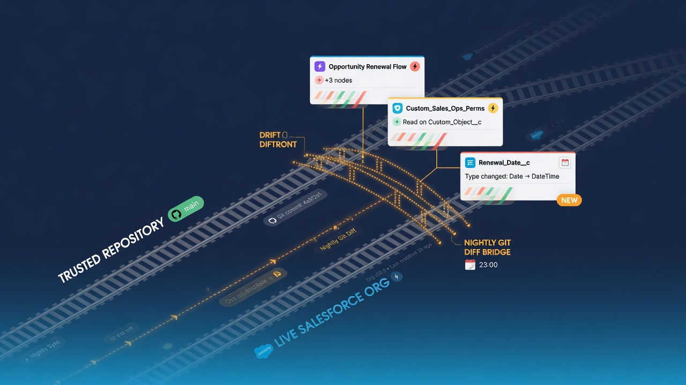

Salesforce org drift happens when the configuration in an org no longer matches the version the team believes it is operating. An admin makes an urgent production edit. A deployment includes an extra component. A permission change is completed in Setup but never represented in the repository. A sandbox keeps evolving after its project branch is abandoned. Each event may be reasonable on its own, but the accumulated difference makes future releases and incident response harder.

Git provides a practical Salesforce org drift detection mechanism when a scheduled process retrieves a known metadata scope and compares it with a trusted baseline. The resulting diff can show which files were added, changed, or removed. It cannot automatically explain the reason, and it cannot detect components that were never included in the retrieval scope, but it turns invisible configuration movement into evidence the team can investigate.

The aim is not to forbid every direct change. Some organizations need controlled break-glass edits. The aim is to make the difference visible, classify it, and reconcile the org and repository before the next release quietly overwrites one with the other.

*Nightly retrieve-and-diff turns invisible configuration movement into evidence.*

## What counts as Salesforce org drift?

Drift is a difference between two intended states. That definition requires naming both sides.

In a source-driven delivery model, the protected default branch may be the authoritative state, and production is expected to match the last deployed commit. A direct production change therefore creates drift until it is either reverted or brought back through a reviewed pull request.

In an admin-led model, production may remain the operational source of truth while GitHub serves as the historical mirror. A nightly snapshot records direct edits rather than treating them all as violations. Drift may instead mean that the snapshot failed, the repository no longer reflects production, or a planned branch was built from an outdated baseline.

Both models can work. Problems begin when different people assume different authority. Write the rule down:

- Which branch represents the trusted metadata state?
- Which orgs are expected to match that state?
- Are direct org changes prohibited, discouraged, or accepted?
- How are emergency changes documented and reconciled?
- Does automation commit snapshots directly or open pull requests?
- Who decides whether the org or repository wins when they differ?

Without those answers, a drift report is just a list of XML changes.

## Why Salesforce orgs drift so easily

Salesforce makes declarative configuration accessible. That is a strength: an authorized administrator can solve a business problem quickly without waiting for a traditional software release. It also means a production system can change through several surfaces.

Common drift sources include:

- direct Setup edits made for urgent support or operations work;
- hotfixes deployed outside the main repository workflow;
- changes made through package installation or upgrade;
- manual permission assignments or modifications;
- failed or partial deployments;
- environment-specific configuration that was never modeled in source;
- long-lived branches created from an old production baseline;
- automation or integration tools that update metadata;
- release work documented in a ticket but not committed;
- retrieve behavior changes after a CLI or API-version update.

Not every difference is a business change. Metadata output can also shift because of serialization, decomposition, implicit values, feature enablement, or tool behavior. A useful detection process must distinguish semantic drift from mechanical noise.

## The detection loop

A basic loop has six stages:

1. Define the metadata scope and trusted repository state.
2. Retrieve that scope from the target org on a dependable schedule.
3. Verify that retrieval completed successfully and fully.
4. Compare the result with the baseline.
5. Classify and route meaningful differences.
6. Reconcile the org and repository, then record the decision.

Salesforce CLI's [`sf project retrieve start` command](https://developer.salesforce.com/docs/platform/salesforce-cli-reference/guide/cli_reference_project_retrieve_start.html) supports manifest-based metadata retrieval. A maintained `package.xml` makes the monitored scope explicit. Salesforce notes that production orgs do not provide source tracking, so the comparison is based on the retrieved files rather than a server-maintained list of source changes.

Git handles the comparison. `git status` identifies changed paths. `git diff --stat` provides a quick shape. `git diff` shows the content. Scripts can classify paths by metadata type, count additions and deletions, or flag sensitive areas. The raw diff remains important because a summary can hide the actual behavior change.

## Establish a clean baseline

Drift detection is only as credible as the baseline. If the repository begins with an incomplete or unexplained retrieval, every alert inherits that uncertainty.

Create the baseline from a known org using a reviewed manifest, project structure, CLI version, and API version. Inspect it for secrets, record data, caches, generated files, and unexpected omissions. Document the retrieval date, source-environment label, exclusions, and any metadata families known to behave noisily.

Then test with controlled changes. Add a small custom field or adjust a validation rule in a sandbox. Retrieve and confirm that the expected file changes appear. Reverse the configuration and confirm the reverse diff. Repeat with a Flow or permission set because different component types can decompose differently.

This exercise calibrates expectations. The team learns what a normal diff looks like before it is asked to interpret a surprising production change.

The baseline also needs a refresh policy. A deliberate project migration, API-version upgrade, package upgrade, or broad normalization may create a large legitimate change. Isolate it in a reviewed commit and mark it clearly so later drift reports are not compared against a mixed mechanical and business update.

## Retrieve safely before comparing

Do not treat every retrieval output as valid simply because the command returned files. Authentication can point to the wrong org. A manifest can be empty or malformed. Permissions can hide components. A network or platform error can leave partial output. A job that writes directly over tracked files may translate those failures into apparent mass deletion.

Before calculating drift, verify:

- the authenticated org matches the expected organization and environment label;
- the intended manifest and API version are in use;
- the command exited successfully;
- expected package directories and representative files exist;
- component counts or file counts are within plausible bounds;
- no temporary credential or archive entered the tracked tree;
- deletions do not exceed a defined safety threshold without review.

Consider retrieving into a temporary location, validating the result, and then synchronizing it into the comparison worktree. The exact mechanics depend on the Salesforce project layout, but the principle is simple: failure output must not become trusted state.

Scheduled GitHub Actions workflows can run the loop. GitHub documents that schedule events run from the default branch and can be delayed during high-load periods. Its [schedule event documentation](https://docs.github.com/actions/using-workflows/events-that-trigger-workflows#schedule) should inform expectations. Add a manual trigger and monitor the age of the last successful result rather than assuming the cron entry guarantees coverage.

[IMAGE PROMPT: Six-step circular drift detection loop: scope, retrieve, verify, compare, classify, reconcile; a red stop gate appears between verify and compare for partial retrievals; minimalist enterprise technical infographic, white background, accessible dark-blue text areas without tiny copy, square format]

## Classify the diff before acting

Not all drift has the same urgency. A useful report groups changes by meaning and risk.

### Expected operational change

The difference maps to an approved ticket or release that occurred outside the snapshot timing. The action may simply be to link the commit to the work item and confirm the baseline.

### Authorized emergency change

A break-glass edit was necessary, but the repository has not been reconciled. The team should create a branch containing the production state, review the change, add missing tests or documentation, and merge it through the normal path—or deliberately revert production.

### Unauthorized or unexplained change

No owner or work item explains the difference. Preserve evidence, check Salesforce setup-audit information and GitHub activity, contact the component owner, and evaluate whether the event is a security or process incident.

### Mechanical noise

A CLI, API version, package, or formatting change rewrote files without a corresponding business configuration change. Isolate and review the mechanical update. Avoid teaching people to ignore large diffs indiscriminately.

### Coverage change

The manifest gained or lost components, permissions changed what the integration user can retrieve, or the org enabled a new feature. This changes what the monitor can see and should receive explicit review.

### Expected environment difference

Some components intentionally differ between sandbox and production. Document the rule and, when possible, model environment-specific values through a controlled configuration mechanism rather than accepting permanent unexplained noise.

Risk scoring can help route attention. A change to a report folder is usually different from a change to an authentication configuration, profile, permission set, Apex trigger, or business-critical Flow. Use the organization's architecture and data model rather than a generic severity table.

## Make the alert useful to a human

“Drift detected” is not enough. A good alert reduces investigation time.

Include:

- the source org label and successful retrieval time;
- the baseline commit and comparison run;
- count of added, modified, and deleted files;
- metadata types and component names where they can be derived safely;
- a link to the full diff or generated pull request;
- any high-risk path flags;
- the manifest and tool versions used;
- the owner expected to triage the result;
- a link to the reconciliation runbook.

Do not paste sensitive metadata, tokens, or full debug logs into a broad Slack channel. Route details according to repository and Salesforce access. The notification can state that a restricted report is available.

Alerts also need a resolution state. An issue or pull request works well because the team can classify the difference, link its ticket, record the decision, and close the loop. A stream of chat messages is easier to overlook and harder to audit.

## Reconcile without erasing evidence

When the org contains the intended change, bring it into the repository through a branch. Preserve the retrieved files, associate them with the responsible work, review the diff, add tests or documentation, and merge according to the repository rules. The snapshot commit or pull request then becomes evidence of both the event and its reconciliation.

When the repository contains the intended state, create a corrective deployment rather than blindly resetting files. Validate against a safe target, review dependencies and destructive behavior, obtain approval, deploy, test, and retrieve again. The final retrieval proves the org and repository converged.

When neither side is obviously correct, stop. Compare business requirements, recent releases, related components, and data consequences. A Git diff proves difference, not correctness.

Avoid force-pushing or rewriting history to make the drift disappear. The sequence—unexpected state, investigation, corrective action, verified convergence—is valuable operational evidence.

## Prevent the same drift from recurring

Drift detection is a feedback mechanism. Repeated patterns should change the system.

If admins make direct production edits because the pull-request process takes days, streamline the validation and approval path. If emergency changes are common in one Flow, improve testing, ownership, and observability around that Flow. If permission changes continually bypass source control, clarify which access changes are metadata-managed and which are operational assignments.

Other preventive controls include:

- protected branches or rulesets requiring pull requests and status checks;
- CODEOWNERS for sensitive metadata paths;
- a documented emergency-change workflow with a required reconciliation step;
- shorter-lived branches refreshed from the current trusted baseline;
- deployment jobs tied to identified commits rather than local folders;
- scheduled reports that show snapshot age and unresolved drift;
- training that helps admins read and create pull requests;
- post-deployment retrieval to confirm the org matches the released commit.

GitHub's [protected branch documentation](https://docs.github.com/en/repositories/configuring-branches-and-merges-in-your-repository/managing-protected-branches/about-protected-branches) describes controls such as required reviews and status checks. Confirm current plan availability during implementation because repository features can vary by plan.

## Measure whether drift detection is working

Counting alerts alone rewards noisy systems. Better measures connect detection to response:

- percentage of scheduled retrievals completed successfully;
- age of the last trusted snapshot;
- median time from meaningful drift detection to ownership;
- median time from ownership to reconciliation;
- number of unresolved drift events by risk and age;
- percentage of direct production changes linked to approved emergency work;
- recurrence rate for the same component or team;
- percentage of releases followed by a matching retrieval;
- false-positive rate caused by mechanical noise;
- age of the oldest unreviewed manifest or tool-version change.

Use trends to improve the process, not to punish people for using Salesforce's flexibility. A spike in direct edits may expose an overloaded release process, unclear ownership, or a production support need that the current workflow does not serve.

## Know the blind spots

Git-based Salesforce org drift detection sees only retrieved, versionable metadata. It does not automatically detect:

- record-data changes;
- components excluded from the manifest;
- metadata the integration user cannot access;
- runtime state and external-system configuration;
- secrets or credentials managed outside the retrieved source;
- all managed-package internals;
- differences hidden by normalization or unsupported metadata behavior;
- a malicious change followed by a snapshot-history rewrite if repository controls fail.

Use Salesforce-native audit information, security monitoring, deployment records, and data-backup controls alongside the repository. The Git diff is one strong signal, not a complete monitoring system.

## A practical first implementation

Begin with one sandbox and a deliberately small manifest. Create the baseline, make three controlled changes across different metadata types, and confirm the retrieved diffs. Schedule a nightly job that opens a pull request only when changes exist. Route it to one named owner. Reconcile each test change and document the decision.

After the loop is dependable, connect production with read-only retrieval authority. Keep production deployment out of the snapshot workflow. Run in report-only mode while the team learns normal change patterns. Then add risk classification, notifications, CODEOWNERS, and reconciliation targets.

This approach produces useful evidence quickly without pretending that every XML difference is automatically an incident.

## Frequently asked questions

### What is Salesforce org drift?

It is a meaningful difference between the metadata state in a Salesforce org and the state the team expects based on its repository, release record, or approved baseline.

### Can Git detect changes made directly in Salesforce?

Git cannot observe Salesforce by itself. A process must first retrieve the monitored metadata from the org. Git then compares those files with the repository baseline.

### How often should a drift check run?

Choose a frequency based on change volume and the amount of undetected change the organization can tolerate. Nightly is a practical starting point, with manual runs after releases or incidents.

### Should every drift event be reverted?

No. First determine which state is intended. Some direct changes are authorized and should be brought into source control. Others should be corrected in the org. Preserve the evidence either way.

### What should this article link to internally?

Link to the **Salesforce source control** pillar, **Salesforce metadata backup** for history and recovery boundaries, **Salesforce GitHub integration** for workflow architecture, and **restore Salesforce metadata from GitHub** for the corrective path.
