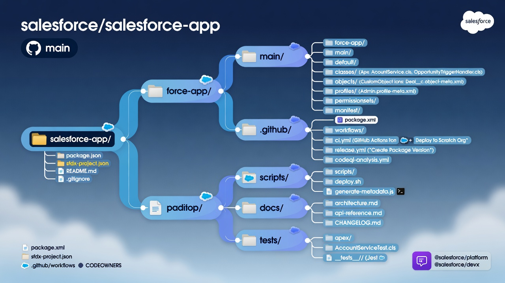
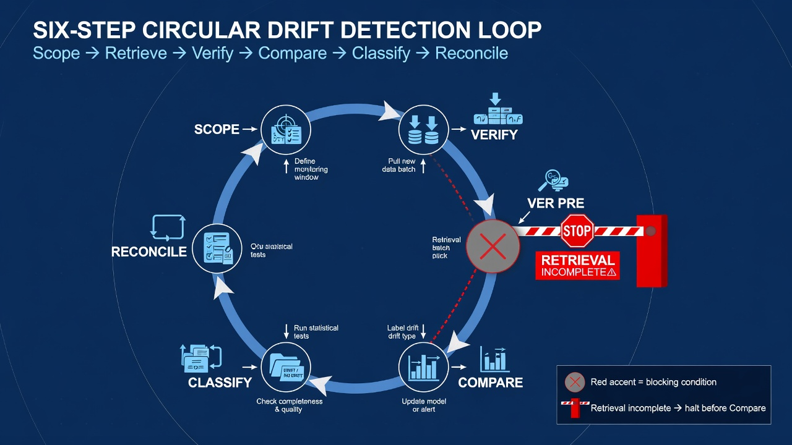
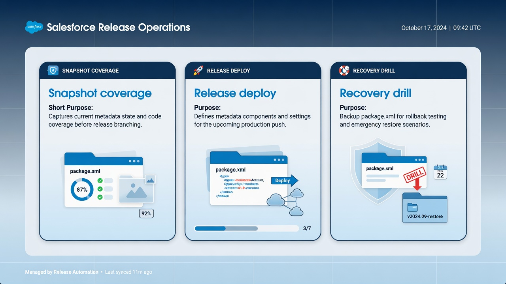

A durable Salesforce package.xml strategy is less about listing every metadata type once and more about deciding what each retrieve, deploy, snapshot, and recovery operation is allowed to touch. The manifest is the inventory boundary for Metadata API work. If that boundary is vague, automation becomes noisy, recovery claims become overconfident, and every “simple” retrieve turns into a long debugging session.

Salesforce DX and the Metadata API give teams powerful ways to move configuration as files. They do not invent scope for you. A wildcard-heavy `package.xml` can pull more than the team understands. A tiny named-member list can miss the components that actually matter during an incident. The useful middle path is intentional: multiple manifests with explicit purposes, reviewed changes, tested API versions, and a clear distinction between observational coverage and deployable release packages.

This article treats `package.xml` as an operational product artifact. It covers wildcards versus named members, API version choices, source format versus classic metadata format, snapshot versus deploy manifests, destructive changes, package directories, how to test scope changes, and the failure modes that appear once automation depends on the file.



*Manifests, package directories, workflows, and ownership live together.*

## Treat package.xml as recovery inventory, not a one-time export

Many teams create their first `package.xml` the day they need a backup or a migration. That is understandable. It is also how orgs end up with a single enormous file that nobody owns.

A better framing is inventory management:

- What metadata must be visible in Git for history and drift detection?
- What metadata is safe and useful to retrieve on a schedule?
- What metadata belongs in a release candidate deploy set?
- What metadata is recovery-critical even if it is rarely changed?
- What metadata is intentionally excluded because it is environment-specific, sensitive, unsupported, or owned elsewhere?

Those are different questions. One file can answer only one of them cleanly. If the same manifest is used for nightly snapshots, feature deploys, and emergency restores, every change to that file becomes a multi-purpose risk.

Document the purpose of each committed manifest in the repository README or a short `docs/metadata-scope.md` note. When someone later removes a type or tightens a wildcard, reviewers should understand which operational promise is changing.

Also keep the metadata-versus-data boundary explicit. A successful retrieve of objects, fields, Flows, Apex, and permission sets is not a backup of Salesforce records, files, or relationship-aware business data. Metadata history and record-data protection are related resilience topics, not substitutes.

## Understand what a package.xml actually declares

At a practical level, a `package.xml` tells Metadata API tooling which types and members to include in a retrieve or deploy package. Typical ingredients include:

- `types` blocks naming a metadata type such as `ApexClass`, `CustomObject`, `Flow`, or `PermissionSet`;
- `members` entries that name specific components or use `*` for a wildcard;
- an `version` element for the Metadata API version used by the package;
- optional naming and structure conventions the team agrees to follow.

Salesforce documents the Metadata API package structure and retrieve/deploy model in its Metadata API developer materials. The [Metadata API Developer Guide](https://developer.salesforce.com/docs/atlas.en-us.api_meta.meta/api_meta/meta_intro.htm) is the durable reference for types, package.xml behavior, and deployment concepts. CLI-oriented teams should also keep the current [`sf project retrieve start` reference](https://developer.salesforce.com/docs/platform/salesforce-cli-reference/guide/cli_reference_project_retrieve_start.html) nearby, because day-to-day work usually runs through Salesforce CLI rather than hand-built SOAP calls.

Two implications matter immediately:

1. The manifest is not a complete model of the org. It is a selection.
2. The selection is only as trustworthy as the last successful operation against a real org with that API version.

A file that looks elegant in Git can still fail in the org because of type support differences, foldered metadata, managed package boundaries, permissions, API version behavior, or component names that no longer exist.

## Prefer multiple manifests with explicit jobs

A maintainable strategy usually includes more than one committed package definition. Names can vary; intent should not.

### Snapshot or baseline manifest

This defines observational coverage. Scheduled automation retrieves this scope, normalizes the result into the repository, and commits meaningful diffs. The goal is visibility and history, not a perfect deploy package.

Characteristics:

- broader than a single feature;
- stable enough that nightly noise is explainable;
- reviewed when coverage expands or contracts;
- documented as history coverage, not as proof of restoreability for every member.

### Deploy or release manifest

This defines a candidate change set for validation and deployment. It should match the work being released, plus necessary dependencies the team has intentionally included.

Characteristics:

- narrow enough to review;
- reproducible for the release evidence;
- free of “grab everything and hope” wildcards unless the release truly is org-wide;
- paired with tests and a validation target.

### Recovery-critical manifest

This is optional but useful once the team starts running restore drills. It lists components the organization has decided must be recoverable quickly: key automation, permission models, integration Apex, and other high-impact configuration.

Characteristics:

- deliberately smaller than the full snapshot;
- exercised in non-production drills;
- never mistaken for complete org recovery;
- updated when business-critical configuration changes.

### Feature or work-item manifests

Short-lived manifests can support a migration, a package extraction, or a large refactor. Keep them under a clearly named directory, date them when helpful, and retire them when the work ends so the repository does not accumulate mystery scope files.

A practical layout:

```text
manifest/
├── snapshot.xml
├── baseline.xml
├── recovery-critical.xml
├── destructive/
│   └── README.md
└── release/
    ├── 2026-07-service-update.xml
    └── 2026-08-permissions.xml
```

If the team also generates manifests from scripts, commit the generated result used for a release or keep the generator deterministic. A dynamic selection that cannot be reconstructed later weakens auditability.

## Wildcards versus named members

Wildcards are convenient. Named members are precise. Both are valid; neither is universally correct.

### When wildcards help

Use `*` when:

- the type is well understood by the team;
- the set of members is large and changes often;
- the goal is observational coverage rather than a surgical deploy;
- the team accepts that new members will appear automatically in future retrieves.

Examples often include Apex classes in an application package directory, custom objects the team owns, or permission sets under active administration, provided those types retrieve cleanly for the org.

### When named members help

Name members explicitly when:

- the deploy set must be reviewable line by line;
- only a subset of a type is in scope;
- the type is sensitive, noisy, or environment-specific;
- a recovery drill needs a stable, small package;
- a wildcard previously pulled unmanaged package noise or unexpected folders.

Named lists grow stale. If the team uses them for ongoing coverage, create a process for discovering new members—otherwise the inventory silently stops representing the org.

### Hybrid patterns

A common hybrid is:

- wildcards in `snapshot.xml` for owned, high-churn types;
- named members in release manifests for the change being shipped;
- a short recovery list for drill packages;
- explicit exclusions documented outside the XML when the Metadata API cannot express the nuance cleanly.

Do not assume every metadata type supports wildcards the same way. Foldered types, some settings, and package-scoped components can behave differently. Test against the target org rather than copying a blog list forever.

## Choose and change API version deliberately

The `version` element is easy to ignore until it rewrites half the repository.

API version affects:

- which metadata shapes are returned;
- which types and fields are available;
- how source conversion behaves;
- whether old automation still parses the result.

Treat a version bump as a migration:

1. Change the version in a branch.
2. Retrieve against a non-production org.
3. Inspect the diff for mechanical churn versus real configuration change.
4. Run validation on a representative package.
5. Update project configuration and documentation together.
6. Merge only when the team accepts the new baseline.

Keep the package version aligned with the project’s source API version strategy in `sfdx-project.json` where the team relies on Salesforce DX source format. Drift between “the version people remember,” the CLI default, and the committed manifest is a frequent source of surprise XML.

Salesforce publishes release notes and Metadata API changes with each platform release. Teams that pin versions for stability should still schedule periodic upgrades instead of freezing indefinitely on an aging contract.

## Source format versus Metadata API format

Modern Salesforce DX projects usually store source format in Git because it produces more reviewable file boundaries than large monolithic metadata-format artifacts. Retrieves and deploys may still involve Metadata API packaging under the hood, especially when a `package.xml` is in play.

Practically:

- Repository history should favor source format for day-to-day diffs.
- Manifests still matter for retrieve and deploy selection.
- Conversion steps should be explicit in scripts and workflows.
- Reviewers should know whether they are looking at source paths under package directories or a temporary mdapi package used only during a job.

Salesforce explains that [source format is optimized for version control](https://developer.salesforce.com/docs/platform/code-builder/guide/codebuilder-source-format.html). That is the right default for a GitHub-centered operating model. Metadata-format ZIP packages remain useful as transient deployment artifacts, release evidence, or integration points with older tooling—not as the primary long-term editing format in the repository.

If a workflow retrieves as mdapi and converts to source before commit, document that pipeline. If another workflow deploys from source with a manifest, document that too. Ambiguity here creates “it worked on my machine” retrieve results that do not match CI.

## Separate snapshot scope from deploy scope

This is the most important operational split in a salesforce package.xml strategy.

### Snapshot scope answers: what changed?

It should be wide enough to detect meaningful drift and preserve history for owned metadata. It can tolerate some components that are not part of the next release. It should not silently include secrets, disposable scratch artifacts, or types the team has no intention of interpreting.

### Deploy scope answers: what are we shipping?

It should be narrow enough that a human can understand the blast radius. It should include required dependencies knowingly, not by accident. It should map to tests the team is willing to run.

Using the snapshot manifest for production deploys is a common early mistake. It couples release authority to observational breadth. Using the deploy manifest for nightly history is the opposite mistake: the repository only learns about the last release shape and misses direct org edits outside that slice.

Automation should name the manifest path explicitly in each job. A shared script that defaults to “the” package.xml invites cross-purpose mistakes.

## Destructive changes need their own discipline

Deleting metadata is not the same as deploying additions and updates. Salesforce supports destructive deployment patterns through dedicated destructive manifests used with a package that may be empty or minimal, depending on the operation style the team chooses.

A maintainable approach:

- Keep destructive intent in a clearly named file or directory.
- Review deletions as high-risk changes with owners of dependent automation and integrations.
- Validate in a sandbox that resembles the target closely enough for dependency failures to appear.
- Prefer explicit member names over broad wildcards for deletions.
- Record why the deletion is safe, what depends on it, and how to detect residual references.
- Do not mix casual cleanup deletions into an unrelated feature deploy without calling them out.

Destructive work is also where metadata-versus-data thinking returns. Removing a field definition is not the same problem as preserving historical record values that depended on that field. Coordinate with data retention and integration owners before destructive production changes.

## Package directories and manifest scope should agree

In a Salesforce DX project, package directories define where source lives and how the project is modularized. Manifests define operation scope. If those two stories disagree, contributors get lost.

Examples of healthy alignment:

- a service package directory validated by a service-focused deploy manifest;
- a shared platform directory retrieved by both snapshot and dependency-aware release manifests;
- a temporary migration directory excluded from normal snapshot noise once retired.

Examples of unhealthy misalignment:

- snapshot wildcards that pull managed package noise into an app directory the team thought was clean;
- release manifests that deploy files from directories no longer listed in `sfdx-project.json`;
- multiple package directories with one giant org-wide wildcard and no ownership model.

Salesforce’s [package development model overview](https://developer.salesforce.com/docs/platform/code-builder/guide/codebuilder-package-dev-model.html) is useful even when the team is not fully committed to second-generation packaging. Directory boundaries help review, testing, and eventual package extraction. Manifests should respect those boundaries instead of flattening everything back into one anonymous bag of XML.

## Test every meaningful scope change

A manifest edit is a coverage or blast-radius change. Treat it like code.

### Before merging a broader snapshot

- Retrieve in a non-production org.
- Measure duration, file count, and diff size.
- Scan for unexpected namespaces, settings, or sensitive configuration.
- Confirm ignore rules still hold.
- Update documentation that describes coverage and recovery expectations.

### Before merging a narrower snapshot

- State which visibility or recovery claim is being reduced.
- Confirm those components are covered elsewhere or intentionally abandoned.
- Check that drift detection still meets the organization’s tolerance.

### Before merging a deploy manifest change

- Run a validation-only deployment against an appropriate sandbox.
- Confirm tests and dependencies for the new members.
- Inspect the deploy result for missing components and warnings.
- Ensure the release notes and work item describe the wider or narrower scope.

### Before relying on a recovery manifest

- Perform a drill that retrieves or deploys from a known commit into a disposable sandbox.
- Time the operation and capture evidence.
- Note components that retrieve cleanly but do not restore meaningful behavior without data or manual setup.

Testing is where teams learn that “we have it in Git” is not the same as “we can put it back safely.”



*Branch, retrieve, review the diff, validate deploy, then document the new scope.*

## Common failure modes and how to defuse them

### The infinite wildcard

Symptoms: long retrieves, huge noisy commits, mystery metadata, slow reviews.

Response: split observational and deploy scopes; name owners for types; replace low-value wildcards with named members or exclude intentionally.

### The optimistic named list

Symptoms: missing new components, false confidence in coverage, recovery gaps.

Response: add discovery checks, periodic org compares, and clear ownership for inventory updates.

### The version bump surprise

Symptoms: massive formatting diffs, broken automation, inconsistent local versus CI results.

Response: isolate version changes, regenerate baselines in non-production, and merge mechanical churn separately from feature work when possible.

### The wrong-purpose manifest

Symptoms: production deploy attempts to ship half the org, or snapshots only see last week’s release files.

Response: separate files, explicit workflow inputs, and naming that encodes purpose.

### The “successful retrieve” illusion

Symptoms: green jobs, incomplete resilience story.

Response: distinguish history capture from restore drills; document excluded types; never imply record-data backup.

### Permission and visibility gaps

Symptoms: partial retrieves, missing members, different results by user.

Response: use a dedicated integration identity with reviewed access; compare results across environments carefully; treat missing members as signal, not only as noise.

### Managed package and installed component confusion

Symptoms: repository pollution, undeployable members, confusing diffs.

Response: decide which installed package metadata is in scope at all; prefer boundaries that match ownership and upgrade processes.

### Environment-only configuration in global scope

Symptoms: sandbox values overwrite intentions, or production endpoints appear in shared history carelessly.

Response: exclude or externalize environment-specific values; document intentional differences; never commit secrets.

## Operating rules that keep manifests maintainable

A concise policy helps more than a perfect initial file:

1. Every committed `package.xml` has a stated purpose and owner.
2. Snapshot and deploy scopes are separate by default.
3. Manifest changes require the same review quality as Apex or Flow changes.
4. API version changes are migrations with sandbox evidence.
5. Wildcards need a reason; named members need a refresh process.
6. Destructive intent is explicit and validated non-productively first.
7. Recovery claims are limited to drilled, understood components.
8. Metadata coverage is never described as full Salesforce data backup.
9. Automation always names the manifest path it uses.
10. Scope documentation lives beside the files and is updated in the same pull request.

These rules are intentionally boring. Boring manifests age better than clever ones.

## A practical adoption sequence

Teams that already have a repository can improve package strategy without a rewrite:

1. Inventory existing manifests and scripts that hardcode scope.
2. Label each one by purpose, even if the filename stays temporarily wrong.
3. Create or clarify `snapshot.xml` for observational automation.
4. Stop using that snapshot file for production deploys.
5. Introduce release manifests for the next few changes.
6. Add a small recovery-critical list only after a successful sandbox drill.
7. Schedule an API version review aligned to Salesforce releases.
8. Add CI checks that fail when a workflow calls a missing manifest path.
9. Educate admins and developers that changing package.xml changes operational coverage.
10. Revisit ignore rules and package directories so the tree matches the inventory story.

If the team is starting from zero, begin in a non-production org, generate a Salesforce DX project, retrieve a deliberately modest scope, and expand only when the diffs are understandable. Breadth is easy to add later. Unowned breadth is hard to clean up after six months of automation.

## What good looks like after three months

You will know the strategy is working when:

- a new engineer can explain which manifest a nightly job uses;
- a release engineer can point to the exact package definition for last month’s production deploy;
- a pull request that removes a metadata type from snapshot coverage gets substantive review comments;
- restore drills name their package files and produce evidence;
- API version upgrades are planned instead of accidental;
- nobody claims the repository backs up Salesforce records merely because `package.xml` is comprehensive.

That is a maintainable salesforce package.xml strategy: not maximal coverage theater, but scoped, tested, purpose-built inventory that Git and Salesforce tooling can actually use.

## Review checklists for everyday pull requests

Manifest work is easy to rubber-stamp because the XML looks small. A short checklist raises the quality of review without turning every change into a committee.

### For snapshot manifest pull requests

Reviewers should be able to answer:

- What operational question does this coverage improve or reduce?
- Which types are new, removed, or changed from wildcard to named members?
- Was a non-production retrieve run with this file?
- How large was the resulting diff, and was unexpected content triaged?
- Did documentation of coverage and exclusions change in the same pull request?
- Could this change cause the nightly job to exceed time or size budgets?

### For deploy manifest pull requests

Reviewers should be able to answer:

- Does the member list match the work item and release notes?
- Are dependencies included deliberately rather than by folklore?
- Is there a validation result against an appropriate sandbox?
- Would a partial failure leave the org in a confusing state?
- Is destructive intent absent, or called out with its own review?

### For recovery manifest pull requests

Reviewers should be able to answer:

- Has this package been drilled recently in a disposable org?
- Are the components still the business-critical set, or historical favorites?
- Does the team understand data and manual steps the package cannot restore?
- Who is allowed to run a recovery using this file?

These questions keep package.xml changes from becoming invisible infrastructure edits.

## Example scenarios that force better scope decisions

Abstract rules help, but concrete situations are where teams renegotiate scope.

### Scenario: an admin builds a high-impact Flow directly in a shared sandbox

If the Flow type is in the snapshot manifest, the next successful retrieve will surface it. That is desirable for visibility. The team still needs a path to promote durable intent through a reviewed deploy package rather than assuming the snapshot commit is a release artifact. Snapshot scope answers “what exists.” Deploy scope answers “what we ship.”

### Scenario: a release needs one permission set and three Apex classes

A named-member deploy manifest is usually clearer than a package-directory-wide wildcard. The pull request can show exactly those members, plus any test classes required for validation. If the classes depend on a new field, include the field intentionally. Discovering the dependency during production deploy is a scope-design failure, not only a testing failure.

### Scenario: leadership asks whether GitHub can “restore the org”

The honest answer depends on drilled manifests, not on the longest package.xml in the repository. Point to recovery-critical coverage, last drill date, known gaps, and the separate record-data process. A comprehensive snapshot helps investigation; it does not automatically authorize a full-org rebuild claim.

### Scenario: Metadata API timeouts during nightly retrieve

Timeouts are often a scope problem dressed up as an infrastructure problem. Split high-cost types into a secondary job, replace low-value wildcards, or move rarely needed types to an on-demand manifest. Measure before and after. Do not “fix” timeouts by silencing failure alerts.

## Coordination with ignore files and generated artifacts

Manifests select what to request. Ignore rules select what to keep out of the working tree and Git history. Teams sometimes widen package.xml and then wonder why junk still appears, or narrow ignore rules and wonder why expected files vanish.

Coordinate these controls:

- `.gitignore` for local tooling, credentials, caches, and non-source artifacts;
- `.forceignore` for Salesforce CLI path exclusions during applicable operations;
- manifest members for Metadata API selection;
- workflow path filters for what the bot is allowed to commit.

If a component should never be in Git, excluding it only from the bot commit step is weaker than excluding it from retrieve scope and ignore rules. Defense in depth matters when a manual retrieve happens on a laptop and someone commits the result.

Generated deployment ZIP files, temporary mdapi directories, and validation reports should not accumulate in the default package directories. Keep them as CI artifacts or clearly named ephemeral paths that ignore rules suppress.

## How package.xml strategy supports release governance

Release governance needs evidence. Manifests contribute evidence when they are named, versioned, and referenced by the job that used them.

Useful evidence artifacts include:

- the commit SHA of the release candidate;
- the exact deploy manifest path and content at that SHA;
- validation deployment IDs from Salesforce;
- test levels and outcomes;
- post-deploy snapshot commits showing the org accepted the change;
- links to the pull request that changed scope if the release introduced new inventory.

When auditors or future teammates ask what shipped, “whatever was in force-app” is weaker than “members listed in `manifest/release/2026-07-service-update.xml` at tag `v2026.07.12-service`.” The file is small. The traceability is large.

This is also why generated-but-uncommitted manifests are risky for regulated or high-scrutiny environments. If the selection cannot be reconstructed, the release story depends on memory and log fragments.

## A note on team roles

Different roles touch package.xml for different reasons:

- developers often expand deploy manifests for features;
- admins may request snapshot coverage for declarative areas they own;
- release managers care about reproducible deploy sets and validation evidence;
- security reviewers care about sensitive settings and over-broad retrieve identities;
- architects care about package-directory alignment and long-term modularity.

Give each role a clear way to propose scope changes without editing “the one true package.xml” in place. Separate files and a short ownership note prevent accidental cross-purpose edits. Training should include at least one hands-on session where an admin and a developer jointly review a snapshot diff and a deploy manifest for the same business change. Shared vocabulary reduces the chance that automation becomes a developer-only artifact.



*Snapshot coverage, release deploy, and recovery drills often need different manifests.*

## Frequently asked questions

### Should one package.xml cover the entire Salesforce org?

Usually no. Full-org ambition creates noise, timeouts, and false confidence. Prefer an owned snapshot scope for history, narrower deploy manifests for releases, and an explicit list of exclusions. Expand coverage when the team can interpret and operate the result.

### Are wildcards safe in a salesforce package.xml strategy?

They are safe when the type is understood, the purpose is observational or intentionally broad, and the team reviews the resulting diffs. They are risky for surgical deploys, destructive changes, sensitive settings, and types with surprising folder or package behavior. Test against a real non-production org.

### Does a complete manifest mean Salesforce data is backed up?

No. Manifests select metadata for Metadata API operations. Record data, files, and many runtime artifacts require separate backup and recovery processes. Keep that distinction visible in runbooks and stakeholder communication.

### How often should we revise API version and scope?

Review around Salesforce release cycles and whenever automation, timeouts, or recovery goals change. Scope should change when ownership or risk changes, not only when someone needs a one-off export. API version changes deserve a dedicated sandbox validation pass.

### What should this article link to internally?

Link to **Salesforce metadata repository structure** for package directories and manifest layout, **Salesforce metadata backup** for snapshot coverage boundaries, **Salesforce org drift detection** for how snapshot scope feeds change visibility, **restore Salesforce metadata from GitHub** for recovery drills that use manifests, and **Salesforce deployment validation** for deploy-scope validation in CI.
