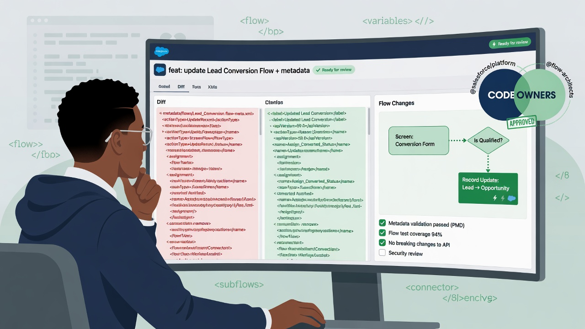

Salesforce pull request review is the skill that turns a GitHub repository of metadata into real release governance. Without it, the repository becomes a filing cabinet and the green check becomes a rubber stamp. With it, admins and developers share a concrete surface for discussing what is about to change: which field, which Flow path, which permission grant, which Apex method, and which destructive action. The goal is confidence—not perfectionism that blocks every release, and not speed that skips reading high-risk XML.

This guide focuses on how to read metadata diffs with a practical eye, how to structure pull requests and ownership, how to deal with noisy retrieves, how to treat permission sets and deletes as first-class risk, and how human review works alongside automation. Prefer reviewing against changes intended for non-production first while the team builds muscle. Remember that reviewing metadata is not the same as backing up or inspecting record data; customer records stay outside this process.

*Treat metadata diffs as a shared review surface, not a formality after green checks.*

## Why metadata review feels harder than “normal” code review

Apex review resembles traditional code review: methods, tests, bulkification, security. Much Salesforce change is configuration expressed as XML or as platform-specific formats. Flows are powerful and verbose. Permission sets encode security policy in large files. Custom objects split across multiple files in source format. Layouts and flexipages can churn with low signal. Auto-generated ordering can make a “no real change” diff look enormous.

Reviewers need a different mental model:

- risk is often in access, automation entry criteria, and data constraints—not only in algorithms;
- a small XML edit can have large runtime effect;
- absence of a file can mean intentional delete or incomplete retrieve;
- CI dry runs prove deployability under a test policy, not business correctness;
- the unit of review should match a coherent business change, not a random file dump.

GitHub’s documentation on [pull requests](https://docs.github.com/en/pull-requests/collaborating-with-pull-requests/proposing-changes-to-your-work-with-pull-requests/about-pull-requests) and [CODEOWNERS](https://docs.github.com/en/repositories/managing-your-repositorys-settings-and-features/customizing-your-repository/about-code-owners) describes the collaboration mechanics. Salesforce CLI deploy validation, including dry-run behavior, is covered in the [project deploy start reference](https://developer.salesforce.com/docs/platform/salesforce-cli-reference/guide/cli_reference_project_deploy_start.html). Mechanics are necessary; judgment still sits with people.

## What good looks like before anyone reads a line of diff

### A focused pull request

A PR should represent one intention: “add discount fields and validation,” “fix Case assignment Flow,” “grant Read on Order to the partner permission set.” When intentions multiply, reviewers miss things. Split work even if it ships the same week.

### A complete narrative in the description

Humans should not reverse-engineer intent only from file paths. A useful description includes:

- business purpose in plain language;
- target environments and rollout plan;
- risk notes (security, data, automation, integration);
- test evidence already performed in a sandbox;
- whether destructive changes are included;
- dependencies on other PRs or manual Setup steps;
- data migration needs, if any (handled outside metadata git as appropriate).

### A stable project and selection story

Reviewers need to know whether the PR is a deliberate feature branch or a full-org re-retrieve. Snapshot PRs should be labeled as such and held to different standards than feature PRs. Feature PRs should not silently reformat half the org.

### Green checks as inputs, not conclusions

Status checks should be required on protected branches. Reviewers still ask: which org was validated, which test level ran, which components were in the deploy set, and did destructive changes validate? GitHub’s [protected branches](https://docs.github.com/en/repositories/configuring-branches-and-merges-in-your-repository/managing-protected-branches/about-protected-branches) guidance is the control plane for making those checks mandatory.

## Pull request templates that raise the floor

A template does not guarantee good reviews, but it prevents empty PRs. Include sections such as:

- Summary
- Metadata types touched (Apex, Flow, CustomObject, PermissionSet, etc.)
- Orgs used for build and test
- Test level expected in CI
- Security and access impact
- Destructive changes (yes/no and list)
- Manual steps after deploy
- Rollback notes (previous revision, not fantasy one-click undo)
- Checklist for author self-review

For snapshot or drift PRs, use a different template emphasizing “unexpected changes,” “known open work,” and “follow-up owners,” so people do not rubber-stamp overnight noise.

## CODEOWNERS: route risk to people who can see it

CODEOWNERS assigns mandatory or suggested reviewers based on paths. Practical patterns:

- `/force-app/**/permissionsets/` → security or platform owners;
- `/force-app/**/classes/` and `/triggers/` → development leads;
- `/force-app/**/flows/` → automation owners or business systems analysts who understand the process;
- `/force-app/**/objects/` → data model owners;
- workflow files under `.github/workflows/` → platform engineering;
- manifests used for production releases → release managers.

Keep the file accurate. Stale ownership is worse than none because it creates false confidence. Pair CODEOWNERS with a human backup rotation so vacations do not freeze the pipeline.

## How to read Apex diffs with confidence

### Correctness and bulk safety

Look for SOQL or DML inside loops, unselective queries, recursive trigger risk, and missing null checks on paths that production data will hit. Ask whether the change assumes a data shape that only exists in a sandbox sample.

### Security

Check CRUD/FLS enforcement patterns appropriate to your org standards, injection risks in dynamic SOQL, and sharing declarations (`with sharing`, `without sharing`, `inherited sharing`). A class that widens access quietly is a release risk even if tests pass.

### Tests

Prefer seeing tests updated in the same PR. Ask whether assertions match the real behavior change. Coverage percentage alone is a weak signal; assertion quality matters. Confirm CI test level will actually execute the relevant classes.

### Integration and callouts

Mocking, timeout handling, and named credential usage deserve attention. Secrets must not appear in code. Endpoints and feature toggles should be environment-safe.

### What CI already proved

Compilation and tests under the chosen level. What it did not prove: every trigger recursion scenario, every volume spike, every permission combination for users who never run those tests as themselves.

## How to read Flow diffs with confidence

Flow XML is verbose. Reviewers should not pretend they can simulate every path from XML alone, but they can catch high-impact edits quickly.

Focus on:

- entry conditions and triggering object;
- record-triggered versus screen versus scheduled context;
- before-save versus after-save behavior where relevant;
- hard-coded record IDs, queue IDs, or email addresses;
- fault paths and whether failures are visible;
- loops and collection handling that might hit limits;
- new email alerts, outbound messages, or subflows;
- changes that re-order decision outcomes;
- activation status intent versus file content.

Ask the author for a path diagram or numbered scenario list for non-trivial Flows. Pair XML review with a sandbox walkthrough for the main success and failure paths. Prefer non-production verification before production activation strategies.

If the diff is mostly element position churn with no logical change, say so and request a cleaner PR or an explanation of the tool rewrite. Do not approve unread noise because it is tiring.

## How to read object model and validation diffs

Custom fields, validation rules, record types, and compact layouts change how people enter and trust data.

Watch for:

- type changes on existing fields;
- new required constraints that production data may violate;
- validation formulas that break integrations or API users;
- delete of fields still referenced by reports, Flows, or Apex (dependencies may appear at deploy time or later);
- naming that collides with existing conventions;
- encryption or sensitivity classification needs (process outside pure git review if required).

A deploy can succeed while business users cannot create records. That gap is why acceptance checks belong beside metadata review.

## Permission sets and profiles: treat as security reviews

Permission metadata is where “configuration review” becomes access review.

### High-sensitivity signals

- new `Modify All` or `View All` style grants;
- object Create/Edit/Delete expansions;
- broad field-level security on sensitive fields;
- new system permissions (manage users, view setup, modify all data, and similar);
- changes to connected app or user permission surfaces if present in scope;
- sudden inclusion of many objects in one PR “while we were here.”

### Review practices

Require security-aware CODEOWNERS on these paths. Ask for the persona and business justification. Prefer additive permission sets for features rather than editing a monolithic profile when process allows. Compare against least privilege: can the same outcome be achieved with narrower access?

CI will not tell you that a permission set is excessive. Only people and policy will.

### Profiles versus permission sets

Profiles often produce painful diffs and merge conflicts. If your repository still tracks profiles, budget extra review time and discourage drive-by reformatting. Permission sets are usually clearer units of intent, though large ones still need careful reading.

[IMAGE PROMPT: Checklist graphic for Salesforce metadata pull request review with sections for Apex, Flow, object model, permission sets, and destructive changes; muted navy, white space, subtle red flags on permission and delete rows, 16:9]

## Destructive changes: read the delete path twice

Deleting metadata is sometimes correct and often under-discussed.

### Clarify intent

Is the file missing because the author removed a component deliberately, because a retrieve scope shrank, or because of a bad merge? Feature PRs should use explicit destructive manifests when the org should drop components. Do not infer deletes from every absence.

### Ask secondary questions

- What happens to existing records that used this field or record type?
- Are reports, integrations, or packages dependent on it?
- Has the delete been validated with dry-run including destructive changes in a non-production org?
- Is there a forward-fix alternative (deprecate, hide, stop referencing) that is safer short-term?

### Rollback honesty

Restoring metadata from git may bring back definitions; it does not automatically repair every data consequence of a delete. Say that in the PR if relevant. Metadata recovery is not record-data recovery.

## Noisy diffs: how teams keep review possible

Noise sources include:

- full-org retrieves mixed into feature branches;
- CLI or API version changes rewriting files;
- XML element reordering without semantic change;
- translating between metadata formats;
- regenerating permissions or layouts through Setup clicks that rewrite large files;
- line-ending or whitespace churn.

Mitigations:

- scoped manifests for features;
- separate snapshot PRs from feature PRs;
- pin CLI versions in local and CI tooling;
- reject unreadable mega-diffs in review culture;
- prefer source format consistently;
- document known chatty metadata types;
- split permission refactors into dedicated PRs.

If a reviewer cannot explain the change after a reasonable pass, the PR is not ready. “Looks fine” on 3,000 unread lines is not a review.

## A practical review checklist

Authors can self-check; reviewers can sample.

**Intent and scope**

- Is the PR purpose clear and single-threaded?
- Are only intended metadata types present?
- Are unrelated retrieve artifacts excluded?

**Risk**

- Security or access expanded?
- Automation entry criteria changed?
- Data validation tightened or field types changed?
- Destructive changes explicit and justified?
- Integrations or hard-coded IDs touched?

**Quality**

- Apex tests updated with meaningful assertions?
- Flow scenarios described and tested in a sandbox?
- Naming and package placement match team standards?
- Manual post-deploy steps listed?

**Evidence**

- CI dry-run green on the expected org and test level?
- Component inventory matches the story?
- Screenshots or scenario notes attached where UI matters?

**Operability**

- Rollback revision identified?
- Monitoring or hypercare needed?
- Does production timing avoid known business freezes?

## Human review plus automation: division of labor

Automation should:

- run Salesforce CLI dry-run deploys;
- execute the agreed Apex test level;
- lint workflow and project basics;
- block merge when checks fail;
- publish artifacts and inventories;
- optionally flag certain path changes for extra attention.

Humans should:

- judge business correctness and timing;
- evaluate permission necessity;
- interpret Flow behavior beyond XML;
- catch “valid but wrong” changes;
- insist on smaller PRs;
- refuse rubber stamps when CI is green but the diff is opaque;
- confirm that metadata changes do not pretend to solve record-data backup or migration problems.

The failure mode to avoid is theatrical process: required reviewers who approve without reading because the build passed. Leadership should value “I requested changes” as much as throughput.

## Review culture for mixed admin and developer teams

Admins may be experts in Setup and novices in GitHub. Developers may reverse. Build shared fluency:

- short training on reading diffs for Flows and permission sets;
- pairing on the first dozen metadata PRs;
- glossary for repository layout;
- office hours when snapshot noise spikes;
- praise for clear PR descriptions as much as clever automation.

Do not make GitHub a gate that only engineers can pass if admins own the configuration. The repository should be a shared workshop.

## Special cases worth spelling out

### Managed packages and installed components

Not everything in an org belongs in your unlocked metadata history the same way. Be careful reviewing changes that are really package upgrades. Separate vendor upgrades from first-party configuration when you can.

### Multi-package directories

Review package boundaries. A change that reaches across owned domains may need multiple CODEOWNERS and a longer conversation about coupling.

### Hotfixes

Emergency PRs still deserve a minimum bar: smaller scope, mandatory second pair of eyes for permissions and destructive changes, follow-up tests if CI was shortened under policy exception. Document exceptions.

### Snapshot PRs that include unexpected production drift

Do not blindly merge drift into main as “truth” without asking whether production should be corrected back to the repository. Sometimes the snapshot detects an unauthorized change. That is a governance event, not only a git event.

## Connecting review to release governance

Pull request approval is one gate. Release approval may be another. A clean pattern:

1. PR review for technical and access quality.
2. Merge to integration and sandbox deploy.
3. Acceptance testing in non-production.
4. Release PR or tag review for production scope.
5. Production environment approval in GitHub Actions or equivalent.

Reviewers should know which gate they are serving. Approving a feature PR is not the same as approving a production go-live window.

Salesforce’s broader DevOps direction continues to emphasize source-driven development; keep official CLI and product docs in the team library, starting from the [Salesforce CLI command reference hub](https://developer.salesforce.com/docs/platform/salesforce-cli-reference/guide/cli_reference_unified.html) for current command behavior as tools evolve.

[IMAGE PROMPT: Calm process diagram linking pull request human review, automated dry-run checks, sandbox acceptance, and production approval as separate gates rather than one rubber stamp; navy and gray palette with a single green path, 16:9]

## Anti-patterns

- Approving because CI is green without opening the files.
- Mixing refactors, feature work, and full retrieves in one PR.
- Editing production directly, then reverse-engineering a PR for paperwork.
- Using a single global approver who cannot understand Flow or security implications.
- Leaving permission set expansions for “a later cleanup.”
- Treating metadata git as proof that records are backed up.
- Skipping non-production validation because “it is only configuration.”
- Requiring so many approvals that people route around GitHub.

## Building confidence over time

Confidence comes from repetition with feedback. Track near-misses: permission mistakes caught in review, Flow faults caught in sandbox, destructive changes stopped before production. Feed those examples into the checklist. Retire checklist items that never pay rent. Update CODEOWNERS when teams reorganize.

New hires should review as secondary reviewers before they are sole approvers on high-risk paths. The repository history itself becomes training material when commit messages and PR descriptions are written for humans.

## Example comments that teach without blocking forever

Specific review comments raise the quality of the next PR, not only the current one.

- “Permission set adds Edit on a payroll object; ticket only asked for Read—please narrow or justify.”
- “Flow now runs on every update instead of IsChanged(Status__c); confirm volume impact in the sandbox.”
- “Apex performs SOQL inside a loop; bulkify before merge.”
- “Destructive removal of LegacyCode__c needs an integration check and a non-production destructive dry-run.”
- “This PR mixes a permission reformat with the feature; split so the security delta is reviewable.”
- “CI used NoTestRun while Apex changed; use the team’s required test level.”

Praise clear work as well: scenario lists, fault-path screenshots, and honest risk notes make approval faster and train the culture you want.

## Closing perspective

Salesforce pull request review is how a team exercises judgment over configuration as code: reading Apex for behavior and safety, reading Flows for entry and side effects, reading permission sets as security policy, and treating destructive changes as deliberate acts. Templates, CODEOWNERS, and CI dry runs raise the floor. They do not replace careful eyes on high-risk diffs. Keep PRs focused, prefer non-production proof, separate snapshot noise from feature intent, and never confuse metadata history with record-data protection. Confidence is the product of clear intent, readable diffs, automation evidence, and humans who are allowed to say “not yet.”

## Frequently asked questions

### How long should a metadata pull request review take?

As long as needed to understand risk, which is usually short for a focused field or label change and longer for permission sets, Flows, destructive changes, or wide object model edits. If review routinely exceeds a reasonable window, the PR is probably too large or too noisy—not the reviewer too slow.

### Can we rely on Salesforce dry-run results instead of reading XML?

No. Dry-run results are necessary evidence that a revision is deployable under a test policy. They do not evaluate whether access is appropriate, whether a Flow matches the business process, or whether a delete is safe for existing data usage. Use both automation and human review.

### What should we do with huge permission set diffs?

Split pure refactors from feature grants when possible. Require security-aware owners. Ask for a persona-based justification and a summary of net new privileges. Reject drive-by expansions bundled with unrelated work. Consider whether smaller, task-focused permission sets would review more cleanly next time.

### Should snapshot PRs follow the same checklist as feature PRs?

Use a related but different standard. Snapshot PRs emphasize unexpected drift, ownership of follow-ups, and whether production should be corrected. Feature PRs emphasize intent, tests, and design. Label them clearly so reviewers apply the right lens.

### Which internal posts should we link for the surrounding system?

Point readers to the Salesforce source control GitHub foundation and repository structure posts for baseline setup, the change sets versus GitHub comparison for process migration, the CI/CD with GitHub Actions guide for pipeline gates, the deployment validation post for dry-run detail, and the GitHub Actions security post for credential and workflow hardening that keeps review evidence trustworthy.
