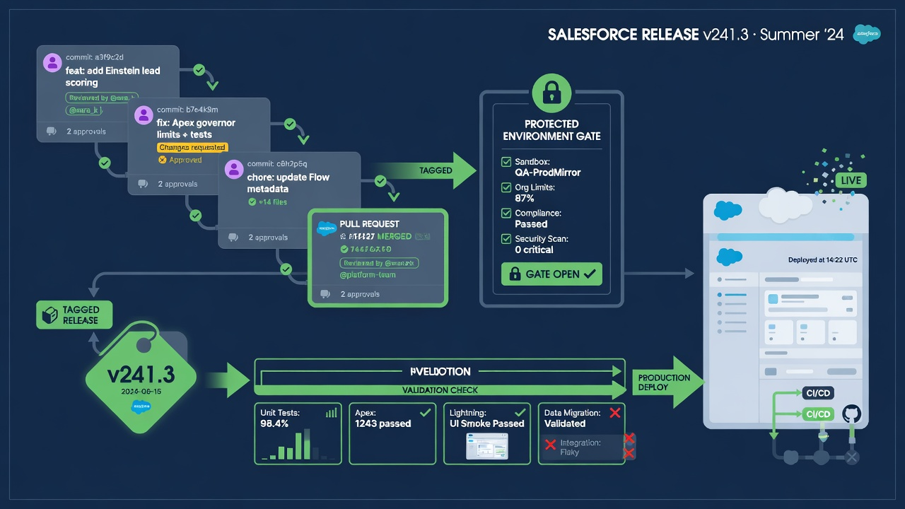
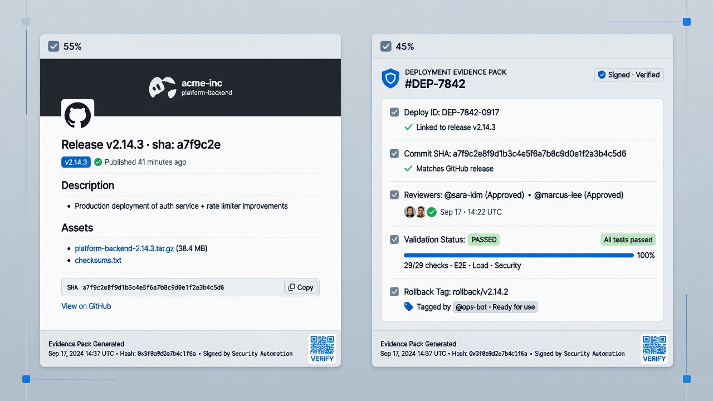
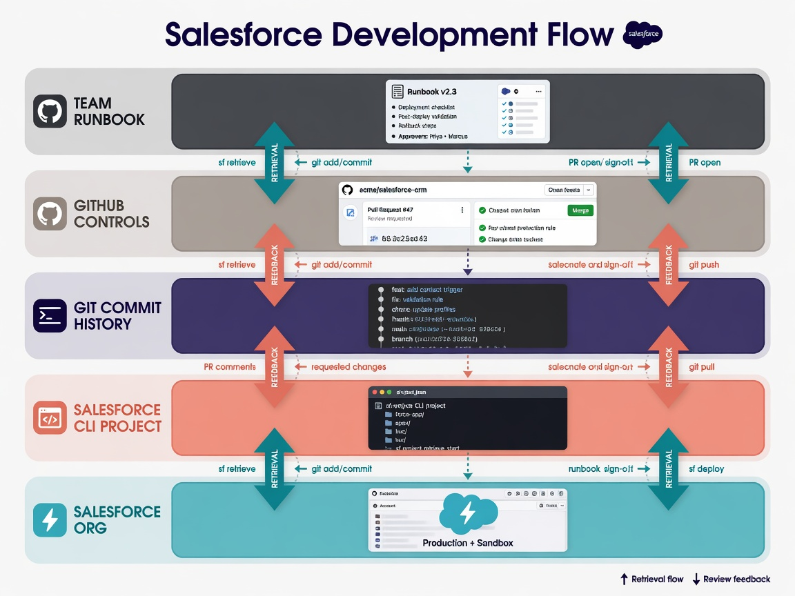

Salesforce release management with GitHub works best when a release is treated as a governed set of reviewed commits—not a folder zipped from a sandbox at the last minute. GitHub already provides pull requests, protected branches, CODEOWNERS, tags, releases, environments, and Actions logs. Salesforce provides validation deploys, test levels, and org targets. The craft is connecting those pieces so ownership is clear, evidence is boringly complete, and rollback is a controlled redeploy rather than folklore.

This guide is for teams building or maturing a metadata-centered delivery path: source in a private repository, automation with Salesforce CLI and GitHub Actions, and humans still accountable for production impact. Prefer non-production pipelines first. Keep the boundary visible: releasing **metadata** through git does not replace **record-data** backup or data migration governance. Those remain parallel tracks.

*Reviewed commits, tags, validation, and a protected deploy gate.*

## Release as a set of reviewed commits

A healthy definition:

> A production Salesforce metadata release is the deployment of an explicitly identified git revision (commit SHA or immutable tag) whose changes were reviewed, validated against the intended policy, approved under change control, and recorded with enough evidence to reconstruct who shipped what and why.

That definition pushes you away from:

- “whatever is in the admin’s downloads folder”;
- unreviewed hotfixes that never return to trunk;
- rebuilding a package by hand after validation already passed on a different tree;
- ambiguous “we deployed the spring project” without a SHA.

### Anatomy of a release candidate

1. **Work lands through pull requests** into a protected integration branch (often `main`).
2. **CI validates** what it can: linters if you use them, manifest integrity, Salesforce dry-run deploy, Apex tests at the agreed level.
3. **A release branch or tag** freezes content for the change window (team process dependent).
4. **Production job deploys that exact revision** after environment protection rules pass.
5. **Post-deploy verification** and communication close the loop.

If validation ran on commit A and production deploys commit B that “looks similar,” you broke the evidence chain. Pin the SHA.

Salesforce CLI deployment capabilities—including dry runs, manifests, and test levels—are documented in the [project deploy command reference](https://developer.salesforce.com/docs/platform/salesforce-cli-reference/guide/cli_reference_project_deploy_start.html). Your release process should cite the same flags in runbooks that CI uses in YAML.

## Tags, GitHub Releases, and immutable references

### Tags

Annotated tags on the release commit give humans a memorable handle (`release-2026-04-17`, `v2026.16.0`) while still resolving to a SHA. Protect tag creation if your threat model includes tag moving; at minimum, educate that moving a production tag is an incident.

### GitHub Releases

GitHub Releases can attach notes, links to change tickets, and artifacts. For Salesforce metadata, the “artifact” is often the git tree itself plus generated inventory (component list, test report URLs, validation deployment ids). Avoid attaching large unmanaged zip dumps that diverge from the tagged source.

GitHub documents [releases and tagging](https://docs.github.com/en/repositories/releasing-projects-on-github/about-releases) for the platform mechanics. Use them as communication and evidence hubs, not as a second source of truth that drifts from the repository.

### What to put in release notes (practical minimum)

- business purpose and ticket ids;
- commit range or PR list;
- metadata inventory summary (objects, Apex, Flows, profiles/permission sets—especially anything high risk);
- validation results and test level used;
- target org identifiers (labels, not secrets);
- known follow-ups and monitoring plan;
- rollback pointer: previous tag/SHA and conditions to trigger it.

## CODEOWNERS: ownership that shows up in the pull request

[CODEOWNERS](https://docs.github.com/en/repositories/managing-your-repository-settings-and-features/customizing-your-repository/about-code-owners) maps paths to responsible reviewers. For Salesforce repositories, path-based ownership is a practical approximation of domain ownership:

- `force-app/main/default/classes/` → development leads;
- `flows/` → automation owners;
- `permissionsets/` and `profiles/` → security-aware reviewers;
- `objects/` → data model stewards;
- pipeline YAML under `.github/workflows/` → platform engineering.

### Why it matters for release management

CODEOWNERS does not replace CAB, architecture review, or business approval. It does ensure that the people who understand blast radius see the diff before merge. Pair it with branch protection that requires owner reviews on protected branches.

Keep the file honest. Fake owners who never review create theater. If a path lacks a real owner, that is a backlog item for organizational design, not something to paper over with `* @everyone`.

### High-risk metadata deserves louder ownership

Permission sets, profiles, sharing rules, connected apps, named credentials (as metadata), critical Flow definitions, and Apex that enforces security should not merge with a single casual approval if your risk model says otherwise. Encode that in required reviewers and status checks.

## Protected branches and protected environments

### Branch protection

Typical production-minded settings:

- no direct pushes to `main`;
- required pull request reviews;
- required status checks (validation workflow, secret scanning if available);
- dismissal of stale approvals when new commits land;
- restricted who can push / merge.

Exact options depend on your GitHub plan; see GitHub’s [branch protection rules documentation](https://docs.github.com/en/repositories/configuring-branches-and-merges-in-your-repository/managing-protected-branches/about-protected-branches).

### Environments

GitHub Environments bind secrets and protection rules to deployment targets: `sandbox-validate`, `uat`, `production`. Production should require manual approval from release managers or on-call change approvers, optionally with wait timers aligned to change freezes.

The production Salesforce credential must live only in the production environment. Validation jobs use non-production credentials. That separation is release control expressed as secret reachability.

## Change calendar and freeze windows

GitHub will not automatically know your company blackout dates. Encode process:

- document freeze windows in the release runbook;
- use environment wait timers or simply refuse approvals during freezes;
- label PRs with release trains (`train:2026-04-17`);
- avoid drive-by production workflow runs from ad-hoc branches.

For multi-team Salesforce orgs, a visible calendar of planned trains reduces “surprise Friday deploys.” CAB then reviews exceptions rather than every routine train if your risk model allows tiering.

## CAB-friendly evidence (make auditors and change boards bored)

Change Advisory Boards and auditors ask similar questions in different dialects: what changed, why, who approved, what testing occurred, what is the backout, what was the outcome?

### Evidence pack per release

Assemble (automatically where possible):

| Evidence | Source |
| --- | --- |
| Change ticket / purpose | Issue tracker link in PR and release notes |
| Diff scope | Pull request files + generated metadata inventory |
| Peer / owner review | GitHub PR reviews + CODEOWNERS |
| Automated validation | Actions run URL, Salesforce validation deploy id |
| Test policy & results | Workflow summary, Apex test level, failing tests if any (should be none for go) |
| Approval to produce | Environment approval log, CAB record if required |
| Exact revision deployed | Tag + SHA in job log |
| Production deploy result | Actions log + Salesforce deploy id |
| Post-checks | Checklist completion, monitoring notes |
| Rollback plan | Prior tag and procedure link |

Store the pack in the ticket, the GitHub Release body, or both. Do not rely on one person’s laptop folder named `evidence_final_v3`.

### Mapping to common control themes

- **Segregation of duties:** author ≠ sole approver; production secret not available to PR from forks; environment approvers distinct when policy requires.
- **Change control:** no anonymous prod deploys; SHA pinned.
- **Testing:** validation dry run + agreed Apex tests + business test notes for higher risk.
- **Access:** integration users least privilege; repo private; workflow permissions minimal.

You are not claiming SOC certification by organizing logs. You are making legitimate questions answerable in minutes.

*Auditors and operators both want the same package: who approved what, from which commit.*

## Pairing with validation workflows

Release management without validation is ceremony. Validation without release management is CI theater.

Recommended pairing:

1. **On pull request:** focused validation against a non-production org or lightweight checks; fast feedback.
2. **On merge to integration branch:** broader validation if needed.
3. **On release candidate / pre-prod:** dry-run against a production-like target with the production-equivalent test level when policy demands.
4. **On production deploy:** deploy the same revision; consider whether to re-validate immediately before deploy if the window between validation and deploy allows drift.

Document what a green check means and what it does not. Validation does not prove every business journey, data migration correctness, or integration health. Release managers still own residual risk.

Prefer non-production for inventing new pipeline stages. Promote workflow YAML through the same review discipline as Apex—pipeline changes are production-affecting software.

## Rollback as controlled redeploy

Rollback is not “git revert and hope” without Salesforce semantics, and it is not only restoring a ZIP from a desk drawer.

### Metadata rollback pattern

1. **Identify the last known good revision** (previous release tag).
2. **Assess data impact:** did the bad release create records or field values that the old metadata cannot handle? Metadata rollback may require data repair—this is where the data track and metadata track meet.
3. **Run validation** of the prior revision against current production shape when possible.
4. **Deploy prior revision** through the same gated pipeline (not a side-channel that bypasses evidence).
5. **Verify** critical journeys and integrations.
6. **Record** the rollback as a change with its own evidence pack.

### When rollback is the wrong first move

- forward fix is smaller and safer;
- data shape already depends on new fields in irreversible ways without migration;
- the failure is environmental (auth, limits) rather than the revision content.

Decision trees belong in the runbook. Practice once in sandbox.

### Snapshots and rollback

Nightly metadata snapshots help discover what production actually contains, including unreviewed drift. They complement release tags; they do not replace intentional release versioning. If production drifted, rolling back to last tag may still leave out-of-band changes unaccounted for—reconcile deliberately.

## Notifications without noise

People need to know:

- release candidate opened;
- validation failed;
- production approval requested;
- production deploy started / succeeded / failed;
- rollback executed.

Channels might be Slack, Teams, email, or PagerDuty for failures—keep the description high level and reliable rather than spamming every lint. Include deep links to the Actions run, PR, and release notes. Silent success may be fine for low-risk trains; silent failure never is.

## What auditors and risk partners often ask

Expect variants of:

1. Who can deploy to production Salesforce, and how is that access granted or removed?
2. Show the last production change: ticket, diff, approvals, tests, outcome.
3. How do you prevent unreviewed metadata from reaching production?
4. How do you handle emergency changes?
5. What is the rollback test evidence?
6. Are production credentials stored in git?
7. How do you separate duties between developers and production approvers?
8. How do monitoring and incident response learn about failed releases?
9. Does this process cover record data? (Answer carefully: metadata release management is not data backup.)
10. How are third-party GitHub Actions and CLI versions controlled?

If your answers require heroic log diving, invest in summaries and consistent naming now.

## Emergency (break-glass) changes

Sometimes production is down and process must compress—not disappear.

A workable break-glass pattern:

- time-boxed elevated path with explicit approver;
- still record the SHA that went out (even if review is retrospective within a fixed SLA);
- still avoid personal long-lived admin automation keys when possible;
- retrospective PR same day or next business day to return trunk to reality;
- mandatory post-incident note: why break-glass, what will prevent repeat.

Break-glass that becomes the Friday norm is just ungoverned release with extra guilt.

## Roles and RACI (lightweight)

| Activity | Dev | Reviewer / CODEOWNER | Release manager | Security | Admin / integration owner |
| --- | --- | --- | --- | --- | --- |
| Implement metadata change | R | C | I | I | C |
| PR review | C | R/A | I | C (high risk) | C |
| Validation workflow | R (fix) | I | C | I | C |
| Prod approval | I | I | A/R | C | C |
| Deploy job execution | C | I | R | I | C |
| Rollback decision | C | C | A | C | C |
| Credential rotation | I | I | C | A | R |

Adjust to your org chart. The point is named humans, not vibes.

## Metrics that help without becoming vanity

Useful:

- lead time from PR open to production for train-eligible changes;
- change fail rate and rollback frequency;
- validation flake rate (noise kills trust);
- time to assemble evidence pack;
- percentage of production deploys with pinned tags;
- count of direct-prod hotfixes outside pipeline.

Less useful:

- raw commit volume as a productivity score;
- green build percentage without quality context.

## Non-production first, then promote the process

Stand up the full release shape against sandboxes:

- PR → validate → approve → deploy to UAT-like target → tag practice → rollback practice.

Only then attach production environment secrets and CAB integration. Teams that start in production invent permanent exceptions.

## Relationship to metadata vs data

Release management ships configuration. If a release includes data migrations, treat migration scripts, reconciliation queries, and data backup checkpoints as first-class plan items—not footnotes. A perfect GitHub release of metadata can still harm the business if record transforms are wrong. Keep data backup and migration runbooks linked from the release notes when relevant, and never imply that git history restores customer records.

*Development PRs, freeze, CAB, production deploy, hypercare, and an optional rollback path.*

## Implementation sequence for teams starting from “we deploy manually”

1. Put metadata in a private repo with a coherent structure.
2. Protect `main` and require PRs.
3. Add CODEOWNERS for high-risk paths.
4. Automate validation to non-production with Salesforce CLI.
5. Introduce tagging and written release notes.
6. Add a production environment with required approvers and isolated secrets.
7. Deploy from tags only.
8. Write rollback and break-glass runbooks; drill in sandbox.
9. Align CAB / change tickets to the evidence pack template.
10. Monitor pipeline health so silence is visible.

Each step delivers value alone; together they become Salesforce release management with GitHub rather than git souvenir storage.

## Hypercare and post-release observation

Shipping is not the end of release management. Define a hypercare window sized to risk: hours for low-risk permission set tweaks, days for core revenue path changes.

During hypercare:

- watch error logs, integration failures, and key business KPIs you already measure;
- keep the release SHA and previous tag immediately accessible;
- ensure the on-call person knows whether they are authorized to approve rollback through the pipeline;
- capture issues in the release ticket rather than scattered chat threads;
- decide explicitly when hypercare ends so the team is not forever in “watch the last deploy” mode.

If the same class of defect escapes repeatedly, fix the validation gap or the review checklist. Release management should feed engineering quality, not only document it.

## Multi-package and multi-team repositories

Larger orgs split metadata across package directories or even multiple repositories. Release management must answer:

- is there one production deploy that orchestrates many packages, or many independent trains?
- how are cross-package dependencies validated?
- who owns the umbrella release notes when several teams ship together?
- do environment approvals sit at monorepo level or per package path?

A workable pattern is a release train repository view (or umbrella workflow) that deploys a bill of materials: a list of SHAs or package versions that were validated together. Another pattern is strict package isolation with independent release cadences and strong API contracts between domains. Mixing both without documentation produces “I thought your package was in this tag” incidents.

CODEOWNERS and required checks can be path-filtered so team A is not stuck waiting for team B’s unrelated failures—until the production train intentionally couples them.

## Working with change tickets and ITSM tools

GitHub does not replace ServiceNow, Jira Service Management, or similar systems in many enterprises. Integrate rather than fight:

- require a change ticket id in PR templates and release notes;
- link the GitHub Release to the change record;
- paste Actions run URLs and Salesforce deploy ids into the ticket work notes;
- use ticket states that mirror pipeline states (validated, approved, implemented, closed);
- for standard changes, automate ticket updates from workflow summaries when APIs allow.

Auditors often live in the ITSM tool. If evidence only exists in GitHub, bridge it. If evidence only exists in tickets without SHAs, strengthen it. The goal is a joinable story: ticket ↔ PR ↔ SHA ↔ validation ↔ deploy.

## Standard, normal, and emergency change tiers

Map git-centric process to change tiers your enterprise already uses:

- **Standard changes:** low-risk, pre-approved patterns (for example, report folder updates within policy) still go through PR and CI but may skip deep CAB. Pre-approval documentation must exist.
- **Normal changes:** full review, validation, environment approval, and scheduled window.
- **Emergency changes:** break-glass path with compressed approval, still with SHA capture and retrospective PR.

Write examples of metadata types or scenarios in each tier. Ambiguity here is how every change becomes an emergency or every emergency becomes endless bureaucracy.

## Handling profile and permission set releases

Security-sensitive metadata deserves special release handling:

- require security-aware CODEOWNERS;
- include human-readable permission diffs in the PR when tooling can produce them;
- validate in a sandbox with representative permission test users;
- avoid bundling large unrelated features with permission model changes;
- treat unexpected snapshot diffs in profiles as high-priority drift.

Many production incidents are authorization incidents. Release management that treats permission sets like ordinary text files will eventually learn otherwise.

## Communication templates worth saving

**Release intent (before window):** purpose, SHA/tag, inventory summary, validation link, rollback tag, hypercare owner.

**Go / no-go:** checklist results, open blockers, approver names, exact start time.

**Completion:** deploy id, duration, verification results, residual risks, hypercare end time.

**Rollback notice:** reason, previous tag deployed, verification status, follow-up incident id.

Reusable templates reduce missing fields when people are tired. Store them beside the workflow YAML or in the team’s operations docs and link them from the repository README.

## Frequently asked questions

### Do we need GitHub Enterprise features to do this well?

Many controls exist on popular GitHub plans, but exact branch protection, rulesets, and environment options vary. Start with what you have: private repo, PR reviews, Actions, environments if available, and disciplined tagging. Upgrade decisions should follow a control gap analysis, not tool envy.

### How does this interact with Salesforce change sets or org-native DevOps tools?

You may be in transition. The governance principles—reviewed intent, validated revision, evidence, rollback—are portable. If two tools both deploy production, document which is system of record for a given change type to avoid split-brain releases.

### Should every metadata type go through the same CAB tier?

Usually no. Permission model changes and core Apex differ from a low-risk report folder tweak. Define risk tiers that still require git review for everything while escalating CAB only for higher impact. Tiers must be written down or they become politics.

### What is the minimum rollback test before we call the program ready?

In a non-production org, deploy revision N, then redeploy N-1 through the pipeline, verify a checklist of critical features, and store timings and issues found. If you cannot complete that drill, production rollback remains theoretical.

### Which internal posts should we link for a complete release narrative?

Link deployment validation with GitHub Actions, JWT or other auth setup for production environments, security hardening for Actions, metadata repository structure, nightly snapshot and drift detection, and the metadata-versus-data backup article so release managers never confuse configuration ship with data recovery.
