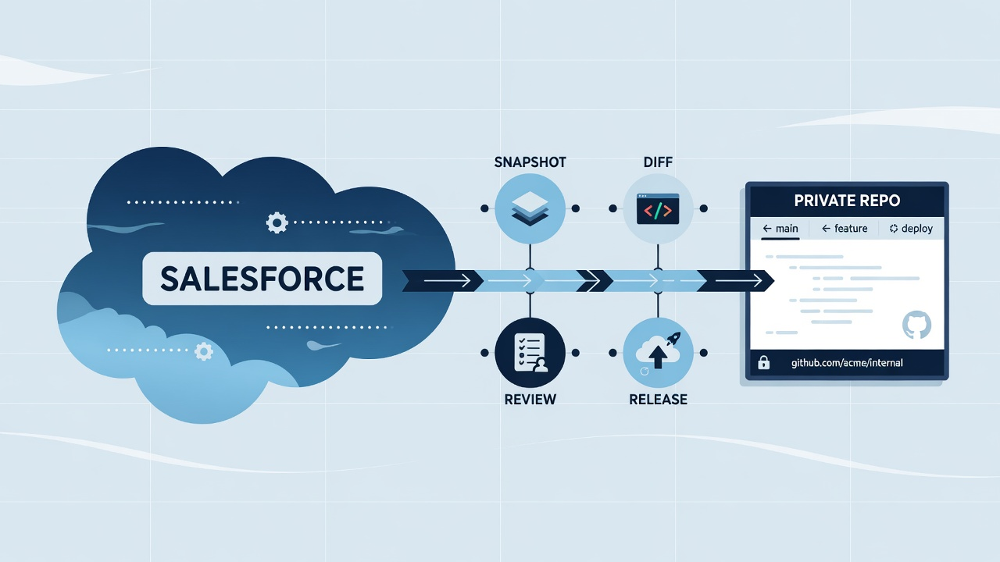
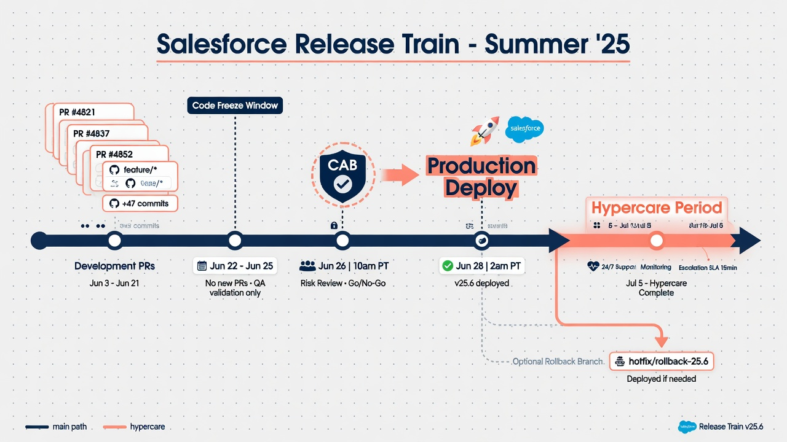

Salesforce source control sounds like a developer concern until an important field changes, a Flow starts behaving differently, or nobody can explain why production no longer matches the implementation notes. Then it becomes an operational concern. A GitHub repository gives a Salesforce team a durable place to see configuration as files, compare versions, review proposed work, and reconstruct the sequence of changes that shaped an org.

That does not mean Git replaces Salesforce, and it does not mean every artifact in an org belongs in a repository. The useful model is narrower: retrieve an approved scope of Salesforce metadata, store it as a Salesforce project in a private GitHub repository, and make that repository the visible history around which better change practices can grow.

This foundation is valuable even for a team that is not ready for full continuous delivery. A nightly snapshot can expose drift. A pull request can give an admin and developer a shared review surface. A tagged release can preserve the exact metadata approved for a launch. Once the plumbing exists, the team can add validation, deployment automation, ownership rules, notifications, and recovery runbooks at a pace that fits its risk tolerance.

*Snapshot, diff, review, and release milestones on one visible path.*

## What Salesforce source control actually controls

Salesforce metadata describes how an org is configured. Depending on the scope, that can include custom objects and fields, Apex classes, Lightning components, Flows, layouts, permission sets, validation rules, and many other component types. In a Salesforce DX project, much of this configuration becomes structured XML, JavaScript, HTML, CSS, or Apex that Git can track.

Git records changes to those files as commits. GitHub adds collaboration and governance around the Git history: private repository access, pull requests, reviews, protected branches, automation, issues, and a web interface for inspecting differences. The repository becomes a readable timeline rather than a mysterious folder of exports.

The distinction between metadata and business data matters. Accounts, Contacts, Opportunities, Cases, files, and other records are not configuration merely because an API can export them. They may contain regulated or confidential information and have different retention, encryption, recovery, and access requirements. A metadata repository should not quietly become a record-data warehouse.

A sensible boundary is:

- GitHub holds approved Salesforce metadata, manifests, automation code, tests, runbooks, and change reports.
- An approved backup or storage system holds record-data exports when the organization requires them.
- The operating documentation states exactly which components are retrieved and what recovery claims the process can support.
- Secrets, private keys, access tokens, and authorization files stay out of committed history.

That boundary makes the repository more trustworthy. A teammate can understand what it represents without assuming it is a complete copy of the org.

## Why the repository is useful before the first automated deployment

Teams sometimes delay source control because they imagine a large DevOps transformation with branching diagrams, release trains, and a wall of CI jobs. Those capabilities can be useful, but they are not the entry requirement. The first useful outcome is simpler: make an invisible configuration state inspectable.

Once the initial retrieval is committed, the team has a baseline. A later retrieval can show that a validation rule changed, a field was added, a permission set widened, or a Flow definition was revised. The diff does not automatically explain the business reason, but it gives the investigation a concrete starting point.

That enables several modest but important questions:

- What changed between Monday and today?
- Did this component change during the planned release or afterward?
- Does the org contain work that never entered the repository?
- Which commit introduced the version currently under review?
- Can we recover the previous file and validate it in a safe environment?
- Are the same components being edited repeatedly, suggesting unstable requirements or ownership?

Without a baseline, these questions depend on memory, screenshots, setup-audit fragments, or a person who happens to know the history. With a baseline, the conversation can begin with evidence.

## The minimum viable architecture

A low-drama Salesforce source control setup has five parts.

### 1. A Salesforce project

The project supplies a predictable directory structure, an `sfdx-project.json` file, and one or more package directories. Metadata retrieved in source format lives inside that structure. The repository should also include a manifest when the team wants an explicit inventory of retrieved component types.

Salesforce documents `sf project retrieve start` as the CLI command for retrieving metadata into a local project. It supports retrieval by manifest, metadata name, or source directory. Production orgs do not provide source tracking, so retrieval and comparison need to be designed with that fact in mind. The [official command reference](https://developer.salesforce.com/docs/platform/salesforce-cli-reference/guide/cli_reference_project_retrieve_start.html) is the best place to confirm current flags and behavior.

### 2. A private GitHub repository

The repository stores the Salesforce project and its history. Private should be the default for organization metadata, even when the files appear harmless. Object names, validation logic, integrations, permission models, and business terminology can reveal how the company operates.

Repository ownership should not be implicit. Name the team responsible for access, workflow maintenance, review rules, and archival decisions. Avoid creating a repository under one employee's personal account if it is meant to serve as an organizational control.

### 3. An authentication path

The person or automation retrieving metadata needs authorized API access to the org. An interactive login may be enough for a non-production pilot. Scheduled automation needs a non-interactive pattern approved by the organization.

Salesforce supports several CLI login approaches. A JWT-based flow uses a connected or external client app, a certificate, and the private key that signs the request. Salesforce's [JWT authorization guide](https://developer.salesforce.com/docs/atlas.en-us.sfdx_dev.meta/sfdx_dev/sfdx_dev_auth_jwt_flow.htm) explains the platform requirements. The right choice depends on internal security policy; the important point is that a production credential must be scoped, stored as a secret, rotatable, and owned.

### 4. A repeatable retrieval

The same approved scope should be retrieved in the same way. An explicit `package.xml` manifest makes that scope reviewable. The job should normalize output, avoid committing transient CLI files, and produce no commit when nothing changed.

Retrieval success alone is not enough. The process should report the target org, API version, manifest used, start and end time, result, and resulting commit identifier. Those details help distinguish a clean no-change run from a job that silently skipped half the intended scope.

### 5. A human operating model

Someone must own failures, access changes, dependency updates, and recovery tests. GitHub Actions can run the job, but automation does not decide whether a surprising deletion is intentional. A short runbook should say who reviews changes, how alerts are handled, when credentials are rotated, and how the workflow is disabled during an incident.

*Org, CLI project, Git history, GitHub controls, and the runbook that keeps them honest.*

## A practical adoption sequence

The safest path earns trust in stages.

### Start in a development org or sandbox

Use a non-production environment to prove authentication, project structure, manifests, retrieval time, file normalization, and commit behavior. Make a small known change, retrieve it, and confirm the diff is understandable. Remove the change and repeat. A successful demo should be boring and reproducible.

This stage also reveals components that do not behave as expected. Metadata types differ in how they are retrieved, decomposed, and deployed. Some configuration has dependencies or special constraints. The initial scope should favor components the team understands rather than promise universal coverage on day one.

### Create an initial baseline deliberately

An initial commit can be enormous. Treat it as an inventory event, not a normal feature change. Record the org identifier, retrieval date, API version, manifest, exclusions, and known limitations. Review the repository for secrets, record data, generated files, and environment-specific values before pushing.

The baseline answers “what did we capture?” It does not prove every captured component is deployable or that every missing component is unimportant. Those are separate validation tasks.

### Add scheduled snapshots

A scheduled GitHub Actions workflow can retrieve the same scope and commit changes. GitHub's schedule trigger runs from the default branch, and the platform notes that scheduled work can be delayed during high-load periods. The [workflow event documentation](https://docs.github.com/actions/using-workflows/events-that-trigger-workflows#schedule) is worth reading before treating a cron expression as a precise service-level promise.

For an operational snapshot, once per night is often enough. Choose a non-round minute, add a manual trigger for testing and recovery, prevent overlapping runs, and send an actionable failure notification. The goal is a dependable history, not maximum polling frequency.

### Introduce pull requests for planned changes

Snapshots tell you what changed in an org. Pull requests help control what should change. These are related but different flows. Planned work can move through a branch and review before deployment, while the snapshot workflow continues to detect work performed directly in the org.

GitHub protected branches and rulesets can require reviews, successful status checks, resolved conversations, or code-owner approval. GitHub's [protected branch documentation](https://docs.github.com/en/repositories/configuring-branches-and-merges-in-your-repository/managing-protected-branches/about-protected-branches) describes the available controls and plan considerations.

Start with rules the team will actually operate. One meaningful reviewer and a reliable validation check are better than a ceremonial approval chain that people learn to bypass.

### Add validation and deployment selectively

Once the repository represents planned work reliably, CI can validate metadata against a target org. Later, an approved merge or release event can drive deployment. Separate validation from deployment so a pull request can prove deployability without changing the target.

Production automation should arrive only after the team has named owners, protected credentials, understood rollback limits, and practiced the manual equivalent. GitHub should make a sound release process more repeatable, not conceal a process nobody understands.

## What this foundation unlocks

The repository becomes shared infrastructure. That opens possibilities well beyond “we have a backup commit.”

Admins and developers can review the same diff. Teams can attach a ticket to a pull request and preserve the conversation beside the change. Automated checks can flag destructive changes, lint Apex or Lightning code, run tests, or compare metadata against policy. CODEOWNERS can route sensitive areas to the right reviewers. Release tags can mark approved states. A deployment job can record evidence. Scheduled retrieval can expose drift. Documentation can live beside the system it describes.

The history can also improve architecture conversations. Repeated changes to the same permission set may point to an access-design problem. A Flow with constant emergency edits may need better tests or clearer ownership. A growing collection of environment-specific exceptions may signal that the project structure needs refactoring.

None of these outcomes appears automatically. Git records files, not intent. The value comes from connecting the files to a lightweight operating practice.

## Common ways teams make the setup less useful

The first mistake is calling the repository a complete Salesforce backup. Metadata history can support recovery of captured configuration, but it usually does not include current record data, files, managed-package internals, credentials, or every artifact needed for a full service restoration. Precise language protects the team from false confidence.

The second mistake is retrieving everything without understanding the scope. A huge manifest can create noisy commits, slow jobs, and confusing dependencies. Broad coverage is a reasonable destination, but an approved, documented scope is a better starting point.

The third mistake is committing secrets. Authorization URLs, private keys, access tokens, `.env` files, and diagnostic output do not belong in Git history. A `.gitignore` helps, but repository secret scanning and pre-commit checks are also worthwhile.

The fourth mistake is making every snapshot a giant rewrite. CLI version changes, API-version changes, decomposed XML ordering, or inconsistent formatting can obscure real configuration changes. Pin and update tool versions deliberately, isolate mechanical migrations, and investigate unexpectedly broad diffs before merging them into the trusted baseline.

The fifth mistake is automation without ownership. A nightly job that fails for three months is not a control. Put failures somewhere a named person will see them, document the rerun procedure, and review whether the schedule is still running.

## How to know the foundation is working

Use observable acceptance criteria:

- A new teammate can identify the source org, metadata scope, repository owner, and workflow owner from the README.
- A known sandbox change produces a small, understandable diff.
- A no-change retrieval produces no commit.
- A failed retrieval produces a visible, actionable alert.
- The default branch is protected from casual destructive changes.
- No Salesforce credential or record-data export exists in Git history.
- The team can check out an earlier commit and validate selected metadata in a safe org.
- The documented rotation and disable procedures have been tested.

Those checks are more meaningful than the presence of a green Actions badge. They measure whether the system helps people understand and control change.

## The sensible first milestone

For most teams, the first milestone is not “continuous deployment.” It is a private repository containing a reviewed non-production baseline, plus a repeatable retrieval that shows a known change. The second milestone is a scheduled snapshot with clear ownership. The third is a pull-request path for planned work.

That sequence creates value without asking the organization to redesign its release process immediately. It also gives stakeholders evidence. They can see the files, inspect the diffs, observe the workflow, and decide which controls deserve further investment.

Salesforce source control is ultimately less about Git commands than organizational memory. The repository makes configuration legible over time. From there, reviews, automation, recovery practice, and release evidence become achievable because the underlying state is finally visible.

## Frequently asked questions

### Is GitHub a Salesforce backup?

GitHub can preserve versions of Salesforce metadata that you successfully retrieve and commit. It is not, by itself, a complete Salesforce data-backup or disaster-recovery service. Record data, files, retention guarantees, restore orchestration, and recovery service levels require separate decisions.

### Do Salesforce admins need to learn Git?

Admins need enough familiarity to read a diff, understand a branch or pull request, and know how their work enters the shared process. They do not all need to become Git specialists. A well-designed workflow should hide unnecessary command-line complexity while keeping the underlying history accessible.

### Should production be the first org connected?

Usually no. Prove retrieval, scope, authentication, normalization, and failure handling in a development org or sandbox. Production access should be a separate, reviewed decision.

### Can source control include declarative configuration?

Yes. Many high-value Salesforce components are declarative metadata, including objects, fields, Flows, layouts, validation rules, and permission sets. Exact support and behavior vary by metadata type, so validate the chosen scope against current Salesforce documentation and a real org.

### What should we link internally after publication?

Link this pillar to the cluster articles about **Salesforce metadata backup**, **Salesforce GitHub integration**, **Salesforce org drift detection**, **restoring Salesforce metadata from GitHub**, and **GitHub Actions Salesforce security** once their final URLs are live.
